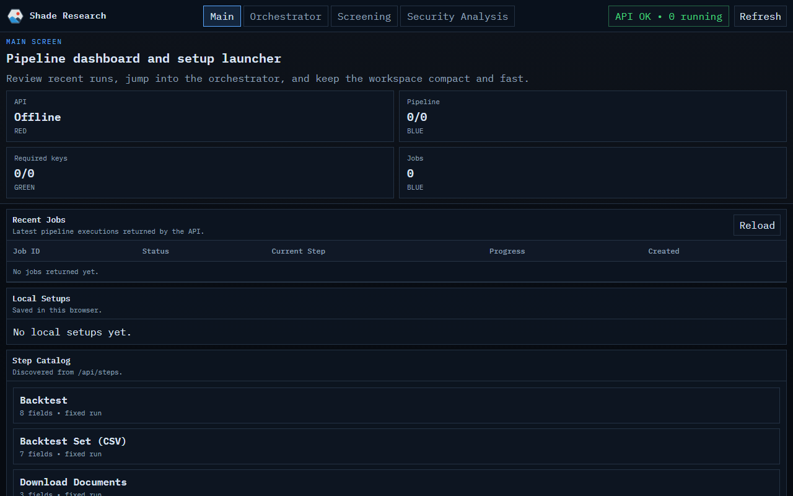
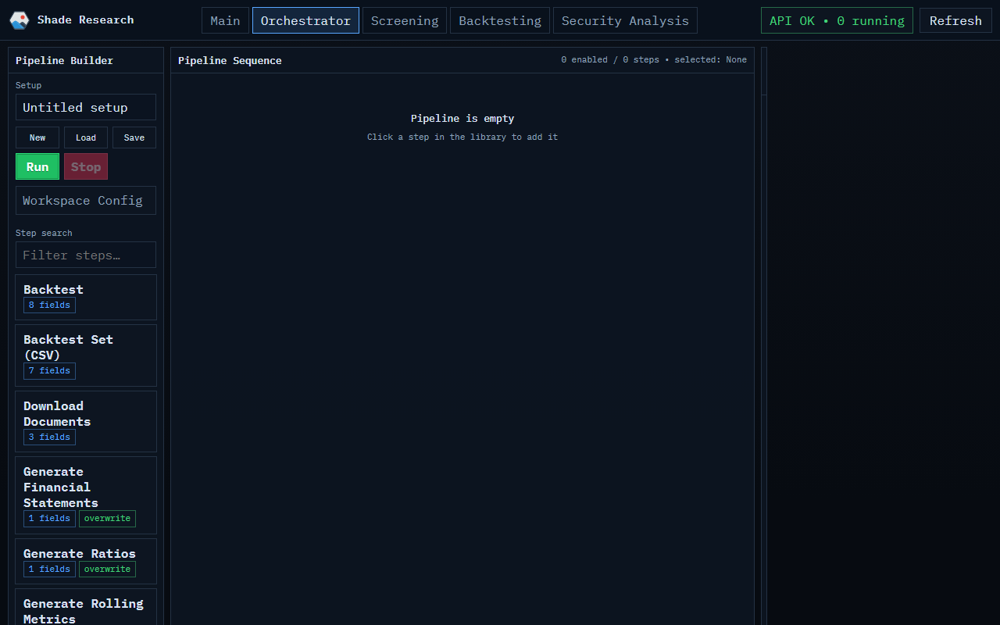
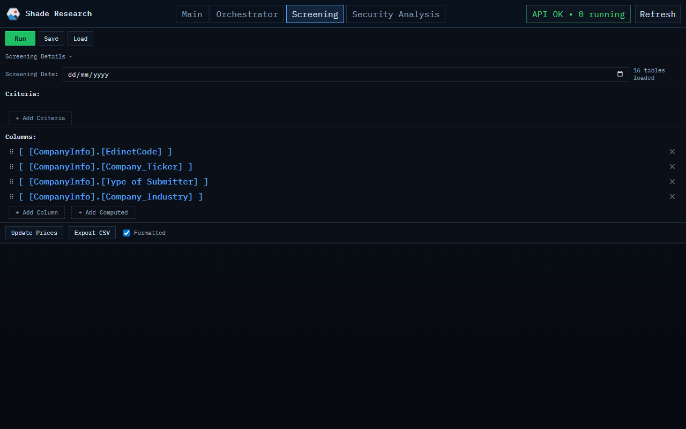
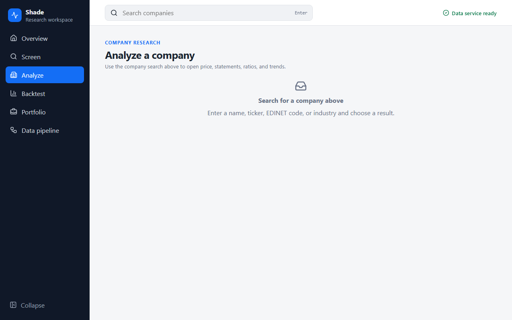

# EDINET Financial Data Tool

Downloads financial filings from the Japanese securities regulator (EDINET), processes them into a structured SQLite database, and runs statistical analysis to identify relationships between financial ratios and stock valuations.

The primary interface is a web workstation (FastAPI + vanilla JavaScript) accessible at `http://127.0.0.1:8000`. It exposes four top-level views: Dashboard, Orchestrator, Screening, and Security Analysis.

Each pipeline step is configured independently, including its source or target database path where applicable.

## Current Status

- **Primary UI** – the web workstation is the default and actively maintained interface.
- **Research surfaces** – Screening and Security Analysis are fully functional views for candidate discovery and single-company research.
- **Architecture** – FastAPI backend with vanilla JS frontend modules communicating via `fetchJson` calls to REST API endpoints.

## Quick Start

1. Download the latest release from [Releases](https://github.com/TiagoDeMatosDias/EDINET/releases)
2. Extract the latest release archive for your platform
3. Copy `config/examples/run_config.example.json` to `config/state/run_config.json` and configure your settings
4. Create a `.env` file with your API keys (see Setup section below)
5. Run `EDINET.exe` (Windows) or the binary for your OS — then open `http://127.0.0.1:8000` in your browser

## What it does

1. **Orchestrator** - Runs a user definable set of steps:
   1. **Fetch document list** – queries the EDINET API for available filings in a given date range.
   2. **Download documents** – downloads the XBRL/CSV filings that match the filter criteria.
   3. **Populate company info** – loads the EDINET company code list from CSV into the database.
   4. **Import stock prices (CSV)** – imports historical prices from a user-supplied CSV file with configurable column mapping.
   5. **Update stock prices** – fetches historical share prices via the Stooq API by default, with a Yahoo Finance chart fallback if Stooq is unavailable.
   6. **Parse taxonomy** – parses an EDINET XBRL taxonomy XSD file and stores element metadata in the database.
   7. **Generate financial statements** – extracts tagged values from raw XBRL data into structured per-company financial tables.
   8. **Generate ratios** – calculates per-share values, valuation ratios, and derived metrics for every company.
   9. **Generate rolling metrics** – computes rolling averages and CAGR-style growth rates for configurable metrics across selected statement tables, producing `<Table>_Rolling` output tables.
   10. **Backtest** – portfolio backtesting with weighted returns, dividend adjustment, and optional benchmark comparison.
   11. **Backtest set** – batch-runs 1/2/3/5/10-year backtests from a CSV of yearly portfolio selections.
2.  **Screening** – filter companies by financial criteria (valuation, quality, per-share metrics), apply weighted ranking rules, review sortable results, toggle raw or formatted value display, save/load criteria, inspect screening history, export CSVs, or generate backtest-set CSV inputs.
3.  **Security analysis** – inspect a single company with typeahead search, overview metric tiles, statement history with configurable column filter, interactive Chart.js charts, price refresh, and peer comparison.

## Screenshots

Current captures from the web workstation at 1280×800:

| View | Screenshot |
|---|---|
| **Dashboard** |  |
| **Orchestrator** |  |
| **Screening** |  |
| **Security Analysis** |  |

- **Dashboard** (`/`) — job history, metrics summary, quick-launch cards into other views.
- **Orchestrator** (`/orchestrator`) — pipeline builder: step library, drag-to-order pipeline, per-step config inspector, run controls.
- **Screening** (`/screening`) — criteria and ranking builder, sortable results, formatted/raw toggle, save/load/history/export, drill-in to Security Analysis.
- **Security Analysis** (`/security`) — company search, overview tiles, historical data with column filter, Chart.js charts, peer comparison, price refresh.

> Screenshots captured via Playwright. Regenerate with `python tests/capture_screenshots.py`.

## Running the Application

```bash
python main.py          # starts the web server on http://127.0.0.1:8000
```

Optional flags:

```bash
python main.py --host 0.0.0.0 --port 8080 --no-reload
```

Then open your browser to the URL shown in the console output.

## Setup

### From Source

#### 1. Install dependencies

```
pip install -r requirements.txt
```

#### 2. Create a `.env` file

Copy the template below into a `.env` file in the project root and fill in your API key:

```
API_KEY=<your_edinet_api_key>
```

All other configuration (database paths, document storage paths, table names, API endpoints) is hardcoded or configured via the web UI / `config/database_paths.json`.

#### 3. Configure and run

Edit `config/state/run_config.json` to enable the steps you want, then:

```
python main.py
```

### From Release

1. Extract the release ZIP file
2. Edit the `.env` file with your configuration
3. Run the executable — it starts the web server automatically
4. Open `http://127.0.0.1:8000` in your browser

All output is logged to timestamped files in the `logs/` directory. See [LOGGING.md](LOGGING.md) for details.

## Documentation

- [RUNNING.md](docs/RUNNING.md) – Full description of every step and configuration options
- [LOGGING.md](docs/LOGGING.md) – Logging system documentation
- [Frontend Architecture.md](docs/Frontend%20Architecture.md) – Web frontend structure and extension guide
- [Contributing.md](docs/Contributing.md) – Contribution guidelines
- [CHANGELOG.md](docs/CHANGELOG.md) – Version history and changes

## Building an executable

The project can be packaged into a single `.exe` with [PyInstaller](https://pyinstaller.org).
The exe resolves all config paths relative to the folder it lives in, so `config/`, `.env`,
and the output `data/` folder just need to sit alongside it.

### 1. Install PyInstaller

```
pip install pyinstaller
```

### 2. Build

Run from the project root:

```
pyinstaller --onefile --name EDINET main.py
```

The exe is written to `dist/EDINET.exe`.

### 3. Prepare the distribution folder

Create a deployment folder and copy the required items into it:

```
EDINET.exe                                   <- built by PyInstaller (from dist/)
.env                                         <- your API keys and DB paths
config/
    database_paths.json                      <- A list of database paths
data/
    ols_results/                             <- must exist for regression output steps
    backtest_results/                        <- must exist for backtest output
    raw_documents                            <- a wip folder where documents will be downloaded and deleted
```

### 4. Run

Double-click `EDINET.exe` or launch it from a terminal.
It starts the web server — open `http://127.0.0.1:8000` in your browser.
It will look for `config/` and `.env` in the same folder as the exe.

> **Note:** Large dependencies (pandas, scipy) make the final exe around 200-300 MB.
> Build time is a few minutes on the first run.

## Configuration files

| File | Purpose |
|---|---|
| `src/orchestrator/generate_ratios/ratios_definitions.json` | Ratio-table definitions used by `generate_ratios` |
| `config/database_paths.json` | Lists the databases to be used |
| `.env` | EDINET API key |

## Web Interface Features

- **Multi-page navigation** – tab bar switches between Dashboard, Orchestrator, Screening, and Security Analysis views without page reload.
- **Pipeline builder** – drag-and-drop step ordering, per-step configuration inspector, run/cancel controls with real-time job status.
- **Screening** – dynamic criteria builder with metric picker, weighted ranking rules, sortable/sort-preserving results, formatted/raw value toggle, save/load criteria, run history, CSV export, backtest-set export, and drill-in to Security Analysis.
- **Security Analysis** – typeahead company search (by ticker, name, EDINET code, industry), overview metric tiles, unified historical data table with column filter (multi-select grouped by source table), period count selector, Chart.js charts (line/bar/area, multi-series, add/remove panels), peer comparison, and stock price refresh.
- **Database management** – resolve, optimize, and select database paths from the UI.
- **Session persistence** – screening criteria, results, and security analysis context survive tab switches via sessionStorage.

## Key EDINET document type codes

| Code | Document type |
|---|---|
| 120 | Securities Report (Annual Report - 有価証券報告書) |
| 140 | Quarterly Securities Report (四半期報告書) |
| 150 | Semi-Annual Securities Report (半期報告書) |
