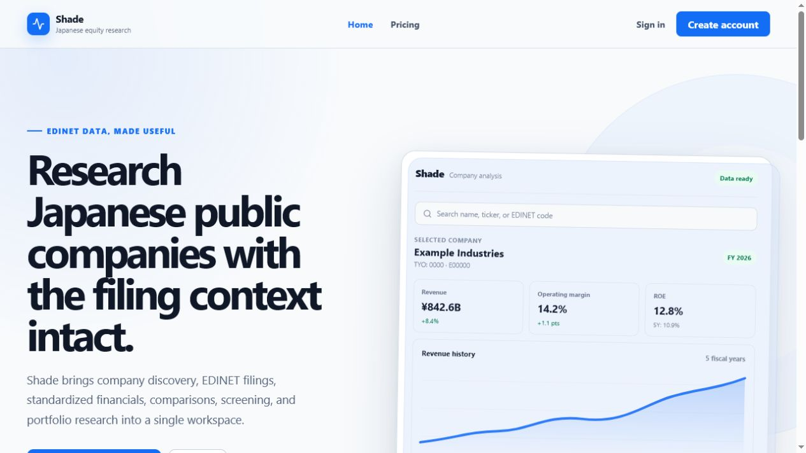
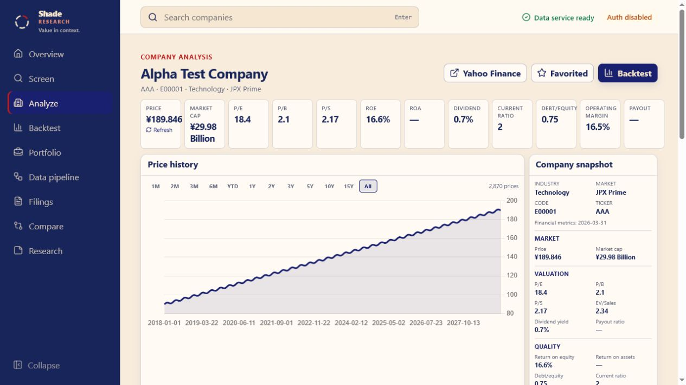
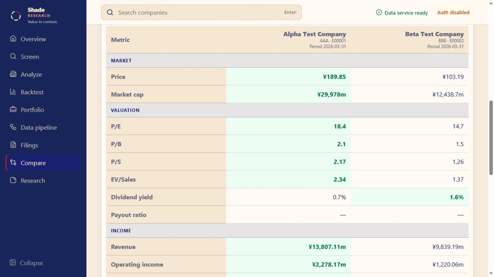
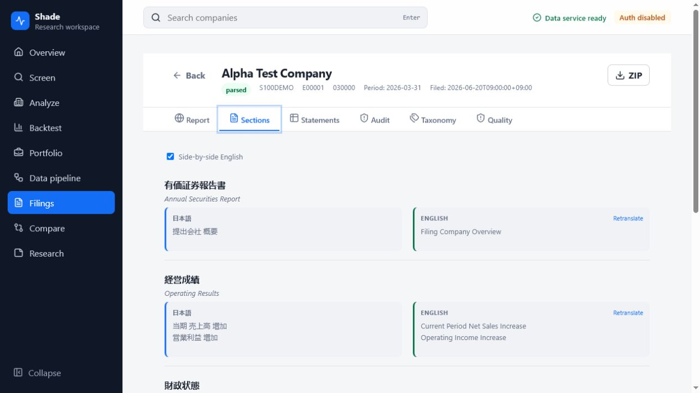
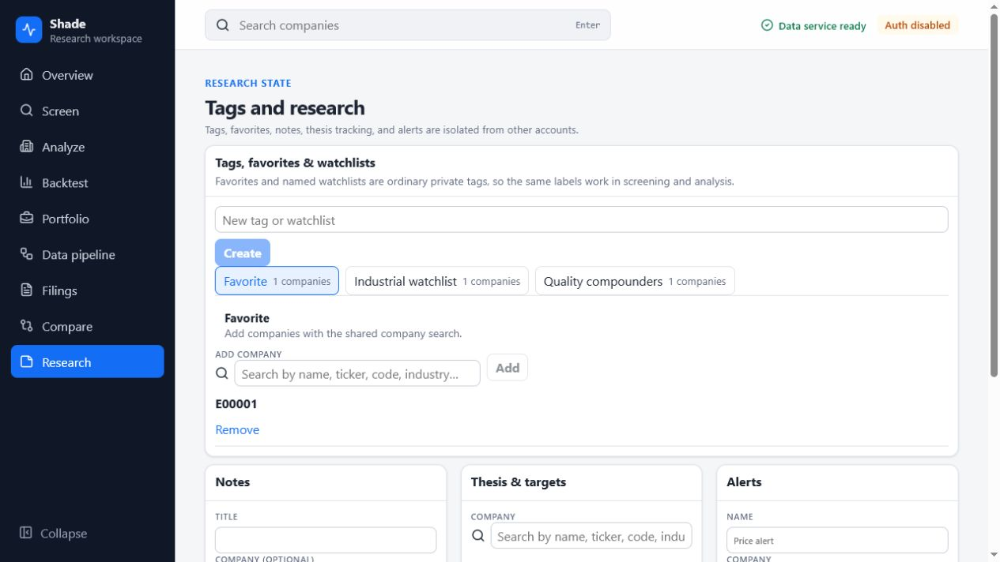
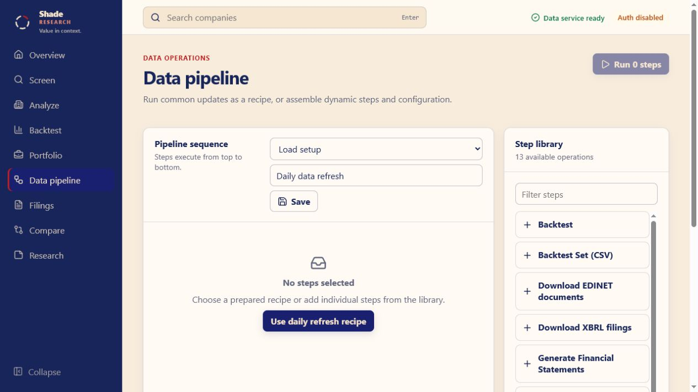

# Shade Research

Shade Research is a local-first company research workstation. It combines source filings and XBRL—including EDINET—standardized financial statements, company search, screening, comparison, backtesting, portfolio analysis, and private research state in one FastAPI and React application.

The public homepage is served at `http://127.0.0.1:8000/`; the signed-in or local workspace starts at `/overview`. The pricing page currently presents one informational tier at €10 per month or €100 per year. Payment processing and subscription enforcement are not implemented.

## Current capabilities

- One best-effort company finder is shared by Analysis, Comparison, Filings, Research, and the global header. It searches names, tickers, EDINET codes, industries, markets, and available price tickers, and degrades gracefully when a configured database is incomplete.
- Company Analysis combines prices, the full financial snapshot, filing history, statement history, ratios, charts, tags, and backtest handoffs.
- Company Comparison supports 2–12 companies, standard metrics, arbitrary numeric `Table.Column` metrics, common-size statements, and optional peer percentiles.
- Filing Explorer retains compressed type-1 ZIPs, indexes compact numeric XBRL facts, reconstructs narrative content on demand, and keeps Japanese and complete English translations side by side.
- Favorites and watchlists use the same private tag system as Analysis, Research, and Screening. Research also stores notes, thesis state, targets, review dates, and in-app alerts.
- Screening, point-in-time rolling backtests, manual/CSV backtests, IBKR FlexQuery portfolio imports, and reproducible report ZIPs are available from the web workspace.
- The data pipeline exposes 13 dynamically discovered steps, durable job state, cancellation, progress, safe file uploads, XBRL `explicit`/`backfill`/`all` modes, and CSV- or filings-backed financial-statement generation.
- Optional account mode provides registration, login, rotating sessions, personal API tokens, account administration, and an administrator-controlled 15–128 character minimum password length.
- Missing configured databases and their managed schemas are created automatically when the server starts.

## Quick start

### Prerequisites

- Python 3.12 or 3.13
- Node.js 22 and npm 10
- Windows for packaged releases; Windows or Linux for source development

### Install and run

```powershell
py -3.13 -m venv .venv3
.\.venv3\Scripts\python.exe -m pip install -e ".[dev]"

Set-Location frontend-v2
npm ci
npm run build
Set-Location ..

.\.venv3\Scripts\python.exe main.py --no-reload
```

Open `http://127.0.0.1:8000`.

Account mode and open registration are the defaults. The first registered account becomes the administrator. Set `EDINET_AUTH_MODE=disabled` only for unrestricted loopback compatibility.

Set `EDINET_API_TOKEN` for the type-1 XBRL downloader. The legacy Get Documents and Download EDINET Documents steps read `API_KEY` from pipeline configuration; when both workflows use the same EDINET credential, both values may be set. They are outbound provider credentials only and are never accepted as application login tokens.

```dotenv
EDINET_API_TOKEN=<your-edinet-api-token>
API_KEY=<your-edinet-api-token>
```

On a clean start, the server creates the configured Base, Standardized, Portfolio, auth, research, pipeline-job, and filing databases if they do not exist. Use the Pipeline workspace to populate market and filing data.

For frontend development, keep FastAPI on port 8000 and run `npm run dev` from `frontend-v2/`. See [Running the Application](docs/RUNNING.md) for account mode, remote binding, storage, pipeline configuration, and recovery commands.

## Routes

| Route | Purpose |
|---|---|
| `/` | Public product homepage with registration, login, and pricing links |
| `/pricing` | Informational €10/month or €100/year plan |
| `/login`, `/register` | Account access and registration |
| `/overview` | Data health, recent jobs, and workflow shortcuts |
| `/screen` | Expression-based company screening and rolling-backtest handoff |
| `/analyze`, `/analyze/:companyCode` | Company search, snapshot, history, charts, tags, and filings |
| `/compare` | Multi-company financial and arbitrary-metric comparison |
| `/filings`, `/filings/:docId` | Filing search, coverage statistics, source report, sections, facts, taxonomy, and quality |
| `/research` | Tags, favorites, watchlists, notes, thesis tracking, and alerts |
| `/backtest` | Manual, CSV-set, and point-in-time rolling-screen backtests |
| `/portfolio` | IBKR import, holdings, activity, performance, and risk views |
| `/pipeline` | Pipeline recipes, uploads, run controls, progress, and job history |
| `/account`, `/admin` | Account settings and administrator controls |

`/security` and `/backtesting` remain compatibility aliases for `/analyze` and `/backtest`.

## Pipeline steps

The step library is discovered from `src/orchestrator/` and currently contains:

1. Get Documents
2. Download EDINET Documents (CSV/type-5)
3. Download XBRL Filings (type-1)
4. Populate Company Info
5. Import Stock Prices (CSV)
6. Update Stock Prices
7. Update FX Data
8. Parse Taxonomy
9. Generate Financial Statements
10. Generate Ratios
11. Generate Rolling Metrics
12. Backtest
13. Backtest Set (CSV)

The stock-price CSV step uses a file picker and accepts files up to 500 MiB. XBRL `all` mode queries eligible filings from `DocumentList`, honors the document-type filter, skips completed downloads, uses at most five concurrent downloads, batches status writes, and reuses HTTP connections. Financial statements can be generated from either the legacy CSV database or compact numeric facts in `Filings.db`.

## Screenshots

These 1280×720 captures use generated demonstration companies, filings, and portfolio activity. The capture process never opens operator databases.

| View | Screenshot |
|---|---|
| Public homepage |  |
| Company analysis |  |
| Financial comparison |  |
| Filing translation |  |
| Tags and research |  |
| Data pipeline |  |

See the [User Guide](docs/USER_GUIDE.md) for the complete screenshot gallery and feature walkthrough. Regenerate every image from isolated synthetic data with:

```powershell
.\.venv3\Scripts\python.exe tests\capture_screenshots.py
```

## Configuration and data

| File or variable | Purpose |
|---|---|
| `config/database_paths.json` | Base, Standardized, Portfolio, auth, research, job, and filing database locations |
| `.env` / `EDINET_API_TOKEN`, pipeline `API_KEY` | Outbound EDINET provider credentials for XBRL and legacy document steps |
| `EDINET_AUTH_MODE` | `disabled` for loopback compatibility or `accounts` for account authentication |
| `src/orchestrator/generate_ratios/ratios_definitions.json` | Ratio definitions |
| `src/orchestrator/generate_rolling_metrics/rolling_metrics.json` | Rolling-average and growth definitions |

`Filings.db` stores compressed provider ZIPs, compact numeric facts, catalog metadata, and versioned translation-cache rows. Narrative HTML and text are reconstructed from the retained ZIP only when requested.

## Documentation

- [User Guide](docs/USER_GUIDE.md) — user-facing workflows and complete screenshot gallery
- [Running the Application](docs/RUNNING.md) — setup, security, database storage, and every pipeline step
- [Building the Windows Release](docs/BUILDING.md) — packaged executable and ZIP workflow
- [Frontend Architecture](docs/Frontend%20Architecture.md) — routes, state, components, and extension guide
- [Python Source File Reference](docs/Application%20Details.md) — backend module responsibilities and contracts
- [Contributing](docs/Contributing.md) — development and bounded verification workflow
- [Logging and Correlation](docs/LOGGING.md) — logs, safe error envelopes, and correlation IDs
- [Changelog](docs/CHANGELOG.md) — release history and unreleased changes

## Verification and packaging

Run all bounded backend, integration, frontend, static, contract, dependency, and documentation checks:

```powershell
.\.venv3\Scripts\python.exe -B scripts\verify.py
```

Build the Windows release with:

```powershell
.\.venv3\Scripts\python.exe -B scripts\build.py
```

The release builder generates fresh configuration and empty databases; it never bundles development databases, credentials, logs, uploads, or portfolio data.

## Common EDINET document type codes

| Code | Document type |
|---|---|
| `120` | Securities Report (Annual Report / 有価証券報告書) |
| `130` | Semi-annual Securities Report (半期報告書) |
| `140` | Quarterly Securities Report (四半期報告書) |
