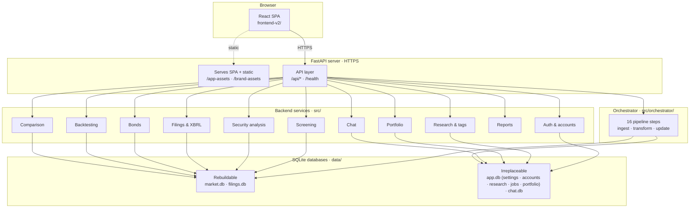

# Shade Research

Shade Research is a local-first company research workstation: one FastAPI + React application that combines EDINET source filings and XBRL-standardized financials with company search, screening, comparison, backtesting, portfolio analysis, and private research state.

It always serves HTTPS, from `https://127.0.0.1:8000/` on the public homepage and from `/overview` once you are signed in. A self-signed certificate is generated into `data/certs/` on first start. The `/pricing` page advertises one informational plan at €10/month or €100/year; payment processing and subscription enforcement are not implemented.

## Architecture

One HTTPS process: a React single-page app in the browser talks to a FastAPI server, which serves the app bundle and the `/api/*` routes. Every route is backed by a backend service in `src/`; the orchestrator runs the data pipeline; and everything it writes lives in one `data/` folder: four SQLite databases, the certificate, logs, and generated artifacts.


```mermaid
flowchart TB
    subgraph Browser["Browser"]
        SPA["React SPA<br/>frontend-v2/"]
    end

    subgraph Server["FastAPI server · HTTPS"]
        SERVE["Serves SPA + static<br/>/app-assets · /brand-assets"]
        API["API layer<br/>/api/* · /health"]
    end

    subgraph Services["Backend services · src/"]
        AUTH["Auth & accounts"]
        SCREEN["Screening"]
        SEC["Security analysis"]
        FIL["Filings & XBRL"]
        COMP["Comparison"]
        PORT["Portfolio"]
        RES["Research & tags"]
        BONDS["Bonds"]
        BT["Backtesting"]
        REP["Reports"]
        CHAT["Chat"]
    end

    subgraph Pipeline["Orchestrator · src/orchestrator/"]
        ORCH["16 pipeline steps<br/>ingest · transform · update"]
    end

    subgraph Data["SQLite databases · data/"]
        REBUILD["Rebuildable<br/>market.db · filings.db"]
        STATE["Irreplaceable<br/>app.db (settings · accounts · research · jobs · portfolio) · chat.db"]
    end

    SPA -->|"HTTPS"| API
    SPA -.->|"static"| SERVE
    API --> AUTH
    API --> SCREEN
    API --> SEC
    API --> FIL
    API --> COMP
    API --> PORT
    API --> RES
    API --> BONDS
    API --> BT
    API --> REP
    API --> CHAT
    API --> ORCH
    ORCH --> REBUILD
    SCREEN --> REBUILD
    SEC --> REBUILD
    FIL --> REBUILD
    BONDS --> REBUILD
    BT --> REBUILD
    COMP --> REBUILD
    AUTH --> STATE
    RES --> STATE
    PORT --> STATE
    CHAT --> STATE
    ORCH --> STATE
```

The frontend never opens a database directly; it only calls the API. The orchestrator is a thin dispatcher that discovers its step packages, so adding a pipeline step does not touch the server. See [Frontend Architecture](docs/Frontend%20Architecture.md) for the UI layer and [Application Details](docs/Application%20Details.md) for the backend module reference.


## Capabilities

- **One company finder everywhere** — Analysis, Comparison, Filings, Research, and the global header search the same index of names, tickers, EDINET codes, industries, markets, and price tickers, degrading gracefully when a configured database is incomplete.
- **Company analysis** — prices, the full financial snapshot, filing and statement history, ratios, charts, tags, and a backtest handoff on a single page.
- **Company comparison** — 2–12 companies, standard metrics, any numeric `Table.Column` metric, common-size statements, and optional peer percentiles.
- **Filing Explorer** — retains compressed type-1 ZIPs, indexes compact numeric XBRL facts, reconstructs narrative content on demand, and keeps Japanese and complete English translations side by side.
- **Research and tagging** — one private tag system shared by favorites, watchlists, Analysis, and Screening, plus notes, thesis state, targets, review dates, and in-app alerts.
- **Chat** — company channels and direct messages: direct and group conversations are end-to-end encrypted in the browser, channel messages are encrypted at rest, with per-channel company context, profiles, and unread badges.
- **Testing ideas** — expression screening, point-in-time rolling backtests, manual and CSV backtests, IBKR FlexQuery portfolio imports, and reproducible report ZIPs.
- **Data pipeline** — 16 dynamically discovered steps, durable job state, cancellation, progress reporting, safe file uploads, XBRL `explicit`/`backfill`/`all` modes, and financial statements generated from CSV or compact filing facts.
- **Optional accounts** — registration, login, rotating sessions, personal API tokens, administrator controls, and an administrator-set 5–128-character password minimum.
- **Zero-setup storage** — the four databases and their schemas are created in `data/` on first start, and every setting, including the EDINET API key, is stored in `app.db` and edited on the Admin page.

## Screenshots

All captures run against generated demonstration companies, filings, and portfolio activity — never operator databases. Regenerate every image with:

```powershell
.\.venv3\Scripts\python.exe tests\capture_screenshots.py
```

| View | Screenshot |
|---|---|
| Public homepage |  |
| Workspace overview (`/overview`) |  |
| Company screening (`/screen`) |  |
| Company analysis (`/analyze/:companyCode`) |  |
| Financial comparison (`/compare`) |  |
| Filing search (`/filings`) |  |
| Filing translation (`/filings/:docId`) |  |
| Tags and research (`/research`) |  |
| Backtesting (`/backtest`) |  |
| Portfolio (`/portfolio`) |  |
| Data pipeline (`/pipeline`) |  |

See the [User Guide](docs/USER_GUIDE.md) for the complete gallery and a feature-by-feature walkthrough.

## Quick start

### Prerequisites

- Python 3.12 or 3.13
- Node.js 22 and npm 10
- Windows for packaged releases; Windows or Linux for source development

### Install and run

```powershell
py -3.13 -m venv .venv3
.\.venv3\Scripts\python.exe -m pip install -e ".[dev]" -c constraints.txt

Set-Location frontend-v2
npm ci
npm run build
Set-Location ..

.\.venv3\Scripts\python.exe main.py --no-reload
```

Open `https://127.0.0.1:8000` and accept the self-signed certificate once, or add `data/certs/cert.pem` to the operating system's trusted root store. To serve a real certificate instead, place a key pair in `data/certs/` — supported pairs are `cert.pem`+`key.pem`, `fullchain.pem`+`privkey.pem`, `tls.crt`+`tls.key`, and `server.crt`+`server.key`.

Account mode with open registration is the default; the first registered account becomes the administrator. Enter the EDINET API key under **Admin → Server settings**, or from a terminal:

```powershell
.\.venv3\Scripts\python.exe main.py config set edinet.api_key    # prompts for the key
```

Every setting lives in `data/app.db`; `main.py config list` shows them all. The API key is an outbound provider credential only and is never accepted as an application login token. Run `main.py config set auth.mode disabled` only for unrestricted loopback use.

On first start the server creates `data/` with its four databases. Populate market and filing data from the Pipeline workspace. An installation that still has the older layout (`config/`, `data/databases/`, `.env`) is moved into `data/` automatically on start; `main.py migrate --dry-run` lists what would move.

For frontend development, keep FastAPI serving HTTPS on port 8000 and run `npm run dev` from `frontend-v2/`; the Vite proxy targets `https://127.0.0.1:8000` without verifying the self-signed certificate. See [Running the Application](docs/RUNNING.md) for account mode, remote binding, storage, pipeline configuration, and recovery commands.

## Routes

| Route | Purpose |
|---|---|
| `/` | Public product homepage with registration, login, and pricing links |
| `/pricing` | Informational €10/month or €100/year plan |
| `/login`, `/register` | Account access and registration |
| `/overview` | Data health, recent jobs, and workflow shortcuts |
| `/screen` | Expression-based company screening and rolling-backtest handoff |
| `/analyze`, `/analyze/:companyCode` | Company search, snapshot, history, charts, tags, and filings |
| `/compare` | Multi-company financial and arbitrary-metric comparison |
| `/filings`, `/filings/:docId` | Filing search, coverage statistics, source report, sections, facts, taxonomy, and quality |
| `/research` | Tags, favorites, watchlists, notes, thesis tracking, and alerts |
| `/backtest` | Manual, CSV-set, and point-in-time rolling-screen backtests |
| `/portfolio` | IBKR import, holdings, activity, performance, and risk views |
| `/pipeline` | Pipeline recipes, uploads, run controls, progress, and job history |
| `/chat` | Encrypted company channels, direct messages, and profiles |
| `/account`, `/admin` | Account settings and administrator controls |

`/security` and `/backtesting` remain compatibility aliases for `/analyze` and `/backtest`.

## Pipeline steps

The step library is discovered from `src/orchestrator/` and currently contains:

1. Get Documents
2. Download EDINET Documents (CSV/type-5)
3. Download XBRL Filings (type-1)
4. Update bonds
5. Populate Company Info
6. Import Stock Prices (CSV)
7. Update Stock Prices
8. Check TDnet splits
9. Detect splits
10. Update FX Data
11. Parse Taxonomy
12. Generate Financial Statements
13. Generate Ratios
14. Generate Rolling Metrics
15. Backtest
16. Backtest Set (CSV)

The stock-price CSV step uses a file picker and accepts files up to 500 MiB. XBRL `all` mode queries eligible filings from `DocumentList`, honors the document-type filter, skips completed downloads, uses at most five concurrent downloads, batches status writes, and reuses HTTP connections. Financial statements can be generated from either the legacy CSV table or the compact numeric facts in `filings.db`.

## Configuration and data

Everything the application writes is in `data/` beside `main.py` or `ShadeResearch.exe`:

| Path | Holds |
|---|---|
| `data/app.db` | Settings and secrets, accounts, research, pipeline jobs, and portfolio. Irreplaceable: back up this file (and `chat.db`). |
| `data/chat.db` | Chat channels and messages, kept apart because it grows with use; its at-rest key ring is in `app.db`. |
| `data/market.db` | Rebuildable market data: the EDINET document index, taxonomy, company info, statements, ratios, rolling metrics, prices, splits, and bonds. |
| `data/filings.db` | Rebuildable filing archive: compressed provider ZIPs, compact numeric facts, catalog metadata, and translation-cache rows. Narrative HTML and text are reconstructed from the retained ZIP only when requested. |
| `data/certs/`, `data/logs/`, `data/artifacts/` | TLS certificate, rotating server log, and generated backtests, reports, exports, and job uploads. |

Settings are rows in `app.db`, edited under **Admin → Server settings** or with `main.py config list|get|set|unset`. Among them: `edinet.api_key`, `auth.mode`, `server.trusted_hosts`, upload and archive limits, job retention, and `storage.market_db_path` / `storage.filings_db_path` to move the two large databases to another disk. How the server listens is chosen at launch (`--host`, `--port`, `--allow-remote`). `EDINET_DATA_DIR` points the application at another data folder, which tests and scratch runs use.

Ratio and rolling-metric definitions ship with the code in `src/orchestrator/generate_ratios/ratios_definitions.json` and `src/orchestrator/generate_rolling_metrics/rolling_metrics.json`.

## Documentation

- [User Guide](docs/USER_GUIDE.md) — user-facing workflows and complete screenshot gallery
- [Running the Application](docs/RUNNING.md) — setup, security, database storage, and every pipeline step
- [Building the Release](docs/BUILDING.md) — one-step launchers and the packaged Windows and Linux executables
- [Frontend Architecture](docs/Frontend%20Architecture.md) — routes, state, components, and extension guide
- [Python Source File Reference](docs/Application%20Details.md) — backend module responsibilities and contracts
- [Contributing](docs/Contributing.md) — development and bounded verification workflow
- [Logging and Correlation](docs/LOGGING.md) — logs, safe error envelopes, and correlation IDs
- [Changelog](docs/CHANGELOG.md) — release history and unreleased changes

## Verification and packaging

Run all bounded backend, integration, frontend, static, contract, dependency, and documentation checks:

```powershell
.\.venv3\Scripts\python.exe -B scripts\verify.py
```

Build the release by double-clicking `build.sh` on Linux or `build.bat` on Windows; each fills its own folder, `release/linux/` or `release/windows/`. The launchers set up their own build environment and then run:

```powershell
.\.venv-build\windows\Scripts\python.exe -B scripts\build.py
```

The release is the executable alone (`ShadeResearch.exe` or `ShadeResearch`); it creates `data/` on first start and never bundles development databases, credentials, logs, uploads, or portfolio data.

## Common EDINET document type codes

| Code | Document type |
|---|---|
| `120` | Securities Report (Annual Report / 有価証券報告書) |
| `130` | Semi-annual Securities Report (半期報告書) |
| `140` | Quarterly Securities Report (四半期報告書) |
