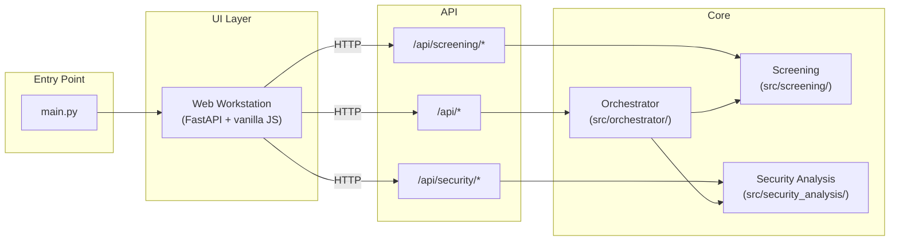

# Python Source File Reference (Living Document)

Last updated: 2026-05-25
- Central reference for runtime/test Python modules (`src/`), web app modules (`src/web_app/`), and top-level scripts.
- For each file: what it owns, available functions, input/output contract, and key dependencies/calls.
- Designed to be updated continuously as functions are added/removed/changed.

---

## How to maintain this document

When updating code, update this file in the same PR/commit:

1. Add/remove function entries for changed files.
2. Update function signatures exactly (types/defaults).
3. Update dependency lists when called functions/modules/signals change.
4. Keep sections ordered by file path.
5. Update the `Last updated` date.

Suggested per-function format:
- `def name(args) -> ReturnType`
	- Purpose: ...
	- Inputs: ...
	- Output: ...
	- Calls/Dependencies: ...

---

## Current project status

- Default interface: the web workstation (FastAPI + vanilla JS) launched by `python main.py` is the primary maintained UI.
- Maintained top-level views: `Dashboard`, `Orchestrator`, `Screening`, `Backtesting`, `Security Analysis`, and `Portfolio`.
- Architecture status: `src.orchestrator` is a thin dispatcher with dynamically discovered step packages; backend modules are decoupled from `Config` and called with explicit parameters.
- Mature user-facing workflows: ingestion, ETL, ratio generation, backtesting, screening, security analysis, and portfolio management all have dedicated test coverage.
- Web workstation: full-featured web UI (FastAPI + vanilla JS) served at `/`, `/orchestrator`, `/screening`, `/backtesting`, `/security`, `/portfolio`. All views are fully functional.

---

## Runtime modules (`src`)

## Architecture overview

The application has a web workstation UI backed by a FastAPI server. The orchestrator is the central dispatcher: it discovers step packages and delegates work to backend modules.

The web workstation server mounts orchestrator API routes (`/api/steps`, `/api/pipeline/run`, `/api/jobs`), screening routes (`/api/screening/*`), and security analysis routes (`/api/security/*`) into a single FastAPI application. The browser's vanilla JS modules call these endpoints via `fetchJson`.

### [src/orchestrator/__init__.py](../src/orchestrator/__init__.py)

Responsibility: public orchestration API and step dispatch. The orchestrator is a thin dispatcher with **no business logic**. Step execution is discovered dynamically from step packages directly under `src/orchestrator`, so new step packages can be added without modifying the orchestrator runtime.

Architecture:
- **`src/orchestrator/orchestrator.py`**: runtime entry point that owns step registries, public API validation, and execution.
- **`src/orchestrator/common/__init__.py`**: shared `StepDefinition` type plus discovery helpers that scan immediate child step packages under `src/orchestrator`.
- **`src/orchestrator/common/validation.py`**: pipeline validation and step config normalization.
- **Discovered step packages**: each step lives in its own package such as `src/orchestrator/generate_financial_statements/` and exports `STEP_DEFINITION` only.
- **`STEP_HANDLERS`**: generated registry mapping step names and aliases to discovered handlers.

- `def run(config=None, steps=None, on_step_start=None, on_step_done=None, on_step_error=None, cancel_event=None) -> None`
	- Purpose: Run the provided pipeline config.
	- Inputs: optional `Config` or config dict, optional ordered `steps`, optional callbacks, optional `cancel_event`.
	- Output: None.
	- Calls/Dependencies: `Config`, `validate_input`, `STEP_HANDLERS`.

- `def list_available_steps() -> list[dict]`
	- Purpose: Return the discovered step catalog for the UI, including step names, config keys, overwrite support, aliases, and input field definitions.
	- Inputs: none.
	- Output: list of step metadata dicts.

- `def validate_input(config, steps=None) -> list[dict]`
	- Purpose: Validate pipeline shape plus required top-level keys, required step-config fields, and typed field values. Returns normalized enabled steps.
	- Inputs: `Config` or config dict, optional ordered `steps`.
	- Output: normalized list of step dicts (raises `RuntimeError` on invalid input).

### [src/orchestrator/common/edinet.py](../src/orchestrator/common/edinet.py)

Responsibility: EDINET API wrapper, document listing, download/unzip, CSV ingestion to DB. (Was `src/edinet_api.py` before the orchestration rework.) No Config dependency; all parameters are passed explicitly via the constructor.

`class Edinet`
	- Purpose: EDINET HTTP wrapper and helpers to download, extract and ingest financial CSVs into the project DB.
	- Constructor: `Edinet(base_url, api_key, db_path, raw_docs_path=None, doc_list_table=None, company_info_table=None, taxonomy_table=None)`

	- `def get_All_documents_withMetadata(self, start_date, end_date) -> list` - Iterate a date range via the EDINET listing API and persist discovered document metadata.
	- `def downloadDoc(self, docID, fileLocation=None, docTypeCode=None) -> None` - Download a single EDINET document ZIP.
	- `def downloadDocs(self, input_table, output_table=None, filter=None) -> None` - Download and extract all not-yet-downloaded documents.
	- `def load_financial_data(self, financialFiles, table_name, doc, connection=None) -> None` - Read extracted TSV/CSV financial files into a DataFrame and persist.
	- `def store_edinetCodes(self, csv_file, target_database=None, table_name=None) -> None` - Load EDINET company codes CSV into the DB.

### [src/orchestrator/common/backtesting.py](../src/orchestrator/common/backtesting.py)

Responsibility: portfolio construction, price/dividend ingestion, return calculations, performance metrics, human-readable reports and charts. (Was `src/backtesting.py` before the orchestration rework.)

- `def _normalise_portfolio_entry(spec) -> tuple[str, float]`
	- Purpose: Parse a single portfolio entry (legacy float or dict) into a canonical `(mode, numeric_value)` tuple.
	- Inputs: `spec` - an `int`/`float` (legacy weight) or `dict` with keys `mode` and `value`.
	- Output: `(mode, value)` where `mode` is one of `"weight"|"shares"|"value"`.
	- Calls/Dependencies: `logger.warning`.

- `def resolve_portfolio_allocations(portfolio_config: dict, start_prices: dict[str, float], initial_capital: float = 0.0) -> tuple[dict[str, float], float, list[str]]`
	- Purpose: Resolve mixed-mode allocation specs (weights, fixed shares, fixed value) into normalised portfolio weights and an effective capital amount.
	- Inputs: `portfolio_config` (ticker → spec), `start_prices` (ticker → opening price), `initial_capital` (user-supplied or 0 to derive).
	- Output: `(portfolio_weights, effective_capital, warnings)` where `portfolio_weights` sums to 1.0 (unless empty), `effective_capital` is the capital used for allocation, and `warnings` lists issues (missing start prices, inconsistent totals).
	- Calls/Dependencies: `_normalise_portfolio_entry`, `logger.warning`.

- `def get_portfolio_prices(db_path: str, prices_table: str, tickers: list[str], start_date: str, end_date: str, *, conn: sqlite3.Connection | None = None) -> pandas.DataFrame`
	- Purpose: Query the `prices_table` for daily `Date, Ticker, Price` rows for the requested tickers and date range.
	- Inputs: `db_path`, `prices_table`, `tickers`, `start_date` (YYYY-MM-DD), `end_date` (YYYY-MM-DD), optional `conn`.
	- Output: `pd.DataFrame` (long form) with columns `Date` (datetime), `Ticker`, `Price` (numeric), ordered by `Date`.
	- Calls/Dependencies: `read_sql_query`, `to_datetime`, `to_numeric`, `sqlite3.connect`, `conn.close`.

- `def get_dividend_data(db_path: str, per_share_table: str, company_table: str, tickers: list[str], start_date: str, end_date: str, *, financial_statements_table: str = "FinancialStatements", dividend_column: str | None = None, conn: sqlite3.Connection | None = None) -> pandas.DataFrame`
	- Purpose: Load per-share dividend records for tickers and map them to `periodEnd` dates. Supports both modern (`PerShare` with `docID`) and legacy schemas (`edinetCode` + `periodEnd`).
	- Inputs: DB path, `per_share_table`, `company_table`, ticker list, date range, optional `financial_statements_table`, optional explicit `dividend_column`, optional `conn`.
	- Output: `pd.DataFrame` with columns `Ticker`, `periodEnd` (datetime), `PerShare_Dividends` (numeric). Empty DataFrame when no supported dividend column or no tickers.
	- Calls/Dependencies: `conn.execute`, `read_sql_query`, `to_datetime`, `to_numeric`, `logger.warning`, `conn.close`.

- `def calculate_portfolio_returns(prices_df: pd.DataFrame, portfolio_weights: dict[str, float], dividends_df: pd.DataFrame | None = None) -> pd.DataFrame`
	- Purpose: Compute weighted daily portfolio returns and cumulative returns. Prices are forward-filled; dividends are treated as cash (not reinvested) and added to portfolio value from their pay date onward.
	- Inputs: `prices_df` (long form with `Date`,`Ticker`,`Price`), `portfolio_weights` (ticker → weight), optional `dividends_df` (with `Ticker`,`periodEnd`,`PerShare_Dividends`).
	- Output: `pd.DataFrame` indexed by `Date` with columns `portfolio_return` (daily) and `cumulative_return` (level series).
	- Calls/Dependencies: `pivot_table`, `ffill`, `pct_change`.

- `def calculate_return_decomposition(prices_df: pd.DataFrame, portfolio_weights: dict[str, float], dividends_df: pd.DataFrame | None = None) -> dict[str, pd.DataFrame]`
	- Purpose: Produce three time series: `total` (price + dividends), `price_only`, and `dividend_only` (additive decomposition where `total = price_only + dividend_only`).
	- Inputs: same as `calculate_portfolio_returns`.
	- Output: `dict` with keys `total`, `price_only`, `dividend_only`; each value is a `DataFrame` indexed by `Date` containing daily and cumulative returns.
	- Calls/Dependencies: `calculate_portfolio_returns`.

- `def calculate_per_company_returns(prices_df: pd.DataFrame, portfolio_weights: dict[str, float], dividends_df: pd.DataFrame | None = None, initial_capital: float = 0.0) -> pd.DataFrame`
	- Purpose: Produce a per-ticker breakdown (start/end price, price return, dividend return, total return, weight and weighted contributions). When `initial_capital` > 0 includes concrete `capital_invested`, `shares_purchased`, `dividends_received` and `market_value`.
	- Inputs: `prices_df`, `portfolio_weights`, optional `dividends_df`, optional `initial_capital`.
	- Output: `pd.DataFrame` with columns including `Ticker`, `start_price`, `end_price`, `price_return`, `dividend_return`, `total_return`, `weight`, `weighted_*` and optional `capital_invested`, `shares_purchased`, `dividends_received`, `market_value`.
	- Calls/Dependencies: `groupby`, `iterrows`, `pd.DataFrame`.

- `def calculate_yearly_returns(decomposition: dict[str, pd.DataFrame]) -> pd.DataFrame`
	- Purpose: Aggregate cumulative-return series into calendar-year price/dividend/total returns.
	- Inputs: `decomposition` (output of `calculate_return_decomposition`).
	- Output: `pd.DataFrame` with `Year`, `Price Return`, `Dividend Return`, `Total Return`.

- `def calculate_dividends_by_company_year(dividends_df: pd.DataFrame | None, shares_purchased: dict[str, float] | None = None) -> pd.DataFrame`
	- Purpose: Pivot per-share dividends into a Year × Ticker table. If `shares_purchased` is provided, values become cash received (per-share × shares).
	- Inputs: `dividends_df`, optional `shares_purchased` map.
	- Output: `pd.DataFrame` indexed by `Year` with one column per ticker and a `Total` column.

- `def calculate_benchmark_returns(prices_df: pd.DataFrame, benchmark_ticker: str, dividends_df: pd.DataFrame | None = None) -> pd.DataFrame`
	- Purpose: Compute daily benchmark returns with price/dividend decomposition and cumulative series.
	- Inputs: `prices_df` (long form), `benchmark_ticker`, optional `dividends_df` for the benchmark.
	- Output: `pd.DataFrame` indexed by `Date` with columns `benchmark_return`, `cumulative_return`, `price_return`, `cum_price_return`, `dividend_return`, `cum_dividend_return`.

- `def calculate_metrics(portfolio_df: pd.DataFrame, benchmark_df: pd.DataFrame | None, start_date: str, end_date: str, risk_free_rate: float = 0.0) -> dict`
	- Purpose: Compute summary performance metrics: `total_return`, `annualized_return`, `volatility` (annualised), `sharpe_ratio`, `max_drawdown`, and benchmark equivalents when available.
	- Inputs: `portfolio_df` (from `calculate_portfolio_returns`), optional `benchmark_df` (from `calculate_benchmark_returns`), `start_date`, `end_date`, `risk_free_rate`.
	- Output: `dict` containing stated metrics plus `risk_free_rate`, and optional `benchmark_*` fields.
	- Calls/Dependencies: `pd.to_datetime`, `np.sqrt`, `cummax`.

- `def generate_report(metrics: dict, output_file: str, decomposition: dict | None = None, per_company: pd.DataFrame | None = None, benchmark_df: pd.DataFrame | None = None, yearly_returns: pd.DataFrame | None = None, dividends_by_year: pd.DataFrame | None = None) -> str`
	- Purpose: Render a human-readable textual backtest report (tables and summaries) and write it to `output_file`.
	- Inputs: `metrics` dict produced by `calculate_metrics`, optional decomposition/per-company/yearly/dividends tables.
	- Output: The textual report string (also written to disk).
	- Calls/Dependencies: `os.makedirs`, `open`, `logger.info`.

- `def generate_backtest_charts(decomposition: dict[str, pd.DataFrame], benchmark_df: pd.DataFrame | None, per_company: pd.DataFrame | None, output_dir: str, start_date: str, end_date: str, dividends_by_year: pd.DataFrame | None = None) -> list[str]`
	- Purpose: Create visualisations (PNG) for cumulative returns, drawdown, decomposition, per-company breakdown and dividends-by-year.
	- Inputs: decomposition, optional `benchmark_df`, optional `per_company`, `output_dir`, `start_date`, `end_date`, optional `dividends_by_year`.
	- Output: List of file paths created. If `matplotlib` is not installed returns an empty list.
	- Calls/Dependencies: `matplotlib.pyplot.subplots`, `fig.savefig`, `np.arange`, `os.makedirs`, `logger.info`.

- `def run_backtest(backtesting_config: dict, db_path: str, prices_table: str = "stock_prices", ratios_table: str = "PerShare", company_table: str = "companyInfo", financial_statements_table: str = "FinancialStatements") -> dict`
	- Purpose: High-level runner used by the orchestrator. Orchestrates data retrieval, allocation resolution, return calculations, metric computation, report writing and chart generation.
	- Inputs: `backtesting_config` (must include `start_date`, `end_date`, `portfolio`; may include `benchmark_ticker`, `output_file`, `risk_free_rate`, `initial_capital`), `db_path`, and optional table names.
	- Output: `metrics` dict (same shape as produced by `calculate_metrics` with additional attachments such as `per_company` list and `chart_files`).
	- Calls/Dependencies: `get_portfolio_prices`, `get_dividend_data`, `resolve_portfolio_allocations`, `calculate_portfolio_returns`, `calculate_return_decomposition`, `calculate_per_company_returns`, `calculate_yearly_returns`, `calculate_dividends_by_company_year`, `calculate_benchmark_returns`, `calculate_metrics`, `generate_report`, `generate_backtest_charts`.

- `_BACKTEST_DURATIONS: dict[str, int]`
	- Purpose: Predefined duration labels used by the backtest-set runner (e.g. `"1yr"`, `"2yr"`, ...).

- `def _generate_set_summary(all_results: list[dict], output_file: str) -> None`
	- Purpose: Produce an aggregate textual summary for a batch of backtests (mean/median stats, benchmark comparisons, per-backtest table) and write to `output_file`.
	- Inputs: `all_results` (list of result entries produced by `run_backtest_set`), `output_file` path.
	- Output: None (writes file).

- `def run_backtest_set(config: dict, db_path: str, prices_table: str = "stock_prices", ratios_table: str = "PerShare", company_table: str = "companyInfo", financial_statements_table: str = "FinancialStatements") -> list[dict]`
	- Purpose: Convenience runner that reads a CSV of yearly scored portfolios and executes a set of horizon backtests for each year (1,2,3,5,10 years by default), emitting per-run reports and an aggregate summary.
	- Inputs: `config` (must include `csv_file`, may include `benchmark_ticker`, `output_dir`, `risk_free_rate`, `initial_capital`), `db_path`, optional table names.
	- Output: List of result dicts (one per individual backtest), and writes an aggregate summary via `_generate_set_summary`.
	- Calls/Dependencies: `pd.read_csv`, `run_backtest`, `_generate_set_summary`.

---

### [src/orchestrator/common/db_config.py](../src/orchestrator/common/db_config.py)

Responsibility: Configuration-driven database path resolution.

- `def get_db2() -> str` - Return the default DB2 path from `config/database_paths.json`, falling back to the `DB2_PATH` env var.

### [src/orchestrator/common/ratios.py](../src/orchestrator/common/ratios.py)

Responsibility: Ratio generation logic consumed by `generate_ratios` and `generate_rolling_metrics` step packages.

### [src/orchestrator/common/sqlite.py](../src/orchestrator/common/sqlite.py)

Responsibility: Shared SQLite helpers (table creation, schema introspection, batch operations).

### [src/orchestrator/common/validation.py](../src/orchestrator/common/validation.py)

Responsibility: Pipeline validation - step config default application, pipeline normalization, and required-key validation.

- `def apply_step_config_defaults(config, steps, step_definitions)` - Apply field defaults from step definitions.
- `def normalize_pipeline_steps(config, steps)` - Resolve enabled steps from run_config.
- `def validate_pipeline_input(config, steps, step_definitions)` - Check required keys and field types.

---

### [src/utilities/stock_prices.py](src/utilities/stock_prices.py)

Responsibility: Shared stock price provider access and persistence helpers used by stock price steps.

- `def load_ticker_data(ticker: str, prices_table: str, conn) -> bool`
	- Purpose: Fetch normalized history for `ticker`, append new rows, return `False` when the upstream provider flow fails.
	- Calls/Dependencies: `_load_provider_history`, `pd.read_sql_query`, `to_sql`, `logger`.

- `def _load_provider_history(ticker: str, start_date: str | None = None) -> tuple[str, pd.DataFrame]`
	- Purpose: Try Stooq first and Yahoo Finance chart as a fallback, then normalize the returned price history.
	- Calls/Dependencies: `_fetch_stooq_history`, `_fetch_yahoo_history`, `_normalise_price_history`.

- `def _create_prices_table(conn, table_name) -> None`
	- Purpose: Ensure the destination stock-prices table exists with the expected schema.
	- Calls/Dependencies: `pd.DataFrame`, `to_sql`, `logger`.

### [src/orchestrator/update_stock_prices/update_stock_prices.py](src/orchestrator/update_stock_prices/update_stock_prices.py)

Responsibility: Step-owned workflow that decides which company tickers should be refreshed before delegating actual provider queries to the shared stock price utilities.

- `def update_all_stock_prices(db_name, Company_Table, prices_table, standardized_table=None) -> None`
	- Purpose: Select eligible tickers from the configured company and financial-data tables, then call `load_ticker_data` for each one.
	- Calls/Dependencies: `sqlite3.connect`, `stock_prices._create_prices_table`, `cursor.execute`, `stock_prices.load_ticker_data`, `conn.close`.

### [src/orchestrator/update_fx_data/update_fx_data.py](../src/orchestrator/update_fx_data/update_fx_data.py)

Responsibility: Step-owned workflow for importing ECB historical FX data and central-bank CPI/inflation data into the Stock_Prices table.

**FX (ECB):**
- `def _download_ecb_fx_csv(session=None) -> pd.DataFrame` — download eurofxref-hist ZIP, parse CSV.
- `def _transform_ecb_fx_to_prices(df) -> pd.DataFrame` — melt wide CSV to long Stock_Prices format.
- `def _fetch_ecb_fx_prices() -> pd.DataFrame` — download + transform in one call.

**Inflation / CPI:**
- `def _download_fred_cpi(series_id, session=None) -> pd.DataFrame` — download a FRED CPI series (USD/JPY/GBP/AUD/CAD). Returns Date/Price DataFrame.
- `def _download_ecb_hicp(session=None) -> pd.DataFrame` — download ECB HICP (Euro area CPI) via SDMX API.
- `def _fetch_all_inflation_prices() -> pd.DataFrame` — fetch all 6 inflation tickers (`Inflation_USD`, `Inflation_JPY`, `Inflation_GBP`, `Inflation_AUD`, `Inflation_CAD`, `Inflation_EUR`) and assemble into Stock_Prices format.

**Shared:**
- `def _insert_new_pairs(df, db_name, prices_table, *, label) -> int` — dedup on (Date, Ticker), insert, return count.
- `def update_fx_data(db_name, prices_table="Stock_Prices") -> dict[str, int]` — run both FX and inflation imports. Returns `{"fx": int, "inflation": int}`.
- `def run_update_fx_data(config, overwrite=False) -> None` — orchestrator handler.

Data sources: ECB eurofxref-hist.zip (FX), FRED graph CSV (5 CPI series), ECB SDMX API (EUR HICP). All free, no API keys.

### [src/orchestrator/import_stock_prices_csv/import_stock_prices_csv.py](../src/orchestrator/import_stock_prices_csv/import_stock_prices_csv.py)

Responsibility: Step-owned workflow for importing user-supplied stock price CSV files into the stock prices table.

- `def import_stock_prices_csv(db_name, prices_table, csv_path, ...) -> int`
	- Purpose: Normalize a user-supplied price CSV, fill configured defaults, skip already-imported `Date` + `Ticker` pairs, and append new rows.
	- Calls/Dependencies: `pd.read_csv`, `pd.to_datetime`, `pd.to_numeric`, `pd.read_sql_query`, `stock_prices._create_prices_table`, `to_sql`, `conn.commit`.

---

### [src/utilities/__init__.py](src/utilities/__init__.py)

Responsibility: public utilities package facade and discovery entry point.

- Package structure: `src/utilities/__init__.py`, `src/utilities/utils.py`, `src/utilities/logger.py`.
- Discovery: `DISCOVERED_UTILITY_MODULES` is built from modules under `src/utilities/`.
- Backward compatibility: `src/utils.py` and `src/logger.py` remain as thin facades that forward to the new package modules.

### [src/utilities/utils.py](src/utilities/utils.py)

Responsibility: Small helpers used across modules (URL building, CSV helpers, simple CSV queries).

- `def generateURL(docID, base_url, api_key, doctype=None) -> str`
	- Purpose: Construct EDINET download URL from explicit parameters.

- `def json_list_to_csv(json_list, csv_filename) -> None`
	- Purpose: Write list-of-dicts to CSV.

- `def get_latest_submit_datetime(csv_filename) -> Optional[str]`
	- Purpose: Parse CSV and return latest `submitDateTime` as string.

---

### [src/utilities/logger.py](src/utilities/logger.py)

Responsibility: Centralized logging setup.

- `class LogSetup` / `def setup_logging(...)` - configure console/file handlers and rotate/archival behavior.
`class LogSetup`
	- Purpose: Configure application logging with file and console handlers, archive old logs.

	- `def __init__(self, log_dir: str = "logs", archive_dir: str = "logs/archive") -> None`
		- Purpose: Ensure log and archive directories exist and record paths.
		- Inputs: `log_dir`, `archive_dir`.
		- Output: None (initializes instance fields).
		- Calls/Dependencies: `Path.mkdir`.

	- `def setup_logging(self) -> tuple[logging.Logger, str]`
		- Purpose: Configure root logger, add file and console handlers, and return `(logger, log_filepath)`.
		- Inputs: none (uses instance `log_dir`/`archive_dir`).
		- Output: `(logger, log_filepath)` tuple.
		- Calls/Dependencies: `_archive_existing_logs`, `logging.getLogger`, `logging.FileHandler`, `logging.StreamHandler`, `logger.addHandler`, `logger.removeHandler`.

	- `def _archive_existing_logs(self) -> None`
		- Purpose: Move existing `run_*.log` files into the archive directory.
		- Inputs: none
		- Output: None (moves files on disk).
		- Calls/Dependencies: `self.log_dir.glob`, `shutil.move`.

`def setup_logging(log_dir: str = "logs", archive_dir: str = "logs/archive") -> tuple[logging.Logger, str]`
	- Purpose: Convenience wrapper that instantiates `LogSetup` and returns `LogSetup.setup_logging()` results.
	- Inputs: `log_dir`, `archive_dir`.
	- Output: `(logger, log_filepath)`
	- Calls/Dependencies: `LogSetup.setup_logging`.

---

## Configuration

### [config.py](../config.py)

Responsibility: Singleton configuration loader. Reads `.env` and `run_config.json` on first access.

`class Config`
	- Purpose: Singleton that loads settings from `.env` and `run_config.json`.

	- `def __new__(cls, run_config_path=None) -> Config`
		- Purpose: Standard singleton constructor; loads config from disk on first creation.

	- `def get(self, key, default=None)`
		- Purpose: Get a config value from settings dict or environment variables.

	- `@classmethod def from_dict(cls, settings: dict) -> Config`
		- Purpose: Create a Config instance from a dict **without touching disk**. Bypasses the singleton pattern. Used by the Tk UI for in-memory configuration.
		- Inputs: `settings` dict.
		- Output: New `Config` instance (not the singleton).

	- `@classmethod def reset(cls) -> None`
		- Purpose: Clear the singleton so the next `Config()` call reloads from disk.

---

## Other entry points

### [main.py](../main.py)

Responsibility: Web workstation entry point launcher.

- `def _run_web(host: str = "127.0.0.1", port: int = 8000, reload: bool = True) -> None`
	- Purpose: Launch the web workstation server via uvicorn.
	- Calls/Dependencies: `setup_logging`, `uvicorn.run`.

---

## How you can help expand this document

- Add exact function signatures (including types/defaults) when you change a function.
- Fill `Inputs`/`Output` sections with precise types and examples for frequently-changed helpers.
- Add `Calls/Dependencies` entries when introducing new inter-module calls.

This reference is intentionally concise. Expand signatures, examples, and dependency notes when you touch the corresponding modules.

---

## Web App modules (`src/web_app`)

### [src/web_app/server.py](../src/web_app/server.py)

Responsibility: FastAPI application assembly — creates the app, mounts API routers, serves static frontend files, and defines the page routes (`/`, `/orchestrator`, `/screening`, `/backtesting`, `/security`).

### [src/web_app/api/screening.py](../src/web_app/api/screening.py)

Responsibility: Screening API routes at `/api/screening/*` — metrics, periods, run, export, save/load, history, update-prices.

### [src/web_app/api/security_analysis.py](../src/web_app/api/security_analysis.py)

Responsibility: Security Analysis API routes at `/api/security/*` — search, overview, statements, price-history, peers, update-price, optimize, db-path, available-columns, chart-data.

### [src/web_app/frontend/](../src/web_app/frontend/)

Responsibility: Browser-side assets — vanilla JS screen modules (`orchestrator/`, `screening/`, `backtesting/`, `security_analysis/`), shared utilities (`common/`), and HTML pages.

---

### [src/security_analysis/__init__.py](../src/security_analysis/__init__.py)

Responsibility: public package facade for the Security Analysis backend. It re-exports the main query helpers from `src/security_analysis/security_analysis.py` and exposes package discovery state for future submodules.

- Package structure: `src/security_analysis/__init__.py`, `src/security_analysis/common.py`, `src/security_analysis/security_analysis.py`.
- Discovery: `DISCOVERED_SECURITY_ANALYSIS_MODULES` is built from modules under `src/security_analysis/`.

Core implementation in `src/security_analysis/security_analysis.py`:

- `@dataclass SecuritySchema`
	- Purpose: Capture resolved table/column names for a specific SQLite database.

- `def resolve_schema(db_path: str) -> SecuritySchema`
	- Purpose: Resolve actual table and column names for `CompanyInfo`, `FinancialStatements`, `Stock_Prices`, optional statement/ratio tables, and optional `DocumentList` metadata when present, including fallback company-name fields used by the standardized database.

- `def ensure_security_analysis_indexes(db_path: str) -> dict[str, Any]`
	- Purpose: Create one-time indexes that accelerate Security Analysis search, overview, statement lookup, price history, and peer-comparison queries.

- `def search_securities(db_path: str, query: str, limit: int = 25) -> list[dict[str, Any]]`
	- Purpose: Search securities across name, ticker, EDINET code, and industry with deterministic ranking.

- `def get_security_overview(db_path: str, edinet_code: str) -> dict[str, Any]`
	- Purpose: Return company profile, market snapshot, fundamentals, valuation, quality, and metadata for the selected security.

- `def get_security_ratios(db_path: str, edinet_code: str) -> dict[str, Any]`
	- Purpose: Return latest valuation and quality ratios, including fallback calculations when direct valuation fields are missing.

- `def get_security_statements(db_path: str, edinet_code: str, periods: int = 8, statement_sources: dict[str, str] | None = None) -> dict[str, Any]`
	- Purpose: Return ordered historical statement rows for the requested financial statement and ratio sources.

- `def get_security_price_history(db_path: str, ticker: str, start_date: str | None = None, end_date: str | None = None) -> list[dict[str, Any]]`
	- Purpose: Return ordered daily price history rows for charting and change calculations.

- `def get_security_peers(db_path: str, edinet_code: str, industry: str | None = None, limit: int = 10) -> list[dict[str, Any]]`
	- Purpose: Return deterministic peer-comparison rows based on the selected company's industry and latest snapshot.

- `def update_security_price(db_path: str, ticker: str) -> dict[str, Any]`
	- Purpose: Refresh one ticker's price history using the existing stock-price provider module and return a structured result summary.

---

### [src/screening/__init__.py](../src/screening/__init__.py)

Responsibility: public package facade for backend screening logic. It re-exports the main screening helpers from `src/screening/screening.py` and exposes package discovery state for future screening modules.

- Package structure: `src/screening/__init__.py`, `src/screening/common.py`, `src/screening/screening.py`.
- Discovery: `DISCOVERED_SCREENING_MODULES` is built from modules under `src/screening/`.

Core implementation in `src/screening/screening.py`:

- Constants: `SCREENING_TABLES`, `OPERATOR_MAP`, `DEFAULT_COLUMNS`, `FORMAT_RULES`, ranking-related constants, and column alias helpers.

- `def get_available_metrics(db_path: str) -> dict[str, list[str]]` - Introspect DB for screening table columns.
- `def get_available_periods(db_path: str) -> list[str]` - Return distinct periodEnd years.
- ``screening_date`` (YYYY-MM-DD) selects the most recent filing per company with ``periodEnd <= date``, and caps stock prices at that date.
- ``computed_columns`` accepts formula specs for runtime valuation columns (P/E, P/B, etc.).
- Column comparisons now support an optional ``offset`` parameter for relative thresholds.

- `def build_screening_query(criteria, columns, period=None, screening_date=None, available_metrics=None, column_aliases=None, computed_columns=None) -> tuple[str, list]` - Build parameterised SQL with validation.
- `def run_screening(db_path: str, criteria: list[dict], columns: list[str], period: str | None = None, sort_by: str | None = None, sort_order: str = "ASC", ranking_algorithm: str = "none", ranking_rules: list[dict] | None = None) -> pd.DataFrame` - Execute screening, apply optional ranking, and return results.
- `def export_screening_to_backtest_csv(db_path: str, criteria: list[dict], columns: list[str], output_path: str, period: str | None = None, max_companies: int = 25, ranking_algorithm: str = "none", ranking_rules: list[dict] | None = None, historical: bool = False) -> str` - Export screening results in the CSV format used by `run_backtest_set`.
- `def export_screening_to_csv(df, output_path) -> str` - Export DataFrame to CSV.
- `def format_financial_value(value, column_name: str, formatted: bool = False) -> str` - Format values for display or return the raw representation used by the UI toggle.
- `def save_screening_criteria(name: str, criteria: list[dict], columns: list[str], period: str | None, save_dir: str, ranking_algorithm: str = "none", ranking_rules: list[dict] | None = None) -> Path` - Persist criteria and ranking state as JSON.
- `def load_screening_criteria(name, save_dir) -> dict` - Load saved criteria.
- `def list_saved_screenings(save_dir) -> list[str]` - List saved screening names.
- `def delete_screening_criteria(name, save_dir) -> None` - Delete saved criteria.
- `def save_screening_history(entry, history_path) -> None` - Append to JSON-lines history.
- `def load_screening_history(history_path) -> list[dict]` - Load history (most recent first).

---

## Tests (`tests/`)

Responsibility: Unit tests covering core logic and UI helpers.

- **[test_backtesting.py](../tests/test_backtesting.py)** - tests backtest data retrieval, calculations, report and chart generation, and end-to-end `run_backtest` flows.
- **[test_edinet_api.py](../tests/test_edinet_api.py)** - tests `Edinet` wrapper methods including download, unzip, CSV ingestion and DB interactions.
- **[test_security_analysis.py](../tests/test_security_analysis.py)** - tests schema normalization, search ranking, overview payloads, price history, peer selection, and single-ticker price updates.
- **[test_update_fx_data.py](../tests/test_update_fx_data.py)** - tests ECB FX data download, transform, and database ingestion with dedup.
- **[test_stockprice_api.py](../tests/test_stockprice_api.py)** - tests CSV import and stock price ingestion logic.
- **[test_screening.py](../tests/test_screening.py)** - Backend screening tests: query building, execution, persistence, formatting, SQL injection prevention.
- **[test_screening_api.py](../tests/test_screening_api.py)** - Web API screening endpoint tests.
- **[test_orchestrator.py](../tests/test_orchestrator.py)** - Orchestrator tests: `run_pipeline` basic flow, cancellation, error handling, `execute_step` dispatch, `validate_config`, `Config.from_dict` independence and singleton behaviour.
- **[test_orchestrator_services.py](../tests/test_orchestrator_services.py)** - Tests for individual orchestrator step services.
- **[test_playwright_orchestrator.py](../tests/test_playwright_orchestrator.py)** - Browser-level orchestrator E2E tests.
- **[test_playwright_screening.py](../tests/test_playwright_screening.py)** - Browser-level screening E2E tests.
- **[test_taxonomy_processing.py](../tests/test_taxonomy_processing.py)** - Taxonomy parsing and processing tests.
- **[test_utils.py](../tests/test_utils.py)** - small helper tests for URL generation and CSV export.
- **[test_web_app_server.py](../tests/test_web_app_server.py)** - Tests for the FastAPI web application server.
- **[test_web_ui_smoke.py](../tests/test_web_ui_smoke.py)** - Web UI smoke tests.

---

Last updated: 2026-05-03

Keep this document aligned with code changes in the same PR or commit.

