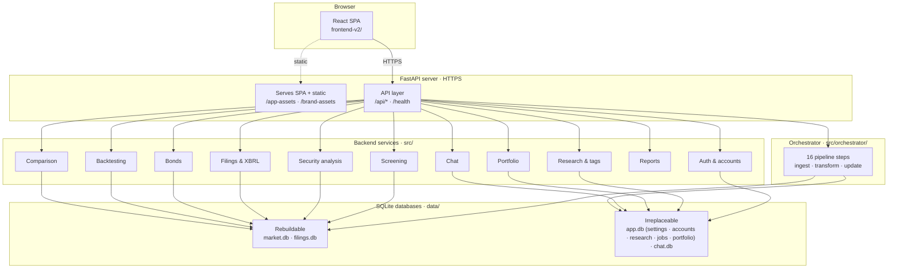

# Python Source File Reference (Living Document)

Last updated: 2026-10-09
- Central reference for runtime/test Python modules (`src/`), web app modules (`src/web_app/`), React frontend (`frontend-v2/`), and top-level scripts.
- For each file: what it owns, available functions, input/output contract, and key dependencies/calls.
- Designed to be updated continuously as functions are added/removed/changed.

---

## How to maintain this document

When updating code, update this file in the same PR/commit:

1. Add/remove function entries for changed files.
2. Update function signatures exactly (types/defaults).
3. Update dependency lists when called functions/modules/signals change.
4. Keep sections ordered by file path.
5. Update the `Last updated` date.

Suggested per-function format:
- `def name(args) -> ReturnType`
	- Purpose: ...
	- Inputs: ...
	- Output: ...
	- Calls/Dependencies: ...

---

## Current project status

- Default interface: the web workstation (FastAPI + React/TypeScript SPA) launched by `python main.py` is the primary maintained UI.
- Maintained top-level views: `Overview`, `Screen`, `Analyze`, `Backtest`, `Portfolio`, `Data pipeline`, `Filings`, `Compare`, `Research`, and `Chat`, plus `Account` and `Admin` when the role allows.
- Architecture status: `src.orchestrator` is a thin dispatcher with dynamically discovered step packages; backend modules are decoupled from `Config` and called with explicit parameters.
- Mature user-facing workflows: ingestion, ETL, ratio generation, backtesting, screening, security analysis, portfolio management, and company tags all have dedicated test coverage.
- Web workstation: React SPA served at `/`, `/pipeline`, `/screen`, `/analyze`, `/backtest`, and `/portfolio`; `/security` and `/backtesting` remain SPA compatibility aliases.
- Pipeline execution: `POST /api/pipeline/run` validates and queues work, returning `202`; a single managed worker persists truthful job/step state in `data/app.db`.
- Job history accepts bounded `limit`/`offset` pagination, and `/health` exposes only aggregate queue depth and counts by status.
- Ordinary HTTP exports and generated backtest artifacts use separate limits; rolling ZIPs are size-limited while being written to disk and incomplete archives are removed.
- Security boundary: loopback is the default. Remote binding requires explicit opt-in, a strong bearer token, and trusted hosts. Database and generated-file access is constrained to configured roots.

---

## Runtime modules (`src`)

### Hardening subsystem reference

- `src/api/models.py` owns pipeline request/response contracts.
- `src/api/runtime.py` owns the validated settings, job store, and job manager used by pipeline routes.
- `src/api/system_routes.py`, `pipeline_routes.py`, and `job_routes.py` own discovery/health, submission, and job lifecycle endpoints; `src.api.router:app` remains the stable facade.
- `src/pipeline_jobs/store.py` owns versioned SQLite persistence. `manager.py` owns the one-worker queue and terminal-state rules. `context.py` exposes cooperative cancellation/progress/workspace state. `redaction.py` bounds and redacts persisted output.
- `src/web_app/security.py` owns `AppSettings`, bearer authentication, trusted hosts, request/correlation IDs, safe error envelopes, request-size limits, and `PathPolicy`.
- `src/orchestrator/common/sqlite.py` exposes `connect_read`, `connect_write`, `transaction`, managed WAL initialization, existence helpers, and identifier quoting.
- `src/portfolio/models.py` owns Portfolio API contracts; `src/portfolio/schema.py` remains the compatibility facade for those models while owning versioned schema migrations. Materialized portfolio tables use owner-aware composite primary keys so rebuilding one account cannot replace another account's state.
- `src/screening/formatting.py` and `src/screening/persistence.py` own formatting and atomic saved-screen persistence behind the existing `src.screening` facade; screening run history is kept per user by `ResearchStore`.

## Architecture overview

The application is a React/TypeScript web workstation backed by a FastAPI server. Every `/api/*` route is mounted from an explicit composition root (`src/web_app/api/__init__.py`) and backed by a backend service in `src/`. The orchestrator is a thin dispatcher: it discovers step packages and delegates pipeline work to backend modules.

```mermaid
flowchart TB
    subgraph Browser["Browser"]
        SPA["React SPA<br/>frontend-v2/"]
    end

    subgraph Server["FastAPI server · HTTPS"]
        SERVE["Serves SPA + static<br/>/app-assets · /brand-assets"]
        API["API layer<br/>/api/* · /health"]
    end

    subgraph Services["Backend services · src/"]
        AUTH["Auth & accounts"]
        SCREEN["Screening"]
        SEC["Security analysis"]
        FIL["Filings & XBRL"]
        COMP["Comparison"]
        PORT["Portfolio"]
        RES["Research & tags"]
        BONDS["Bonds"]
        BT["Backtesting"]
        REP["Reports"]
        CHAT["Chat"]
    end

    subgraph Pipeline["Orchestrator · src/orchestrator/"]
        ORCH["16 pipeline steps<br/>ingest · transform · update"]
    end

    subgraph Data["SQLite databases · data/"]
        REBUILD["Rebuildable<br/>market.db · filings.db"]
        STATE["Irreplaceable<br/>app.db (settings · accounts · research · jobs · portfolio) · chat.db"]
    end

    SPA -->|"HTTPS"| API
    SPA -.->|"static"| SERVE
    API --> AUTH
    API --> SCREEN
    API --> SEC
    API --> FIL
    API --> COMP
    API --> PORT
    API --> RES
    API --> BONDS
    API --> BT
    API --> REP
    API --> CHAT
    API --> ORCH
    ORCH --> REBUILD
    SCREEN --> REBUILD
    SEC --> REBUILD
    FIL --> REBUILD
    BONDS --> REBUILD
    BT --> REBUILD
    COMP --> REBUILD
    AUTH --> STATE
    RES --> STATE
    PORT --> STATE
    CHAT --> STATE
    ORCH --> STATE
```

The FastAPI server mounts the pipeline/jobs, auth, admin, filings, research, reports, screening, security-analysis, splits, tags, backtesting, bonds, comparison, portfolio, chat, profiles, overview, and settings routers. The React frontend communicates with all endpoints through the authenticated API client layer in `frontend-v2/src/api/`; it never opens SQLite databases directly.

### [src/orchestrator/__init__.py](../src/orchestrator/__init__.py)

Responsibility: public orchestration API and step dispatch. The orchestrator is a thin dispatcher with **no business logic**. Step execution is discovered dynamically from step packages directly under `src/orchestrator`, so new step packages can be added without modifying the orchestrator runtime.

Architecture:
- **`src/orchestrator/orchestrator.py`**: runtime entry point that owns step registries, public API validation, and execution.
- **`src/orchestrator/common/__init__.py`**: shared `StepDefinition` type plus discovery helpers that scan immediate child step packages under `src/orchestrator`.
- **`src/orchestrator/common/validation.py`**: pipeline validation and step config normalization.
- **Discovered step packages**: each step lives in its own package such as `src/orchestrator/generate_financial_statements/` and exports `STEP_DEFINITION` only.
- `download_xbrl` supports explicit IDs, bounded `DocumentList` backfill, and an `all` mode that queues every eligible XBRL document using the dedicated `DocumentList.XbrlDownloaded` marker while preserving the legacy CSV `Downloaded` marker.
- `generate_financial_statements` accepts `Source_Mode="csv"` (legacy `financialData_full`) or `Source_Mode="filings"` (normalized numeric XBRL facts from `filings.db`); both modes write the same standardized statement tables to `market.db`. `ShareMetrics` per-share figures and ratios are the consolidated ones (an IFRS or US GAAP filer's from its own summary concepts, `_SHARE_METRICS_CONSOLIDATED_CONCEPTS`), on one scope per filing; afterwards `slips.correct_decimal_slips` corrects share counts, P/Es, and EPS an issuer tagged a power of ten off, where two of the report's own measures agree, recording each in `ShareMetrics_Corrections`.
- **`STEP_HANDLERS`**: generated registry mapping step names and aliases to discovered handlers.

- `def run(config=None, steps=None, on_step_start=None, on_step_done=None, on_step_error=None, cancel_event=None) -> None`
	- Purpose: Run the provided pipeline config.
	- Inputs: optional `Config` or config dict, optional ordered `steps`, optional callbacks, optional `cancel_event`.
	- Output: None.
	- Calls/Dependencies: `Config`, `validate_input`, `STEP_HANDLERS`.

- `def list_available_steps() -> list[dict]`
	- Purpose: Return the discovered step catalog for the UI, including step names, config keys, overwrite support, aliases, and input field definitions.
	- Inputs: none.
	- Output: list of step metadata dicts.

- `def validate_input(config, steps=None) -> list[dict]`
	- Purpose: Validate pipeline shape plus required top-level keys, required step-config fields, and typed field values. Returns normalized enabled steps.
	- Inputs: `Config` or config dict, optional ordered `steps`.
	- Output: normalized list of step dicts (raises `RuntimeError` on invalid input).

### [src/orchestrator/common/edinet.py](../src/orchestrator/common/edinet.py)

Responsibility: EDINET API wrapper, document listing, download/unzip, CSV ingestion to DB. (Was `src/edinet_api.py` before the orchestration rework.) No Config dependency; all parameters are passed explicitly via the constructor.

`class Edinet`
	- Purpose: EDINET HTTP wrapper and helpers to download, extract and ingest financial CSVs into the project DB.
	- Constructor: `Edinet(base_url, api_key, db_path, raw_docs_path=None, doc_list_table=None, company_info_table=None, taxonomy_table=None)`

	- `def get_All_documents_withMetadata(self, start_date, end_date) -> list` - Iterate a date range via the EDINET listing API and persist discovered document metadata.
	- `def downloadDoc(self, docID, fileLocation=None, docTypeCode=None) -> None` - Download a single EDINET document ZIP.
	- `def downloadDocs(self, input_table, output_table=None, filter=None) -> None` - Download and extract all not-yet-downloaded documents.
	- `def load_financial_data(self, financialFiles, table_name, doc, connection=None) -> None` - Read extracted TSV/CSV financial files into a DataFrame and persist.
	- `def store_edinetCodes(self, csv_file, target_database=None, table_name=None) -> None` - Load EDINET company codes CSV into the DB.

### [src/orchestrator/common/corporate_actions.py](../src/orchestrator/common/corporate_actions.py)

Responsibility: put reported per-share figures on the split-adjusted share basis of the stored prices. Split events come from confirmed `Stock_Splits` rows (dated at the ex-date; holdings change up to five days later, at the record date; squeeze-outs beyond 100-to-1 are skipped, and records of one ratio within ten days, or a price-heuristic record within a quarter of the provider's, are one split: `distinct_split_records`), from the year-end and filing-date share counts of one annual report, and from fiscal-year-end issued share counts in consecutive reports (standard ratios; near misses confirmed by book value or dividends per share). A share-count change with a better-dated split inside is that split's, and a filing-date count beside the recorded split it shows (dated within the record-date allowance or up to a quarter after filing) is one split; a second split in the same year needs a standard ratio and book value per share to confirm it. The year-end price (stored over P/E × EPS, a loss year's negative P/E and EPS included) confirms a split hidden by a share issue, shows when a report already restated a split that took effect after its year end, and vetoes a count that moved by a split's ratio while the price as traded and the stored price stayed together (an issue, buyback, or cancellation of treasury shares; `_price_denies`, comparing the nearest priced reports surely either side). A small ratio (under 1.5) left unrecorded where Yahoo priced every day needs the prices to confirm it, since Yahoo records each split it adjusts for. A report filed after a split took effect counts as restated unless its book value per share is still on the year-end shares and its price as traded steps by the ratio to the next report's; for a recorded split, the last report before it counts as restated when its price or book value says so (a split decided before filing that takes effect months later), unless another split between the reports compared explains them. A price-heuristic record is dropped when the provider records a split of the same ratio between the same two year ends and the share count moved by it once (`_without_heuristic_twins`). A company without a ticker (delisted, or never listed) is keyed by its EDINET code (`_company_key_sql`), so its splits are read from its reports. A share-count fall reads as a consolidation only by a whole number of shares into one (1/2, 1/5, 1/10); a count down by a tenth or a sixth is a cancellation of shares.

- `load_split_events(conn, tickers, ...) -> dict[str, list[SplitEvent]]` — every known split per ticker.
- `dividend_payments(rows) -> DataFrame` — annual dividends as interim and final payments at their record dates.
- `adjust_payments_for_splits(payments, events, raw_events=None) -> DataFrame` — divides each payment by the later splits (interim payments inside an inferred window are placed by amount); adds `split_factor` and `reported_per_share`.
- `raw_basis_events(conn, prices_table, events)` — events across which the stored price level still steps by the ratio (left unadjusted).
- `filing_basis_factors(conn, *, tickers=None, events=None) -> list[FilingBasis]` — per filing, `restated` for figures issuers restate for splits before filing (EPS, BPS, shares at the filing date), `fiscal` for figures fixed at the year end (year-end share counts and per-share ratios from them), `interim` for the interim dividend, and `dividend` for the year's dividend (interim and final either side of a split); screening joins them as `temp.share_basis`.

### [src/orchestrator/common/share_basis.py](../src/orchestrator/common/share_basis.py)

Responsibility: which stored columns move with share splits and how (`SHARE_BASIS_COLUMNS`: `ShareMetrics`, `PerShare_Metrics`, and the averages in their `_Rolling` tables, each with its factor and whether it multiplies or divides), `share_basis_rule(table, column)`, and `to_adjusted_basis(value, factor, operator)`. Stored tables keep figures as filed; screening, the rolling step, statement history (`src/security_analysis/history.py`, which returns `reported_values` and the splits), and the Analysis overview apply the factors. `rolling_columns.py` names the rolling tables and columns, and `own_filings.py` keeps a company's own annual reports apart from those a trust bank files for its trusts.

### [src/backtesting/detail.py](../src/backtesting/detail.py), [src/backtesting/html_report.py](../src/backtesting/html_report.py)

Responsibility: drill-down views and the shareable report of saved backtests. `build_single_detail(result)` turns a stored single result into per-holding growth, yearly rows, dividends, allocation drift, and cumulative contributions (`GET /api/backtesting/result/{id}/detail`). `render_report(stored, meta=None, backtest_id="")` renders a saved single, rolling, or CSV result as one self-contained HTML page with inline SVG charts (`GET /api/backtesting/report/{id}`; also `report.html` in archives).

### [src/bonds/](../src/bonds/)

Responsibility: corporate bonds from EDINET filings, valued on the JGB curve and JSDA reference prices; stored in the bond tables of the rebuildable `market.db` (`db_config.get_market_db()`), beside the `DocumentList` and `CompanyInfo` they read.

- `parsing.py` — `parse_issuance(zip)` reads a shelf-registration supplement's label/value tables (merged cells expanded, multi-row fields joined, notes attached to their bond) into `IssuedBond`s with amount, issue price, coupon and kind, frequency, maturity, first call, collateral, covenants, features, seniority, and ratings; `parse_bond_schedule(zip)` reads the annual report's 社債明細表 (or the IFRS bonds-and-borrowings note) into `ScheduleRow`s with issuer, balances, coupon, maturity, and currency. Helpers normalise era dates, 億/百万円 amounts, percentages, and ratings (`rating_notch`, `notch_label`: AAA = 1).
- `valuation.py` — clean/dirty price, yield, and modified duration on the browser calculator's conventions; `CurveBook`/`Curve` give the JGB par curve on or before a date, linear between tenors.
- `market.py` — Ministry of Finance JGB curve CSVs (`parse_jgb_csv`, `fetch_jgb_curve`). `jsda.py` — JSDA reference-price files (`parse_reference_csv`, `fetch_reference_prices` with rate-limit handling) and `match_quotes` by maturity, coupon, series, and issuer name.
- `build.py` — `build_bonds(conn, db2_path)` merges the latest schedule per company with supplements (by series and maturity, or maturity and coupon), marks redeemed, matured, and likely-private bonds, infers issuer ratings by ranking, and adds spreads at issue and matched JSDA yields and spreads.
- `update.py` — `update_bonds(...)` runs the step: pending supplements (downloaded four at a time and stored), pending annual reports (read from `filings.db` one archive at a time, selecting on pre-BLOB columns), the curve, JSDA prices, and the rebuild.
- `service.py` and `api.py` — `GET /api/bonds/status`, `/company/{edinet_code}` (bonds, totals, ladder, documents), `/market` (every outstanding bond, gzipped; company fields once per company), `/bond/{bond_id}` (terms, valuation, peer fair value, similar bonds, spread curve, price history), and `/documents/{doc_id}` (the stored supplement ZIP; accounts only).

### [src/orchestrator/update_bonds/update_bonds.py](../src/orchestrator/update_bonds/update_bonds.py)

Responsibility: the `update_bonds` pipeline step; reads the `edinet.api_key` setting and passes the step's flags to `src.bonds.update.update_bonds`.

### [src/orchestrator/common/backtesting.py](../src/orchestrator/common/backtesting.py)

Responsibility: portfolio construction, price/dividend ingestion, return calculations, performance metrics, human-readable reports and charts. (Was `src/backtesting.py` before the orchestration rework.)

- `def _normalise_portfolio_entry(spec) -> tuple[str, float]`
	- Purpose: Parse a single portfolio entry (legacy float or dict) into a canonical `(mode, numeric_value)` tuple.
	- Inputs: `spec` - an `int`/`float` (legacy weight) or `dict` with keys `mode` and `value`.
	- Output: `(mode, value)` where `mode` is one of `"weight"|"shares"|"value"`.
	- Calls/Dependencies: `logger.warning`.

- `def resolve_portfolio_allocations(portfolio_config: dict, start_prices: dict[str, float], initial_capital: float = 0.0) -> tuple[dict[str, float], float, list[str]]`
	- Purpose: Resolve mixed-mode allocation specs (weights, fixed shares, fixed value) into normalised portfolio weights and an effective capital amount.
	- Inputs: `portfolio_config` (ticker → spec), `start_prices` (ticker → opening price), `initial_capital` (user-supplied or 0 to derive).
	- Output: `(portfolio_weights, effective_capital, warnings)` where `portfolio_weights` sums to 1.0 (unless empty), `effective_capital` is the capital used for allocation, and `warnings` lists issues (missing start prices, inconsistent totals).
	- Calls/Dependencies: `_normalise_portfolio_entry`, `logger.warning`.

- `def get_portfolio_prices(db_path: str, prices_table: str, tickers: list[str], start_date: str, end_date: str, *, conn: sqlite3.Connection | None = None) -> pandas.DataFrame`
	- Purpose: Query the `prices_table` for daily `Date, Ticker, Price` rows for the requested tickers and date range.
	- Inputs: `db_path`, `prices_table`, `tickers`, `start_date` (YYYY-MM-DD), `end_date` (YYYY-MM-DD), optional `conn`.
	- Output: `pd.DataFrame` (long form) with columns `Date` (datetime), `Ticker`, `Price` (numeric), ordered by `Date`.
	- Calls/Dependencies: `read_sql_query`, `to_datetime`, `to_numeric`, `sqlite3.connect`, `conn.close`.

- `def get_dividend_data(db_path: str, per_share_table: str, company_table: str, tickers: list[str], start_date: str, end_date: str, *, financial_statements_table: str = "FinancialStatements", dividend_column: str | None = None, conn: sqlite3.Connection | None = None) -> pandas.DataFrame`
	- Purpose: Load per-share dividend records for tickers and map them to `periodEnd` dates. Supports both modern (`PerShare` with `docID`) and legacy schemas (`edinetCode` + `periodEnd`).
	- Inputs: DB path, `per_share_table`, `company_table`, ticker list, date range, optional `financial_statements_table`, optional explicit `dividend_column`, optional `conn`.
	- Output: `pd.DataFrame` with columns `Ticker`, `periodEnd` (datetime), `PerShare_Dividends` (numeric). Empty DataFrame when no supported dividend column or no tickers.
	- Calls/Dependencies: `conn.execute`, `read_sql_query`, `to_datetime`, `to_numeric`, `logger.warning`, `conn.close`.

- `def calculate_portfolio_returns(prices_df: pd.DataFrame, portfolio_weights: dict[str, float], dividends_df: pd.DataFrame | None = None) -> pd.DataFrame`
	- Purpose: Compute weighted daily portfolio returns and cumulative returns. Prices are forward-filled; dividends are treated as cash (not reinvested) and added to portfolio value from their pay date onward.
	- Inputs: `prices_df` (long form with `Date`,`Ticker`,`Price`), `portfolio_weights` (ticker → weight), optional `dividends_df` (with `Ticker`,`periodEnd`,`PerShare_Dividends`).
	- Output: `pd.DataFrame` indexed by `Date` with columns `portfolio_return` (daily) and `cumulative_return` (level series).
	- Calls/Dependencies: `pivot_table`, `ffill`, `pct_change`.

- `def calculate_return_decomposition(prices_df: pd.DataFrame, portfolio_weights: dict[str, float], dividends_df: pd.DataFrame | None = None) -> dict[str, pd.DataFrame]`
	- Purpose: Produce three time series: `total` (price + dividends), `price_only`, and `dividend_only` (additive decomposition where `total = price_only + dividend_only`).
	- Inputs: same as `calculate_portfolio_returns`.
	- Output: `dict` with keys `total`, `price_only`, `dividend_only`; each value is a `DataFrame` indexed by `Date` containing daily and cumulative returns.
	- Calls/Dependencies: `calculate_portfolio_returns`.

- `def calculate_per_company_returns(prices_df: pd.DataFrame, portfolio_weights: dict[str, float], dividends_df: pd.DataFrame | None = None, initial_capital: float = 0.0) -> pd.DataFrame`
	- Purpose: Produce a per-ticker breakdown (start/end price, price return, dividend return, total return, weight and weighted contributions). When `initial_capital` > 0 includes concrete `capital_invested`, `shares_purchased`, `dividends_received` and `market_value`.
	- Inputs: `prices_df`, `portfolio_weights`, optional `dividends_df`, optional `initial_capital`.
	- Output: `pd.DataFrame` with columns including `Ticker`, `start_price`, `end_price`, `price_return`, `dividend_return`, `total_return`, `weight`, `weighted_*` and optional `capital_invested`, `shares_purchased`, `dividends_received`, `market_value`.
	- Calls/Dependencies: `groupby`, `iterrows`, `pd.DataFrame`.

- `def calculate_yearly_returns(decomposition: dict[str, pd.DataFrame]) -> pd.DataFrame`
	- Purpose: Aggregate cumulative-return series into calendar-year price/dividend/total returns.
	- Inputs: `decomposition` (output of `calculate_return_decomposition`).
	- Output: `pd.DataFrame` with `Year`, `Price Return`, `Dividend Return`, `Total Return`.

- `def calculate_dividends_by_company_year(dividends_df: pd.DataFrame | None, shares_purchased: dict[str, float] | None = None) -> pd.DataFrame`
	- Purpose: Pivot per-share dividends into a Year × Ticker table. If `shares_purchased` is provided, values become cash received (per-share × shares).
	- Inputs: `dividends_df`, optional `shares_purchased` map.
	- Output: `pd.DataFrame` indexed by `Year` with one column per ticker and a `Total` column.

- `def calculate_benchmark_returns(prices_df: pd.DataFrame, benchmark_ticker: str, dividends_df: pd.DataFrame | None = None) -> pd.DataFrame`
	- Purpose: Compute daily benchmark returns with price/dividend decomposition and cumulative series.
	- Inputs: `prices_df` (long form), `benchmark_ticker`, optional `dividends_df` for the benchmark.
	- Output: `pd.DataFrame` indexed by `Date` with columns `benchmark_return`, `cumulative_return`, `price_return`, `cum_price_return`, `dividend_return`, `cum_dividend_return`.

- `def calculate_metrics(portfolio_df: pd.DataFrame, benchmark_df: pd.DataFrame | None, start_date: str, end_date: str, risk_free_rate: float = 0.0) -> dict`
	- Purpose: Compute summary performance metrics: `total_return`, `annualized_return`, `volatility` (annualised), `sharpe_ratio`, `max_drawdown`, and benchmark equivalents when available.
	- Inputs: `portfolio_df` (from `calculate_portfolio_returns`), optional `benchmark_df` (from `calculate_benchmark_returns`), `start_date`, `end_date`, `risk_free_rate`.
	- Output: `dict` containing stated metrics plus `risk_free_rate`, and optional `benchmark_*` fields.
	- Calls/Dependencies: `pd.to_datetime`, `np.sqrt`, `cummax`.

- `def generate_report(metrics: dict, output_file: str, decomposition: dict | None = None, per_company: pd.DataFrame | None = None, benchmark_df: pd.DataFrame | None = None, yearly_returns: pd.DataFrame | None = None, dividends_by_year: pd.DataFrame | None = None) -> str`
	- Purpose: Render a human-readable textual backtest report (tables and summaries) and write it to `output_file`.
	- Inputs: `metrics` dict produced by `calculate_metrics`, optional decomposition/per-company/yearly/dividends tables.
	- Output: The textual report string (also written to disk).
	- Calls/Dependencies: `os.makedirs`, `open`, `logger.info`.

- `def generate_backtest_charts(decomposition: dict[str, pd.DataFrame], benchmark_df: pd.DataFrame | None, per_company: pd.DataFrame | None, output_dir: str, start_date: str, end_date: str, dividends_by_year: pd.DataFrame | None = None) -> list[str]`
	- Purpose: Create visualisations (PNG) for cumulative returns, drawdown, decomposition, per-company breakdown and dividends-by-year.
	- Inputs: decomposition, optional `benchmark_df`, optional `per_company`, `output_dir`, `start_date`, `end_date`, optional `dividends_by_year`.
	- Output: List of file paths created. If `matplotlib` is not installed returns an empty list.
	- Calls/Dependencies: `matplotlib.pyplot.subplots`, `fig.savefig`, `np.arange`, `os.makedirs`, `logger.info`.

- `def run_backtest(backtesting_config: dict, db_path: str, prices_table: str = "stock_prices", ratios_table: str = "PerShare", company_table: str = "companyInfo", financial_statements_table: str = "FinancialStatements") -> dict`
	- Purpose: High-level runner used by the orchestrator. Orchestrates data retrieval, allocation resolution, return calculations, metric computation, report writing and chart generation.
	- Inputs: `backtesting_config` (must include `start_date`, `end_date`, `portfolio`; may include `benchmark_ticker`, `output_file`, `risk_free_rate`, `initial_capital`), `db_path`, and optional table names.
	- Output: `metrics` dict (same shape as produced by `calculate_metrics` with additional attachments such as `per_company` list and `chart_files`).
	- Calls/Dependencies: `get_portfolio_prices`, `get_dividend_data`, `resolve_portfolio_allocations`, `calculate_portfolio_returns`, `calculate_return_decomposition`, `calculate_per_company_returns`, `calculate_yearly_returns`, `calculate_dividends_by_company_year`, `calculate_benchmark_returns`, `calculate_metrics`, `generate_report`, `generate_backtest_charts`.

- `_BACKTEST_DURATIONS: dict[str, int]`
	- Purpose: Predefined duration labels used by the backtest-set runner (e.g. `"1yr"`, `"2yr"`, ...).

- `def _generate_set_summary(all_results: list[dict], output_file: str) -> None`
	- Purpose: Produce an aggregate textual summary for a batch of backtests (mean/median stats, benchmark comparisons, per-backtest table) and write to `output_file`.
	- Inputs: `all_results` (list of result entries produced by `run_backtest_set`), `output_file` path.
	- Output: None (writes file).

- `def run_backtest_set(config: dict, db_path: str, prices_table: str = "stock_prices", ratios_table: str = "PerShare", company_table: str = "companyInfo", financial_statements_table: str = "FinancialStatements") -> list[dict]`
	- Purpose: Convenience runner that reads a CSV of yearly scored portfolios and executes a set of horizon backtests for each year (1,2,3,5,10 years by default), emitting per-run reports and an aggregate summary.
	- Inputs: `config` (must include `csv_file`, may include `benchmark_ticker`, `output_dir`, `risk_free_rate`, `initial_capital`), `db_path`, optional table names.
	- Output: List of result dicts (one per individual backtest), and writes an aggregate summary via `_generate_set_summary`.
	- Calls/Dependencies: `pd.read_csv`, `run_backtest`, `_generate_set_summary`.

---

### [src/paths.py](../src/paths.py)

Responsibility: the application's filesystem roots. `app_dir()` is the folder holding the executable (frozen) or the repository root; `bundle_dir()` holds bundled read-only files (PyInstaller's unpack folder when frozen; never written). `data_dir()` is `app_dir()/data` or `EDINET_DATA_DIR`, and `app_db_path`, `chat_db_path`, `default_market_db_path`, `default_filings_db_path`, `certs_dir`, `logs_dir`, `artifacts_dir`, `backtests_dir`, `reports_dir`, `exports_dir`, `jobs_dir`, `manual_uploads_dir`, and `downloads_dir` are fixed places inside it. Runtime folders are never derived from `__file__`.

### [src/orchestrator/common/db_config.py](../src/orchestrator/common/db_config.py)

Responsibility: the four database locations.

- `def get_app_db() -> str` - `data/app.db`: settings, secrets, accounts, research, pipeline jobs, portfolio.
- `def get_chat_db() -> str` - `data/chat.db`.
- `def get_market_db() -> str` - `data/market.db`, or the `storage.market_db_path` setting.
- `def get_filings_db() -> str` - `data/filings.db`, or the `storage.filings_db_path` setting.
- `def reload() -> None` - forget the cached storage settings and layout check.
- Every getter first checks `migrate_layout.pending_databases()` and raises `LegacyLayoutError` while an old-layout database has not been migrated, so no lookup creates an empty database beside a real one.

### [src/orchestrator/common/migrate_layout.py](../src/orchestrator/common/migrate_layout.py)

Responsibility: the one-time move from the old nine-database layout (`data/databases`, `config/state`, `config/database_paths.json`, `.env`) into the data folder. Only runs for the default data folder.

- `def plan(app_dir=None, data_dir=None) -> list[Step]` - every step still needed, each skipped once its target exists.
- `def migrate_legacy_layout(*, dry_run=False, report=print) -> list[str]` - checks no old database is open, then merges auth/research/pipeline_jobs/Portfolio into `app.db` (built as `app.db.partial`, renamed when complete), imports the chat key ring and the `.env` API key as settings, moves chat and Filings, merges Base and Bonds into Standardized and renames it `market.db`, moves generated folders into `artifacts/`, records each saved backtest's `owner.json`/`meta.json` in `saved_backtests`, and keeps every merged or imported file with a `.migrated` suffix.
- `def pending_databases() -> list[Path]` - old database files whose new home does not exist yet.
- Copies a database by executing each object's stored DDL and `INSERT … SELECT *`; unscoped `schema_migrations` rows are recorded under the owning component, and `sqlite_sequence` counters are carried over.

### [src/backtesting/catalog.py](../src/backtesting/catalog.py)

Responsibility: `BacktestCatalog` owns the `saved_backtests` table in `app.db`: the account that ran each saved backtest (`record_owner`) and the kind, title, subtitle, and headline figures the saved-results list shows (`describe`, `get`, `all`). The result files stay in their folder under `data/artifacts/backtests`; a folder without a row is an unowned legacy result, visible to administrators only.

### [src/orchestrator/common/database_bootstrap.py](../src/orchestrator/common/database_bootstrap.py)

Responsibility: Startup creation and schema initialization for the four databases.

- `def ensure_application_databases(*, settings=None, app_db_path=None, chat_db_path=None, market_db_path=None, filings_db_path=None, busy_timeout_ms=None) -> dict[str, Path]` - runs the idempotent initializers of the settings, auth, research, pipeline-jobs, and portfolio components on `app.db`, of chat on `chat.db`, the bond tables on `market.db` (its other tables are pipeline-owned), and the filing catalog on `filings.db`. Called from the web server lifespan.

### [src/orchestrator/common/sqlite.py](../src/orchestrator/common/sqlite.py) (migrations)

- `def schema_version(conn, component) -> int` / `def record_schema_version(conn, component, version, applied_at) -> None` - per-component migration bookkeeping in `schema_migrations(component, version, applied_at)`, so several components can share `app.db`. A pre-existing unscoped table is adopted by the first component that opens the file.

### [src/orchestrator/common/ratios.py](../src/orchestrator/common/ratios.py)

Responsibility: Ratio generation logic consumed by `generate_ratios` and `generate_rolling_metrics` step packages.

### [src/orchestrator/common/sqlite.py](../src/orchestrator/common/sqlite.py)

Responsibility: Shared SQLite helpers (table creation, schema introspection, batch operations).

### [src/orchestrator/common/validation.py](../src/orchestrator/common/validation.py)

Responsibility: Pipeline validation - step config default application, pipeline normalization, and required-key validation.

- `def apply_step_config_defaults(config, steps, step_definitions)` - Apply field defaults from step definitions.
- `def normalize_pipeline_steps(config, steps)` - Resolve enabled steps from run_config.
- `def validate_pipeline_input(config, steps, step_definitions)` - Check required keys and field types.

---

### [src/utilities/stock_prices.py](../src/utilities/stock_prices.py)

Responsibility: Shared stock price provider access and persistence helpers used by stock price steps.

- `def load_ticker_data(ticker: str, prices_table: str, conn) -> bool`
	- Purpose: Fetch normalized history for `ticker`, append new rows, return `False` when the upstream provider flow fails.
	- Calls/Dependencies: `_load_provider_history`, `pd.read_sql_query`, `_append_price_rows`, `logger`.

- `def _load_provider_history(ticker: str, start_date: str | None = None) -> tuple[str, pd.DataFrame, list[dict]]`
	- Purpose: Try the JPX quote JSON endpoint first for Japanese tickers, then Stooq and Yahoo Finance chart fallbacks; normalize the returned price history and authoritative provider split events. JPX's 360-session window is used for incremental coverage and is skipped when it would truncate an initial/older backfill.
	- Calls/Dependencies: `_fetch_jpx_history`, `_fetch_stooq_history`, `_fetch_yahoo_history`, `_normalise_price_history`.

- `def _request_with_retries(provider, request_fn, url, *, response_validator=None, cooldown_on_failure=True, **kwargs) -> requests.Response`
	- Purpose: Apply bounded retry/backoff handling to transient provider failures, honor `Retry-After`, detect rate-limit responses, and cool down blocked providers between ticker requests.

- `def _fetch_jpx_history(provider_ticker: str, start_date: str | None = None) -> pd.DataFrame`
	- Purpose: Fetch JPX's `qjsonp.aspx` stock-detail JSON (Referer-gated) and parse its split-adjusted `A_HISTDAYL` closing prices for the latest 360 trading sessions; in-JSON error statuses are retried with backoff.

- `def _validate_jpx_response(response) -> None`
	- Purpose: Treat JPX's HTTP-200 `{"status": !=0}` error payloads as retryable provider failures so `_request_with_retries` applies backoff and cooldown.

- `def _create_prices_table(conn, table_name) -> None`
	- Purpose: Ensure the destination stock-prices table exists, migrate row-level provenance columns, and create lookup indexes.
	- Calls/Dependencies: SQLite DDL, `price_provenance.ensure_price_provenance_columns`, `logger`.

- `def _append_price_rows(conn, prices_table, ticker, df, currency, *, provider=None, price_basis=None, provider_symbol=None, source_revision=None, retrieved_at=None, split_events=None) -> None`
	- Purpose: Append source quotes without rewriting `Price`; records provider, stable source ID/revision, retrieval timestamp, and raw/adjusted/unknown basis using transaction-preserving SQLite inserts so overwrite SAVEPOINTs remain active.

- `def reconcile_ticker_price_basis(conn, prices_table, ticker) -> dict`
	- Purpose: Explicitly repair reviewed legacy mixed-basis boundaries; this is separate from normal ingestion and never runs implicitly.

### [src/utilities/price_provenance.py](../src/utilities/price_provenance.py)

Responsibility: Idempotent Stock_Prices provenance migration and the SQL-friendly split-adjusted read model.

- `def ensure_price_provenance_columns(conn, table_name="Stock_Prices") -> set[str]` - Add provenance columns without replacing existing rows; pre-existing rows are marked `unknown`.
- `def refresh_split_adjusted_prices(conn, ticker=None, prices_table="Stock_Prices") -> int` - Populate `Split_Adjustment_Factor` and `Adjusted_Price` for raw rows from confirmed raw-basis split events, for unknown rows from the confirmed splits their closes still step by at its date (`split_jump_in_closes`), and for adjusted rows from a confirmed split their own closes still step by within a week of it (`unadjusted_split_step`: daily quotes fetched before the split, or a provider that lists a split it has not adjusted its history for), up to the step and only for rows fetched before the split unless the provider served the step itself; source `Price` is never changed. Squeeze-outs (`is_squeeze_out`: more than a hundred shares into one) never adjust prices, and duplicate records of one split adjust once (`distinct_split_records`).
- `def source_id(provider, provider_symbol, date) -> str` - Build a stable row-level provenance identifier.

`Stock_Prices` provenance columns: `Price_Basis`, `Provider`, `Source_Id`, `Source_Revision`, `Adjustment_Factor`, `Split_Adjustment_Factor`, `Adjusted_Price`, and `Retrieved_At`.

JPX and Yahoo daily historical closes are stored as received with `Price_Basis='adjusted'` (split-adjusted); Stooq, ETF, and user CSV rows remain `unknown` until their adjustment convention is reviewed.

### [src/portfolio/split_schema.py](../src/portfolio/split_schema.py)

Responsibility: Managed `Stock_Splits`/`Split_Detection_Watermarks` schema with source/action metadata, confirmation state, and basis semantics.

- `def ensure_split_tables(db2_path=None, conn=None) -> None` - Create or migrate split/action tables and indexes without replacing history.

### [src/portfolio/split_detection.py](../src/portfolio/split_detection.py)

Responsibility: Conservative price-heuristic detection and annual-report/share-price cross-checking.

- `def detect_splits_by_price_heuristic(conn, ticker, threshold=0.40, start_date=None) -> list[dict]` - Detect integer/fractional discontinuities while carrying source/basis context and honoring incremental watermarks.
- `def verify_split_with_share_metrics(conn, ticker, candidate_date_str, candidate_ratio_from, candidate_ratio_to) -> dict` - Compare issued-share and, when available, report share-price ratios.
- `def run_split_detection(db2_path, tickers=None, mode="incremental", threshold=0.40) -> dict` - Persist pending/confirmed/rejected events and update per-ticker scan watermarks.

### [src/orchestrator/update_stock_prices/update_stock_prices.py](../src/orchestrator/update_stock_prices/update_stock_prices.py)

Responsibility: Step-owned workflow that decides which company tickers should be refreshed before delegating actual provider queries to the shared stock price utilities.

- `def update_all_stock_prices(db_name, Company_Table, prices_table, context=None, overwrite=False) -> None`
	- Purpose: Select eligible tickers from the configured company and financial-data tables, then call `load_ticker_data` for each one. Individual provider failures are logged while later tickers continue. With `overwrite=True`, each selected ticker is replaced transactionally and failed/empty downloads roll back to the previous rows.
	- Calls/Dependencies: `sqlite3.connect`, `stock_prices._create_prices_table`, `cursor.execute`, `stock_prices.load_ticker_data`, `conn.close`.

### [src/orchestrator/update_fx_data/update_fx_data.py](../src/orchestrator/update_fx_data/update_fx_data.py)

Responsibility: Step-owned workflow for importing ECB historical FX data and central-bank CPI/inflation data into the Stock_Prices table.

**FX (ECB):**
- `def _download_ecb_fx_csv(session=None) -> pd.DataFrame` — download eurofxref-hist ZIP, parse CSV.
- `def _transform_ecb_fx_to_prices(df) -> pd.DataFrame` — melt wide CSV to long Stock_Prices format.
- `def _fetch_ecb_fx_prices() -> pd.DataFrame` — download + transform in one call.

**Inflation / CPI:**
- `def _download_fred_cpi(series_id, session=None) -> pd.DataFrame` — download a FRED CPI series (USD/JPY/GBP/AUD/CAD). Returns Date/Price DataFrame.
- `def _download_ecb_hicp(session=None) -> pd.DataFrame` — download ECB HICP (Euro area CPI) via SDMX API.
- `def _fetch_all_inflation_prices() -> pd.DataFrame` — fetch all 6 inflation tickers (`Inflation_USD`, `Inflation_JPY`, `Inflation_GBP`, `Inflation_AUD`, `Inflation_CAD`, `Inflation_EUR`) and assemble into Stock_Prices format.

**Shared:**
- `def _insert_new_pairs(df, db_name, prices_table, *, label) -> int` — dedup on (Date, Ticker), insert, return count.
- `def update_fx_data(db_name, prices_table="Stock_Prices") -> dict[str, int]` — run both FX and inflation imports. Returns `{"fx": int, "inflation": int}`.
- `def run_update_fx_data(config, overwrite=False) -> None` — orchestrator handler.

Data sources: ECB eurofxref-hist.zip (FX), FRED graph CSV (5 CPI series), ECB SDMX API (EUR HICP). All free, no API keys.

### [src/orchestrator/import_stock_prices_csv/import_stock_prices_csv.py](../src/orchestrator/import_stock_prices_csv/import_stock_prices_csv.py)

Responsibility: Step-owned workflow for importing user-supplied stock price CSV files into the stock prices table.

- `def import_stock_prices_csv(db_name, prices_table, csv_path, ...) -> int`
	- Purpose: Normalize a user-supplied price CSV, fill configured defaults, skip already-imported `Date` + `Ticker` pairs, and append new rows.
	- Calls/Dependencies: `pd.read_csv`, `pd.to_datetime`, `pd.to_numeric`, `pd.read_sql_query`, `stock_prices._create_prices_table`, `to_sql`, `conn.commit`.

---

### [src/utilities/__init__.py](../src/utilities/__init__.py)

Responsibility: public utilities package facade and discovery entry point.

- Package structure: `src/utilities/__init__.py`, `src/utilities/utils.py`, `src/utilities/logger.py`.
- Discovery: `DISCOVERED_UTILITY_MODULES` is built from modules under `src/utilities/`.
- Backward compatibility: `src/utils.py` and `src/logger.py` remain as thin facades that forward to the new package modules.

### [src/utilities/utils.py](../src/utilities/utils.py)

Responsibility: Small helpers used across modules (URL building, CSV helpers, simple CSV queries).

- `def generateURL(docID, base_url, api_key, doctype=None) -> str`
	- Purpose: Construct EDINET download URL from explicit parameters.

- `def json_list_to_csv(json_list, csv_filename) -> None`
	- Purpose: Write list-of-dicts to CSV.

- `def get_latest_submit_datetime(csv_filename) -> Optional[str]`
	- Purpose: Parse CSV and return latest `submitDateTime` as string.

---

### [src/utilities/logger.py](../src/utilities/logger.py)

Responsibility: Centralized logging setup.

- `class LogSetup` / `def setup_logging(...)` - configure console/file handlers and rotate/archival behavior.
`class LogSetup`
	- Purpose: Configure application logging with file and console handlers. The default directory is the data folder's `logs/` (`src.paths.logs_dir`).

	- `def __init__(self, log_dir: str | None = None, log_filename: str = "server.log") -> None`
		- Purpose: Ensure log and archive directories exist and record paths.
		- Inputs: `log_dir`, `archive_dir`.
		- Output: None (initializes instance fields).
		- Calls/Dependencies: `Path.mkdir`.

	- `def setup_logging(self) -> tuple[logging.Logger, str]`
		- Purpose: Configure root logger, add file and console handlers, and return `(logger, log_filepath)`.
		- Inputs: none (uses instance `log_dir`/`archive_dir`).
		- Output: `(logger, log_filepath)` tuple.
		- Calls/Dependencies: `_archive_existing_logs`, `logging.getLogger`, `logging.FileHandler`, `logging.StreamHandler`, `logger.addHandler`, `logger.removeHandler`.

	- `def _archive_existing_logs(self) -> None`
		- Purpose: Move existing `run_*.log` files into the archive directory.
		- Inputs: none
		- Output: None (moves files on disk).
		- Calls/Dependencies: `self.log_dir.glob`, `shutil.move`.

`def setup_logging(log_dir: str = "logs", archive_dir: str = "logs/archive") -> tuple[logging.Logger, str]`
	- Purpose: Convenience wrapper that instantiates `LogSetup` and returns `LogSetup.setup_logging()` results.
	- Inputs: `log_dir`, `archive_dir`.
	- Output: `(logger, log_filepath)`
	- Calls/Dependencies: `LogSetup.setup_logging`.

---

## Configuration

### [src/settings/](../src/settings/)

Responsibility: operator settings and server secrets, stored as JSON rows in the `settings` table of `app.db`. Nothing is read from environment variables or files.

- `registry.py` - `SETTINGS`, one `SettingSpec(key, kind, default, label, description, choices, minimum, restart)` per setting (`edinet.api_key`, `auth.mode`, `server.trusted_hosts`, `pipeline.allowed_data_roots`, four `limits.*`, `jobs.retention_hours`, `storage.market_db_path`, `storage.filings_db_path`, and the internal `chat.message_keys`); `validate` and `parse_text` normalize values and raise `SettingError`.
- `store.py` - `SettingsStore` (get, rows, set, set_if_missing, delete) and `read_stored_value(s)`, which read without creating `app.db`. It opens SQLite itself so importing settings never triggers pipeline-step discovery.
- `__init__.py` - `get_setting`, `load_settings`, `set_setting`, `unset_setting`, `describe_settings` (secret values never included), and `edinet_api_key()`, read at call time.
- `api.py` - administrator routes `GET /api/admin/settings`, `PUT /api/admin/settings/{key}` (`{"value": …}`), and `DELETE /api/admin/settings/{key}`; changes are written to the auth audit log.

### [config.py](../config.py)

Responsibility: Explicit in-memory pipeline configuration.

`class Config`
	- Purpose: Wrap a request/programmatically supplied settings dictionary. It does not load `run_config.json`, `.env`, or environment variables; operator settings come from `src.settings`.

	- `def get(self, key, default=None)`
		- Purpose: Get a value from the settings dict.

	- `@classmethod def from_dict(cls, settings: dict) -> Config`
		- Purpose: Create a Config instance from an explicit dictionary.
		- Inputs: `settings` dict.
		- Output: New `Config` instance (not the singleton).

	- `@classmethod def reset(cls) -> None`
		- Purpose: No-op retained for test/source compatibility.

---

## Other entry points

### [main.py](../main.py)

Responsibility: launcher. `main.py` serves the workstation; `main.py config list|get|set|unset` reads and changes settings (secrets are prompted for when no value is given); `main.py migrate [--dry-run]` moves an old installation. Every command migrates first.

- `def _run_web(host: str = "127.0.0.1", port: int = 8000, reload: bool = True, allow_remote: bool = False) -> None`
	- Purpose: Migrate an old layout, warn about retired environment variables, load `AppSettings` from the launch options and `app.db`, hand the launch options to the server process through `EDINET_HOST`/`EDINET_PORT`/`EDINET_ALLOW_REMOTE`, provision TLS, and launch Uvicorn.
	- Calls/Dependencies: `migrate_legacy_layout`, `AppSettings.load`, `setup_logging`, `provision_tls`, `uvicorn.run`.

---

## How you can help expand this document

- Add exact function signatures (including types/defaults) when you change a function.
- Fill `Inputs`/`Output` sections with precise types and examples for frequently-changed helpers.
- Add `Calls/Dependencies` entries when introducing new inter-module calls.

This reference is intentionally concise. Expand signatures, examples, and dependency notes when you touch the corresponding modules.

---

## Web App modules (`src/web_app`)

### [src/web_app/server.py](../src/web_app/server.py)

Responsibility: FastAPI application assembly — mounts API routers, the React production bundle at `/app-assets`, canonical Shade Research files from `assets/brand/` at `/brand-assets`, the branded favicon, and primary SPA entry routes. `EDINET_FRONTEND_DIST` can override the bundle directory for packaging and isolated tests; production defaults to `frontend-v2/dist`.

### [src/web_app/api/screening.py](../src/web_app/api/screening.py)

Responsibility: Screening API routes at `/api/screening/*` — metrics, periods, run, export, save/load, history, update-prices.

### [src/web_app/api/security_analysis.py](../src/web_app/api/security_analysis.py)

Responsibility: Security Analysis API routes at `/api/security/*` — search, overview, statements, price-history, peers, update-price, optimize, db-path, available-columns, chart-data.

### [src/web_app/api/settings.py](../src/web_app/api/settings.py)

Responsibility: per-user workstation preferences. `GET`/`PUT`/`DELETE /api/settings/hotkeys` read, replace, and clear the caller's hotkey overrides (`{hotkey_id: [key spec, …]}`, at most four keys per id and 1,000 ids), stored as JSON in `user_settings` in `app.db` through `AuthStore.get_user_setting`/`set_user_setting`/`delete_user_setting`. Works for accounts and for the auth-disabled `local` principal; the frontend owns the hotkey catalogue and defaults.

### [src/web_app/api/tags.py](../src/web_app/api/tags.py)

Responsibility: Company tags API routes at `/api/tags/*` — CRUD operations for user-defined company tags.

### [src/portfolio/api.py](../src/portfolio/api.py)

Responsibility: Portfolio API routes at `/api/portfolio/*` — import, holdings, transactions, performance, charts, currency, options.

### [src/portfolio/performance.py](../src/portfolio/performance.py)

Responsibility: Owner-scoped portfolio return, risk, drawdown, dividend, inflation, and benchmark calculations. Requested date windows rebase the inception wealth index before total/annualized returns are calculated; drawdown follows flow-adjusted wealth rather than raw account value.

### [frontend-v2/](../frontend-v2/)

Responsibility: Primary React/TypeScript/Vite workspace — application shell (AppShell), feature routes (Overview, Screening, Analysis, Backtesting, Portfolio, Pipeline), shared components (BrandLockup, DataTable, Feedback, GlobalCompanySearch), shared brand tokens and the global Chart.js theme (`brand.ts`, `chartTheme.ts`), self-hosted fonts, responsive styles, API clients, and Vitest coverage.

### [frontend-v2/src/features/portfolio/PortfolioWorkspace.tsx](../frontend-v2/src/features/portfolio/PortfolioWorkspace.tsx)

Responsibility: Portfolio query orchestration and navigation. Owns the five-section workspace, performance range and display currency, lazy analytical queries, imports/rebuilds, six headline drill-down metrics, and selected drawer state.

### [PortfolioOverview.tsx](../frontend-v2/src/features/portfolio/PortfolioOverview.tsx), [PortfolioHoldings.tsx](../frontend-v2/src/features/portfolio/PortfolioHoldings.tsx), [PortfolioPerformance.tsx](../frontend-v2/src/features/portfolio/PortfolioPerformance.tsx), [PortfolioIncome.tsx](../frontend-v2/src/features/portfolio/PortfolioIncome.tsx), [PortfolioActivity.tsx](../frontend-v2/src/features/portfolio/PortfolioActivity.tsx)

Responsibility: Decision-focused portfolio sections for wealth/allocation, searchable weighted positions, return and risk analytics, gross/tax/net income, and a filtered/paginated transaction ledger with real cash effects.

### [PortfolioCharts.tsx](../frontend-v2/src/features/portfolio/PortfolioCharts.tsx), [PortfolioData.tsx](../frontend-v2/src/features/portfolio/PortfolioData.tsx), [PortfolioDrawer.tsx](../frontend-v2/src/features/portfolio/PortfolioDrawer.tsx), [PortfolioDetailContent.tsx](../frontend-v2/src/features/portfolio/PortfolioDetailContent.tsx)

Responsibility: Bounded Chart.js views, flow-adjusted risk/distribution/concentration analysis, and the accessible modal side drawer used for value, performance, risk, allocation, income, activity, holding, and transaction detail.

### [portfolioFormat.ts](../frontend-v2/src/features/portfolio/portfolioFormat.ts), [portfolioTypes.ts](../frontend-v2/src/features/portfolio/portfolioTypes.ts), [portfolio.css](../frontend-v2/src/portfolio.css)

Responsibility: Portfolio-specific contracts, currency/percent/quantity formatting, range slicing, aggregate summaries, transaction cash-effect selection, and responsive chart/table/drawer containment.

---

### [src/security_analysis/__init__.py](../src/security_analysis/__init__.py)

Responsibility: public package facade for the Security Analysis backend. It re-exports the main query helpers from `src/security_analysis/security_analysis.py` and exposes package discovery state for future submodules.

- Package structure: `src/security_analysis/__init__.py`, `src/security_analysis/common.py`, `src/security_analysis/history.py`, `src/security_analysis/security_analysis.py`.
- Discovery: `DISCOVERED_SECURITY_ANALYSIS_MODULES` is built from modules under `src/security_analysis/`.

Core implementation in `src/security_analysis/security_analysis.py`:

- `@dataclass SecuritySchema`
	- Purpose: Capture resolved table/column names for a specific SQLite database.

- `def resolve_schema(db_path: str) -> SecuritySchema`
	- Purpose: Resolve actual table and column names for `CompanyInfo`, `FinancialStatements`, `Stock_Prices`, optional statement/ratio tables, and optional `DocumentList` metadata when present, including fallback company-name fields used by the standardized database.

- `def ensure_security_analysis_indexes(db_path: str) -> dict[str, Any]`
	- Purpose: Migrate legacy price rows to explicit provenance before creating one-time indexes that accelerate Security Analysis search, overview, statement lookup, price history, and peer-comparison queries.

- `def search_securities(db_path: str, query: str, limit: int = 25) -> list[dict[str, Any]]`
	- Purpose: Search securities across name, ticker, EDINET code, and industry with deterministic ranking.

- `def get_security_overview(db_path: str, edinet_code: str) -> dict[str, Any]`
	- Purpose: Return company profile, market snapshot, fundamentals, valuation, quality, and metadata for the selected security. Confirmed post-filing splits project report per-share values and share counts onto the current-share basis without changing filed values.

- `def get_security_ratios(db_path: str, edinet_code: str) -> dict[str, Any]`
	- Purpose: Return latest valuation and quality ratios, including fallback calculations when direct valuation fields are missing and split-basis projections for report metrics.

- `def _split_adjusted_statement_value(conn, ticker, period_end, value, *, per_share=True) -> float | None`
	- Purpose: Project filed per-share metrics (or issued-share counts when `per_share=False`) onto the current-share basis using confirmed raw-basis events, without rewriting the source statement.

- `def get_security_statements(db_path: str, edinet_code: str, periods: int = 8, statement_sources: dict[str, str] | None = None) -> dict[str, Any]`
	- Purpose: Return ordered historical statement rows for the requested financial statement and ratio sources.
	- Implementation: Delegates to history.get_security_statements_by_source, which queries each wide statement source independently to stay below SQLite's result-column limit.

- `def get_security_price_history(db_path: str, ticker: str, start_date: str | None = None, end_date: str | None = None, adjusted: bool = False) -> list[dict[str, Any]]`
	- Purpose: Return ordered daily price history rows for charting and change calculations, retaining source-price provenance and optionally materializing a current-share split-adjusted view.

- `def get_security_peers(db_path: str, edinet_code: str, industry: str | None = None, limit: int = 10) -> list[dict[str, Any]]`
	- Purpose: Return deterministic peer-comparison rows based on the selected company's industry and latest snapshot.

- `def update_security_price(db_path: str, ticker: str) -> dict[str, Any]`
	- Purpose: Refresh one ticker's price history using the existing stock-price provider module and return a structured result summary.

---

### [src/screening/__init__.py](../src/screening/__init__.py)

Responsibility: public package facade for backend screening logic. It re-exports the main screening helpers from `src/screening/screening.py` and exposes package discovery state for future screening modules.

- Package structure: `src/screening/__init__.py`, `src/screening/common.py`, `src/screening/screening.py`.
- Discovery: `DISCOVERED_SCREENING_MODULES` is built from modules under `src/screening/`.

Core implementation in `src/screening/screening.py`:

- Constants: `SCREENING_TABLES`, `OPERATOR_MAP`, `DEFAULT_COLUMNS`, `FORMAT_RULES`, ranking-related constants, and column alias helpers.

- `def get_available_metrics(db_path: str) -> dict[str, list[str]]` - Introspect DB for screening table columns, including the managed `Stock_Splits` action-table schema.
- `def get_available_periods(db_path: str) -> list[str]` - Return distinct periodEnd years.
- ``screening_date`` (YYYY-MM-DD) selects the most recent filing per company with ``periodEnd <= date``, and caps stock prices at that date.
- ``computed_columns`` accepts legacy ratio specs or validated ``expression_tokens`` (metrics, values, ``+ - * /``, and balanced parentheses) for runtime output fields.
- Column comparisons now support an optional ``offset`` parameter for relative thresholds.
- `Stock_Splits` criteria are correlated through `FinancialStatements` -> `CompanyInfo` (company code) -> `CompanyInfo.Company_Ticker` -> `Stock_Splits.ticker` (with `.T`/`.JP` suffix normalization); `split_date` and related action dates accept ISO date values. Raw `Stock_Splits` filters share split-event semantics: they match confirmed events by default (`split_status` opts into pending/rejected/any) and never see splits effective after `screening_date`.
- `comparison_mode="recent_split"` adds a configurable split-event rule: `split_action` includes or excludes matching companies, `split_status` selects confirmed/rejected/pending/any events, and the matched range comes either from `split_window_days` (counted back from `screening_date` or today; new UI rules default to 365) or from `split_date_operator` with the absolute cutoff in `value`; matching events are capped by `screening_date`.

- `def build_screening_query(criteria, columns, period=None, screening_date=None, available_metrics=None, column_aliases=None, computed_columns=None, use_adjusted_price=False) -> tuple[str, list]` - Build parameterised SQL with validation, including company-linked stock-split criteria.
- `def run_screening(db_path: str, criteria: list[dict], columns: list[str], period: str | None = None, sort_by: str | None = None, sort_order: str = "ASC", ranking_algorithm: str = "none", ranking_rules: list[dict] | None = None) -> pd.DataFrame` - Execute screening, apply optional ranking, and return results.
- `def export_screening_to_backtest_csv(db_path: str, criteria: list[dict], columns: list[str], output_path: str, period: str | None = None, max_companies: int = 25, ranking_algorithm: str = "none", ranking_rules: list[dict] | None = None, historical: bool = False) -> str` - Export screening results in the CSV format used by `run_backtest_set`.
- `def export_screening_to_csv(df, output_path) -> str` - Export DataFrame to CSV.
- `def format_financial_value(value, column_name: str, formatted: bool = False) -> str` - Format values for display or return the raw representation used by the UI toggle.
- `def save_screening_criteria(name: str, criteria: list[dict], columns: list[str], period: str | None, save_dir: str, ranking_algorithm: str = "none", ranking_rules: list[dict] | None = None) -> Path` - Persist criteria and ranking state as JSON.
- `def load_screening_criteria(name, save_dir) -> dict` - Load saved criteria.
- `def list_saved_screenings(save_dir) -> list[str]` - List saved screening names.
- `def delete_screening_criteria(name, save_dir) -> None` - Delete saved criteria.
- `def save_screening_history(entry, history_path) -> None` - Append to JSON-lines history.
- `def load_screening_history(history_path) -> list[dict]` - Load history (most recent first).

---

## Tests (`tests/`)

Responsibility: Unit and integration tests covering core logic, API endpoints, and UI helpers. Tests generate isolated databases, IBKR XML, and a minimal SPA bundle at runtime; they do not read operator files under `data/` or require a pre-existing frontend build.

- **[factories.py](../tests/factories.py)** - Deterministic market-database and synthetic IBKR FlexQuery factories shared across test layers.
- **[capture_screenshots.py](../tests/capture_screenshots.py)** - Builds an isolated demonstration data folder (`app.db`, `market.db`, `filings.db`) through `EDINET_DATA_DIR`, serves the current SPA, and refreshes documentation screenshots without opening operator data.

### Unit tests (`tests/unit/`)

- **[test_backtesting.py](../tests/unit/test_backtesting.py)** - tests backtest data retrieval, calculations, report and chart generation, and end-to-end `run_backtest` flows.
- **[test_backtesting_chart_response.py](../tests/unit/test_backtesting_chart_response.py)** - Chart response format tests.
- **[test_database_bootstrap.py](../tests/unit/test_database_bootstrap.py)** - Verifies clean-startup creation and schema initialization for the four databases.
- **[test_storage_layout.py](../tests/unit/test_storage_layout.py)** - Data-folder paths, storage settings, the refusal to create databases beside an unmigrated layout, and the old-layout migration (contents, counters, migrations, dry run, resume after interruption, in-use refusal, `EDINET_DATA_DIR` isolation).
- **[test_settings.py](../tests/unit/test_settings.py)** - Setting defaults and validation, secret masking, `AppSettings.load`, the administrator API, and `main.py config`.
- **[test_backtesting_web.py](../tests/unit/test_backtesting_web.py)** - Web backtesting interface tests.
- **[test_edinet_api.py](../tests/unit/test_edinet_api.py)** - tests `Edinet` wrapper methods including download, unzip, CSV ingestion and DB interactions.
- **[test_frontend_v2_server.py](../tests/unit/test_frontend_v2_server.py)** - Tests for the React SPA serving and API integration.
- **[test_filings_translation.py](../tests/unit/test_filings_translation.py)** - Complete-translation, cache validation, chunking, HTML, model-failure, and API error-contract tests.
- **[test_orchestrator.py](../tests/unit/test_orchestrator.py)** - Orchestrator tests: `run_pipeline` basic flow, cancellation, error handling, `execute_step` dispatch, `validate_config`, `Config.from_dict` independence and singleton behaviour.
- **[test_orchestrator_services.py](../tests/unit/test_orchestrator_services.py)** - Tests for individual orchestrator step services.
- **[test_portfolio_additional.py](../tests/unit/test_portfolio_additional.py)** - Additional portfolio edge case tests.
- **[test_portfolio_api.py](../tests/unit/test_portfolio_api.py)** - Portfolio API endpoint tests.
- **[test_portfolio_options.py](../tests/unit/test_portfolio_options.py)** - Portfolio options pricing tests.
- **[test_portfolio_parser.py](../tests/unit/test_portfolio_parser.py)** - IBKR FlexQuery XML parser tests.
- **[test_portfolio_performance.py](../tests/unit/test_portfolio_performance.py)** - Portfolio performance metrics tests.
- **[test_portfolio_schema.py](../tests/unit/test_portfolio_schema.py)** - Portfolio database schema tests.
- **[test_portfolio_state.py](../tests/unit/test_portfolio_state.py)** - Portfolio state management tests.
- **[test_portfolio_transactions.py](../tests/unit/test_portfolio_transactions.py)** - Portfolio transaction processing tests.
- **[test_screening.py](../tests/unit/test_screening.py)** - Backend screening tests: query building, execution, persistence, formatting, SQL injection prevention.
- **[test_screening_api.py](../tests/unit/test_screening_api.py)** - Web API screening endpoint tests.
- **[test_security_analysis.py](../tests/unit/test_security_analysis.py)** - tests schema normalization, search ranking, overview payloads, price history, peer selection, and single-ticker price updates.
- **[test_security_analysis_api.py](../tests/unit/test_security_analysis_api.py)** - Security analysis API endpoint tests.
- **[test_security_history_scaling.py](../tests/unit/test_security_history_scaling.py)** - History scaling tests.
- **[test_stockprice_api.py](../tests/unit/test_stockprice_api.py)** - tests CSV import and stock price ingestion logic.
- **[test_taxonomy_processing.py](../tests/unit/test_taxonomy_processing.py)** - Taxonomy parsing and processing tests.
- **[test_update_fx_data.py](../tests/unit/test_update_fx_data.py)** - tests ECB FX data download, transform, and database ingestion with dedup.
- **[test_utils.py](../tests/unit/test_utils.py)** - small helper tests for URL generation and CSV export.
- **[test_web_app_server.py](../tests/unit/test_web_app_server.py)** - Tests for the FastAPI web application server.

### Integration tests (`tests/integration/`)

- **[test_backtesting_integration.py](../tests/integration/test_backtesting_integration.py)** - End-to-end backtesting API, persistence, validation, benchmark, and currency tests against generated market data.
- **[test_rolling_screening_backtest.py](../tests/integration/test_rolling_screening_backtest.py)** - Rolling screening backtest integration tests.

---

### [src/auth/](../src/auth/)

Responsibility: dedicated account authentication state. `AuthStore` owns the account tables in `app.db`; `AuthService` hashes passwords with Argon2id, issues rotating opaque sessions and personal API tokens, and never reads the EDINET provider token. `src/auth/api.py` exposes registration, login, refresh, logout, identity, and personal-token routes.

### [src/filings/](../src/filings/)

Responsibility: EDINET type-1 acquisition and rebuildable filing indexes. `EdinetDownloadClient.from_settings()` reads the `edinet.api_key` setting, solely for outbound EDINET requests. `archive.py` validates ZIPs and extracts requested members on demand, `xbrl.py` uses defused XML plus sanitized narrative parsing, and `FilingCatalog` owns `filings.db` metadata, compressed archives, compact numeric facts, contexts/units, on-demand narrative reconstruction, and quality issues. `rebuild_filings_db.py` creates a new catalog without materialized narrative text or the wide raw-fact uniqueness index. The Filing Explorer coverage endpoint provides unique filing/company/archive counts for the empty-state dashboard, and the report viewer keeps Japanese and translated HTML panes side by side. `translate.py` uses an application-wide, serialized Argos ja→en model, glossary handling for short EDINET labels, boundary-aware long-text chunks, residual-Japanese repair, and cache version 3. It translates complete section bodies and all visible HTML text/labels; only output validated as complete is cached or returned. Model/runtime failures return HTTP 503 and never masquerade as an English pane.

### [src/research/](../src/research/)

Responsibility: owner-scoped durable watchlists, notes, and in-app alert rules/events, and per-user screening run history in `app.db`. APIs require an account identity and never use rebuildable market-data databases for user-authored state.

### [src/backtesting/asof.py](../src/backtesting/asof.py), [src/portfolio/tax_lots.py](../src/portfolio/tax_lots.py), [src/portfolio/scenarios.py](../src/portfolio/scenarios.py), [src/reports/manifest.py](../src/reports/manifest.py)

Responsibility: deterministic point-in-time observation selection, execution costs, tax-lot matching, scenario shocks, and reproducible report input manifests. These primitives are used by the next vertical integration slices.

### [src/comparison/api.py](../src/comparison/api.py), [src/reports/api.py](../src/reports/api.py)

Responsibility: bounded comparison snapshots/history/peer endpoints and owner-scoped report ZIP generation, manifest retrieval, download, and deletion. Comparison exposes a validated table/column catalog and accepts `Table.Column` metric references for arbitrary statement-column comparisons. Report artifacts are atomically written beneath `data/reports/` and are never addressed by client-supplied filesystem paths.

### Authenticated portfolio analytical previews

`POST /api/portfolio/tax-lots` applies FIFO, average-cost, or specific-lot matching to a submitted preview event stream. `POST /api/portfolio/greeks` aggregates Black-Scholes Greeks with explicit quantity/multiplier/volatility assumptions. `POST /api/portfolio/scenarios/evaluate` applies deterministic equity and FX shocks. All three endpoints require an authenticated account and return assumptions; they do not mutate imported portfolio activity.

Keep this document aligned with code changes in the same PR or commit.

