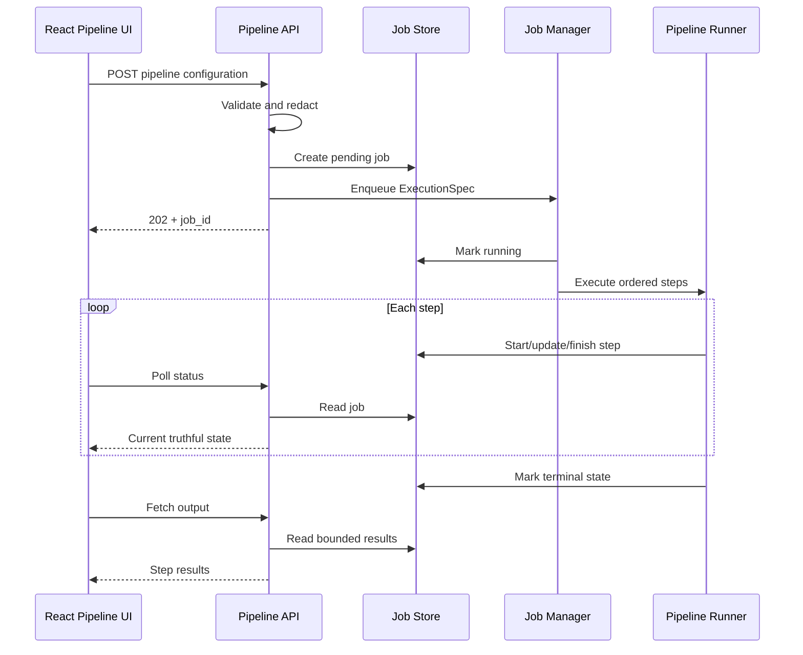

# Project Hardening Plan

Status: Implemented; pending operator review  
Created: 2026-07-22  
Completed: 2026-07-23  
Scope: Correctness, security, reliability, maintainability, verification, documentation, and release engineering.  
Explicitly out of scope: New end-user research or portfolio functionality.

## 1. Purpose

Stabilize the current EDINET workstation before expanding its product surface. The project already spans ingestion, taxonomy processing, financial statements, ratios, screening, security analysis, backtesting, and portfolio management. This plan makes those existing capabilities dependable, safe to expose outside loopback when explicitly configured, easier to maintain, and reproducible.

The plan addresses these confirmed or strongly evidenced issues:

1. Pipeline jobs are executed in the request lifecycle and do not have a truthful, cancellable, persistent lifecycle.
2. Every Portfolio route is registered twice.
3. Saved screening definitions discard `screening_date`.
4. A non-loopback deployment exposes privileged local operations without an authentication or filesystem boundary.
5. Upload, export, temporary-file, SQLite connection, and migration behavior is inconsistent.
6. Several core modules combine too many responsibilities and are difficult to change safely.
7. API response contracts, documentation, dependency boundaries, packaging instructions, and automated quality gates have drifted.

## 2. Goals

- Make API state and responses match actual execution state.
- Make cancellation cooperative, observable, and tested.
- Preserve every field required to reproduce a screen or pipeline run.
- Guarantee that each HTTP method/path pair is registered once.
- Keep the default local workflow frictionless while requiring deliberate configuration for remote access.
- Restrict server-side file access to configured roots and explicitly allowed files.
- Bound upload memory, disk use, result size, and temporary-file lifetime.
- Give SQLite a consistent connection, transaction, concurrency, and migration policy.
- Break large modules into cohesive units without changing public behavior.
- Make backend and frontend contracts typed and testable.
- Align technical documentation and packaging with the actual repository.
- Leave every phase in a state the operator can review before any commit is made.

## 3. Non-goals

- No new research workflows, analytics, data providers, watchlists, alerts, comparison screens, reports, or portfolio capabilities.
- No database-engine migration away from SQLite.
- No cloud deployment platform or multi-user account system.
- No visual redesign except UI changes required to reflect truthful job state or validation errors.
- No rewrite of working numerical algorithms solely for style.
- No public API compatibility guarantee beyond the local frontend; unavoidable contract changes must include a compatibility adapter or coordinated frontend change.
- No unsafe hard termination of Python threads. Cancellation must use cooperative checkpoints; process isolation can be evaluated separately if hard cancellation remains necessary.

## 4. Delivery principles

### 4.1 Small reviewable change sets

Each phase should be implemented and verified independently. Do not combine correctness fixes with broad module moves. The operator reviews changes before any commit, as required by repository policy.

### 4.2 Characterize before refactoring

Add failing or characterization tests before changing behavior. Preserve public facades while implementations move behind them.

### 4.3 No silent fallback

Terminal job state, security policy, database selection, migration failures, cancellation support, and export failures must be explicit. Do not catch a broad exception and continue when correctness is uncertain.

### 4.4 Safe defaults

- Bind to loopback by default.
- Run one mutating pipeline at a time by default.
- Treat database paths and uploaded files as untrusted input.
- Redact secrets and absolute paths from client-facing 500 responses.
- Do not persist API keys or base64 upload bodies in the job database.

### 4.5 Backward-compatible stored state

Existing saved screens and Portfolio databases must continue to load. New fields receive safe defaults. All schema changes use explicit versioned migrations and backups where material.

## 5. Workstream and phase map

| Phase | Outcome | Depends on |
|---|---|---|
| 0 | Reproducible baseline and characterization tests | None |
| 1 | Duplicate routes and screening-date loss fixed | Phase 0 |
| 2 | Truthful, persistent, cancellable pipeline jobs | Phase 0; can follow Phase 1 |
| 3 | Explicit security, path, upload, export, and error boundaries | Phases 1-2 contracts stable |
| 4 | Consistent SQLite access and versioned migrations | Phase 3 path policy |
| 5 | Cohesive modules and typed API/frontend contracts | Phases 1-4 behavior stable |
| 6 | Aligned docs, dependencies, CI, and packaging | Can begin early; finalize after Phase 5 |
| 7 | Full regression, migration, performance, and release validation | All prior phases |

## 6. Phase 0 — Baseline and safety net

### 6.1 Record supported environments

Document and verify:

- Supported Python versions.
- Supported Node/npm versions.
- Windows as the packaged target.
- Whether Linux is supported for source-only development and CI.
- The canonical virtual environment for local verification.
- Expected locations and ownership of Base, Standardized, and Portfolio databases.

### 6.2 Establish baseline commands

The baseline must include:

```powershell
python -m pytest tests/unit -q
python -m pytest tests/integration -q
```

```powershell
Set-Location frontend-v2
npm ci
npm test
npm run lint
npm run build
```

Record test counts, durations, known warnings, and any environment-dependent exclusions. Do not accept an unexplained failure as baseline behavior.

### 6.3 Add characterization tests before fixes

Add tests that expose the current defects:

- Collect every FastAPI route as `(method, path)` and fail on duplicates.
- Submit a two-step pipeline and assert individual timing, progress, outputs, and terminal status.
- Make a step fail and assert that the job is `failed`, later steps do not run, and the error is retained server-side.
- Cancel a queued job and a running job at a cooperative checkpoint.
- Save and reload a screening with `screening_date` and assert exact round-trip behavior.
- Load an old saved-screen JSON without `screening_date` and assert `None` compatibility.
- Assert that a client-facing 500 response does not include a traceback, API key, or absolute internal path.

The initial duplicate-route, pipeline-lifecycle, and screening-date tests are expected to fail until Phases 1 and 2.

### 6.4 Capture behavioral fixtures

Create small, deterministic databases for:

- One successful pipeline with two lightweight synthetic steps.
- One failed step.
- One cancellation-aware long step.
- One saved historical screen.
- Portfolio schema migration from each supported previous version.

Fixtures must contain no operator data and must be small enough for normal unit tests.

### 6.5 Phase 0 exit criteria

- Baseline commands and environment are documented.
- Current failures are categorized as product defects, environment issues, or pre-existing warnings.
- Each confirmed defect has a reproducing test.
- No production behavior has changed.

## 7. Phase 1 — Immediate correctness fixes

### 7.1 Use one router-registration mechanism

Current problem: Portfolio is included manually and found again by package discovery.

Target design:

- Make `src/web_app/api/__init__.py` the single composition root.
- Prefer an explicit immutable router list for the current finite set: screening, security analysis, tags, backtesting, and Portfolio.
- Remove dynamic view-router scanning unless there is a demonstrated plugin requirement.
- If discovery remains, never manually register a discoverable router and deduplicate by router identity before inclusion.
- At application startup, build a `(HTTP method, normalized path)` index and raise a descriptive error on duplicates.
- Keep the route-uniqueness check in the test suite even after startup validation exists.

Files expected to change:

- `src/web_app/api/__init__.py`
- `src/web_app/server.py`
- `tests/unit/test_web_app_server.py`
- `tests/unit/test_frontend_v2_server.py`

Acceptance criteria:

- Every method/path pair occurs exactly once.
- Portfolio OpenAPI operation IDs are unique.
- Route count is deterministic across repeated imports.
- All existing Portfolio endpoint tests still pass.
- PyInstaller imports remain explicit and testable.

### 7.2 Preserve `screening_date`

Target changes:

- Add `screening_date: str | None = None` to `save_screening_criteria()`.
- Pass `ScreeningSaveRequest.screening_date` through the API endpoint.
- Persist the exact ISO date in saved JSON.
- When loading older JSON, normalize a missing field to `None`.
- Validate non-empty dates as `YYYY-MM-DD` before saving or running.
- Ensure frontend load restores the date control and subsequent save does not clear it.
- Ensure export and backtest handoff retain the same as-of date where already supported.

Files expected to change:

- `src/screening/screening.py`
- `src/web_app/api/screening.py`
- `frontend-v2/src/api/types.ts`
- `frontend-v2/src/features/screening/ScreeningWorkspaceDense.tsx`
- Screening backend, API, and frontend tests.

Acceptance criteria:

- A date survives save, list, load, edit, resave, run, and export.
- Old saved screens load without manual migration.
- Invalid dates receive a 422 or a domain-specific 400, not a 500.
- Existing saved screen names and file paths remain unchanged.

### 7.3 Remove misleading success behavior from the synchronous pipeline path

Before the full job redesign lands:

- Stop execution after the first step failure.
- Return or store `failed` rather than `completed` when any step fails.
- Measure each step from its own start timestamp.
- Assign step results to job state.
- Set terminal progress to 100 only for successful completion.
- Clear `current_step` at every terminal transition.

If Phase 2 immediately follows, these changes may be implemented directly in the new runner instead of temporarily patching the old endpoint.

### 7.4 Phase 1 exit criteria

- Route-uniqueness test passes.
- Historical screening state round-trips.
- Existing frontend routes and saved screens remain compatible.
- Focused Python and frontend tests pass.

## 8. Phase 2 — Durable pipeline job lifecycle

### 8.1 Required behavior

Submitting a pipeline must return quickly with a usable job ID. Execution continues outside the HTTP request. The job must have a persistent audit trail, truthful state, per-step results, bounded output, cooperative cancellation, and restart handling.

### 8.2 Proposed components

Create a focused `src/pipeline_jobs/` package:

- `models.py` — status enum and immutable job/step records.
- `store.py` — SQLite persistence and queries.
- `runner.py` — sequential step execution and terminal-state rules.
- `manager.py` — queue, worker, cancellation tokens, startup/shutdown.
- `redaction.py` — removes API keys, upload bodies, and sensitive paths from persisted metadata.

Split HTTP concerns from orchestration:

- `src/api/pipeline_routes.py` — submit/status/list/cancel/output endpoints.
- Keep `src/api/router.py` as a compatibility facade until Phase 5.

### 8.3 Job persistence

Create `config/state/pipeline_jobs.db` at runtime with versioned migrations.

Suggested `jobs` fields:

- `job_id` primary key.
- `status`: `pending`, `running`, `cancelling`, `cancelled`, `completed`, `failed`, or `interrupted`.
- `created_at`, `started_at`, `completed_at` as UTC ISO timestamps.
- `current_step`, `progress_percent`.
- `step_count`, `completed_step_count`.
- Redacted step/config summary; never the EDINET API key or base64 upload content.
- Bounded public error message and internal error correlation ID.

Suggested `job_steps` fields:

- `job_id`, ordinal, canonical step name.
- Status and overwrite flag.
- Start/end timestamps and true per-step duration.
- Bounded serialized result summary.
- Internal error correlation ID.

Execution payloads that contain secrets remain in process memory. Jobs that were pending or running when the process stops are marked `interrupted` at next startup; they are not silently resumed.

### 8.4 Execution model

- Use a managed executor with `max_workers=1` by default because many pipeline steps mutate shared SQLite databases.
- Allow the worker count to become configurable only after concurrent-write tests prove safety.
- Validate and normalize the request before enqueueing, but do not execute steps in the request.
- Queue an in-memory `ExecutionSpec` keyed by the persisted job ID.
- Persist every transition in a transaction before publishing it through the API.
- Stop after the first error.
- Retain job records for a configurable period; cleanup must include orphan workspaces.



### 8.5 Cooperative cancellation

Introduce `StepExecutionContext` containing:

- `cancel_event`.
- `report_progress(completed, total, message=None)`.
- Per-job workspace path.
- Job and step identifiers for logging.

Extend the handler contract compatibly:

```python
handler(config, *, overwrite=False, context=None)
```

`execute_step()` continues to work when no context is supplied. Long-running services add checkpoints at natural safe boundaries:

- Document batches.
- Filing batches.
- Taxonomy archives and concepts.
- Tickers and price-provider requests.
- Ratio/rolling-metric batches.
- Backtest periods and portfolio runs.

Cancellation rules:

- `pending` becomes `cancelled` immediately and never starts.
- `running` becomes `cancelling`; the event is set.
- The active step rolls back its current transaction at the next safe checkpoint.
- No later step starts.
- The terminal state becomes `cancelled` only after the runner stops.
- Python worker threads are never forcibly killed.
- Preserve the existing `force` request field for compatibility, but reject unsupported forced termination of an active thread with an explicit 409 response. Do not pretend it succeeded.

### 8.6 API contract

- `POST /api/pipeline/run` returns `202` and `JobCreateResponse` immediately.
- `GET /api/jobs/{job_id}` returns the persisted job and ordered step states.
- `GET /api/jobs` returns paginated recent jobs.
- `POST /api/jobs/{job_id}/cancel` returns the resulting `cancelled` or `cancelling` state.
- `GET /api/jobs/{job_id}/output` returns bounded successful step outputs after a terminal state.
- Invalid state transitions return 409.
- Unknown jobs return 404.
- Validation errors return 422/400 before a job is queued.

The React Pipeline page must switch from awaiting a long request to polling the existing status endpoint with TanStack Query. Cancel buttons reflect `cancelling`, and terminal error text is bounded and actionable.

### 8.7 Logging and observability

- Add `job_id`, `step_name`, and error correlation ID to log context.
- Log transitions exactly once.
- Do not log API keys, complete configuration payloads, uploaded file bodies, or Portfolio XML.
- Expose queue depth and counts by status in the local health payload without exposing job content.

### 8.8 Pipeline tests

Unit tests:

- Valid transition table.
- Per-step duration uses the step start.
- Results are stored and returned in order.
- First failure stops later steps.
- Redaction removes secrets and upload bodies.
- Output-size limit truncates with an explicit marker.

Integration tests:

- Submit returns before the synthetic slow step completes.
- Status progresses from pending to running to completed.
- Queued cancellation prevents execution.
- Running cancellation stops at a checkpoint and skips later steps.
- Restart marks stale work interrupted.
- Two submissions execute in order with one worker.
- Cleanup removes expired records and workspaces only.

Frontend tests:

- Polling stops on terminal state.
- Cancel transitions through cancelling.
- Failed jobs show the failed step and safe message.
- Reload restores current job state from the server.

### 8.9 Phase 2 exit criteria

- Submission returns a job ID promptly.
- Job state survives app restart, with stale work marked interrupted.
- Failure, cancellation, progress, timing, and output are truthful.
- No step runs after a failed or cancelled step.
- No secret or upload body is persisted.
- The Pipeline UI no longer depends on a long-held HTTP request.

## 9. Phase 3 — Security and file boundary

### 9.1 Central application settings

Add a typed settings object for:

- Bind host and port.
- `allow_remote` flag.
- Optional API token.
- Allowed database/data roots.
- Upload and export size limits.
- Job retention and workspace location.
- SQLite busy timeout.

Load it once during app creation. Avoid global environment reads scattered through route handlers.

### 9.2 Remote-access policy

- Loopback remains the default and requires no token.
- Binding to a non-loopback host requires an explicit `--allow-remote` flag.
- Non-loopback mode refuses to start without a strong API token.
- In authenticated mode, require `Authorization: Bearer <token>` for `/api/*` except a minimal health check.
- Compare tokens with `secrets.compare_digest`.
- Do not put tokens in query strings, localStorage, logs, or error messages.
- Keep CORS disabled unless explicit origins are configured.
- Configure trusted hosts when remote mode is enabled.

### 9.3 Path policy

Create one `PathPolicy` service used by all APIs and pipeline configuration validation.

For database input:

- Resolve the path strictly.
- Require a normal file with the expected suffix.
- Require it to be one of the configured database files or under an allowed data root.
- Resolve symlinks/junctions before the containment check.
- Separate read-only and writable authorization.
- Return a stable database identifier to clients where possible, not an absolute path.

For output paths:

- Generate server-owned names beneath an allowed job/export root.
- Never accept an arbitrary output directory from an unauthenticated request.
- Reject traversal, alternate data streams, reserved names, and paths outside the root.

Apply the policy to screening, security analysis, backtesting, Portfolio, pipeline fields, CSV imports, taxonomy downloads, and exports.

### 9.4 Upload handling

Portfolio XML:

- Enforce a configurable byte limit while reading.
- Use `defusedxml` or an equivalently hardened parser.
- Reject DTD/entity content and unexpected root structures.
- Normalize the source filename with `Path(name).name`.
- Validate content independently of the extension.
- Return a safe 400/413 response.

Pipeline embedded uploads:

- Validate base64 syntax with strict decoding.
- Reject encoded or decoded content above the field-specific limit.
- Write into `config/state/jobs/<job_id>/uploads/` using a generated name plus sanitized display name.
- Record only metadata and a content hash.
- Keep the workspace until the terminal job expires, then delete it through job cleanup.
- Never create untracked `edinet_upload_*` directories without an owner and retention rule.

### 9.5 Export handling

- Remove fixed filenames such as `screening_backtest_export.csv` beside a selected database.
- Prefer an iterator, `StringIO`, or `BytesIO` response for bounded exports.
- For large ZIP/XLSX exports, use a per-job temporary file and attach a response background cleanup task.
- Generate collision-resistant filenames.
- Sanitize `Content-Disposition` values.
- Put an explicit maximum on in-memory exports and switch to disk streaming above it.

### 9.6 Error policy

- Add centralized exception handlers and a stable error envelope: code, safe message, request/error correlation ID.
- Map domain validation to 400/409/422 as appropriate.
- Log the traceback only server-side.
- Remove `detail=str(exc)` for unexpected 500 responses.
- Never return repository roots, API keys, SQL text with values, or absolute private paths in remote mode.

### 9.7 Security tests

- Remote startup without token fails closed.
- Missing/incorrect token returns 401.
- Disallowed database paths and traversal are rejected.
- Symlink/junction escape is rejected where the platform supports the test.
- Oversized XML/base64 payload returns 413 without a leftover file.
- Malicious XML entity input is rejected.
- Export filenames cannot escape the export root.
- A synthetic exception response contains no secret or absolute test path.

### 9.8 Phase 3 exit criteria

- Local default workflow remains unchanged.
- Remote access is impossible without an explicit flag and token.
- All server file access passes through the path policy.
- Upload and export resource use is bounded and cleaned up.
- Unexpected errors are useful in logs but safe over HTTP.

## 10. Phase 4 — SQLite consistency and migrations

### 10.1 Connection factory

Extend or replace `src/orchestrator/common/sqlite.py` with a small shared database layer that provides:

- `connect_read(path)` using SQLite read-only URI mode where valid.
- `connect_write(path)` with configured busy timeout.
- `transaction(path)` or transaction context on a supplied connection.
- Consistent `sqlite3.Row` behavior.
- `PRAGMA foreign_keys = ON` for managed databases.
- WAL and synchronous policy applied during managed database initialization, not redundantly on every read.
- Typed helpers for table/index existence and identifier quoting.

Each thread opens and closes its own connection. Do not pass live connections between the event loop and worker threads.

### 10.2 Transaction boundaries

Audit mutating workflows:

- Portfolio import and rebuild.
- Price updates.
- Taxonomy parsing.
- Financial statement, ratio, and rolling-metric generation.
- Job-state transitions.
- Tag and saved-state persistence where applicable.

Define where partial progress is permitted. A cancellation or exception must roll back the active atomic batch. Log batch boundaries so recovery is understandable.

### 10.3 Versioned migrations

For application-owned databases, add `schema_migrations` with ordered migration IDs and timestamps.

- Portfolio migrations replace unconditional `ALTER TABLE` plus broad `OperationalError` suppression.
- Pipeline job storage starts at schema version 1.
- A migration checks existing columns explicitly before applying DDL.
- Each migration is transactional where SQLite permits it.
- A failed migration aborts startup for that feature with an actionable message.
- Make a timestamped backup before the first material migration of an operator database.

Generated EDINET analytical tables remain managed by their pipeline steps; do not force them into the Portfolio migration model.

### 10.4 Incremental adoption order

1. Pipeline job database.
2. Portfolio schema and mutating APIs.
3. Tags and other small writable stores.
4. Screening/security read paths.
5. Backtesting and orchestrator services.

Keep legacy connection helpers as forwarding facades until all consumers migrate.

### 10.5 SQLite tests

- Upgrade every supported old Portfolio schema to current.
- Run the same migration twice and prove idempotence.
- Simulate a locked database and assert bounded retry followed by a clear error.
- Cancel a write batch and prove rollback.
- Run concurrent readers during one writer under WAL.
- Reject write attempts through a read-only connection.
- Verify connections close after exceptions.

### 10.6 Phase 4 exit criteria

- Application-owned schema versions are explicit.
- No migration masks an unrelated `OperationalError`.
- Managed writes use explicit transactions and configured timeouts.
- Cancellation cannot leave a half-written atomic batch.
- Focused concurrency and migration tests pass on Windows.

## 11. Phase 5 — Modularization and typed contracts

Behavior must already be covered before moving code. Perform one module family at a time.

### 11.1 API assembly

Split `src/api/router.py` into:

- Request/response models.
- Pipeline routes.
- Job routes.
- Health/config routes.
- Shared exception mapping.

Keep `src.api.router:app` as a stable import facade while the server and packaging transition.

### 11.2 Portfolio

Split `src/portfolio/api.py` into routers for:

- Imports and transactions.
- Holdings and history.
- Dividends.
- Performance and returns.
- Charts/analytics.

Move remaining SQL and calculation blocks out of route functions into service/query modules. Route functions should validate, authorize, call one service, and serialize a typed response.

Split `portfolio_state.py` into transaction replay, position state, valuation, and read-model queries while keeping its current public facade.

### 11.3 Screening

Split `screening.py` into:

- Expression/token model and validation.
- Schema/metric discovery.
- SQL compiler and identifier policy.
- Execution and ranking.
- Formatting.
- Saved-screen/history persistence.
- Export adapters.

Keep `src.screening` exports stable. Add compiler golden tests so SQL semantics do not change during the move.

### 11.4 Security analysis

Split into:

- Schema resolution.
- Search.
- Company overview and ratios.
- Statements/history.
- Peers.
- Prices.
- Taxonomy tree presentation.

Eliminate duplicate schema introspection and connection logic by using the Phase 4 database layer.

### 11.5 Backtesting

Split the calculation engine by concept:

- Allocation normalization.
- Price/dividend loading.
- Corporate-action adjustments already supported.
- Return series.
- Risk/performance metrics.
- Rolling-screen orchestration.
- Report/ZIP/XLSX serialization.

Preserve the existing package facade and build golden-result fixtures before moving formulas.

### 11.6 Taxonomy processing

Split network discovery/download, archive handling, XSD parsing, normalization, and SQLite persistence. Ensure each public function remains below the repository's preferred 80-line limit or delegates cohesive work to named helpers.

### 11.7 Typed contracts

- Give every endpoint an explicit response model.
- Use constrained enums/literals for status, operators, formats, directions, and currencies where the set is closed.
- Forbid unknown request fields on safety-sensitive requests after frontend compatibility is verified.
- Keep one error envelope.
- Generate or mechanically derive frontend API types from OpenAPI; stop manually duplicating shapes where practical.
- Add an OpenAPI snapshot/compatibility test for public frontend endpoints.

### 11.8 Static quality gates

Adopt a minimal Python tool configuration in `pyproject.toml`:

- Formatter/import policy.
- Linting, including broad-exception and unused-code checks with justified exceptions.
- Type checking for new/changed modules first, expanding incrementally.
- Coverage reporting with a ratcheting threshold rather than an unrealistic immediate target.

Do not perform a repository-wide formatting rewrite in the same change set as behavior changes.

### 11.9 Phase 5 exit criteria

- Public imports and API behavior remain stable except for documented fixes.
- Core modules have one clear responsibility and no new oversized functions.
- Route handlers contain minimal business logic.
- Backend contracts and frontend types agree automatically or through contract tests.
- Numerical golden tests remain unchanged.

## 12. Phase 6 — Documentation, dependencies, CI, and packaging

### 12.1 Documentation reconciliation

Update together:

- `docs/Application Details.md` — actual Config behavior, new job subsystem, new modules, exact signatures.
- `docs/Frontend Architecture.md` — remove compatibility-route contradiction and describe job polling.
- `docs/RUNNING.md` — actual configuration source, local/remote security policy, job state, allowed roots.
- `docs/LOGGING.md` — job/error correlation IDs, redaction, retention.
- `docs/Contributing.md` — current React widgets and real pipeline-step extension process; remove Tk terminology.
- `docs/BUILDING.md` — one truthful packaging workflow.
- `docs/CHANGELOG.md` — user-visible fixes and migrations.

Add an automated link/path check for documentation where practical.

### 12.2 Dependency boundaries

Move toward one `pyproject.toml` source of truth:

- Runtime dependencies.
- `dev` optional dependencies for pytest, browser tests, lint, type checking, and coverage.
- `build` optional dependencies for PyInstaller.

Keep a generated or compatibility `requirements.txt` only if the build workflow requires it. Document the generation command and verify it in CI.

### 12.3 Version source

Define the application version once and use it for:

- Python package/build metadata.
- FastAPI app version.
- Packaged artifact name.
- Health/config diagnostics.
- Changelog release headings.

### 12.4 PyInstaller workflow

Resolve the missing/unclear `EDINET.spec` contract:

- Either version a canonical spec file, or generate it deterministically in `scripts/build.py`.
- Do not document both models.
- Verify dynamic imports are no longer required where explicit router/step registries replace discovery.
- Build the frontend before packaging and fail early when `dist/index.html` is absent.
- Ensure the distribution contains only empty/new databases, never development data.
- Smoke-test the packaged app, `/health`, the SPA entry point, and one read-only API route.

### 12.5 Continuous integration

Add separate jobs for:

- Python unit tests.
- Python integration tests.
- Frontend tests, lint, and production build.
- Route uniqueness and OpenAPI contract.
- Documentation/link checks.
- Windows packaged-app smoke test, at least on release or scheduled runs if too expensive per change.

Cache dependencies without caching operator data or runtime state.

### 12.6 Phase 6 exit criteria

- A new developer can install, test, run, and package from the docs.
- CI exercises the same commands documented locally.
- Version and dependency sources are unambiguous.
- The packaging guide references only files that exist or are deterministically generated.
- Packaged smoke tests pass on Windows.

## 13. Phase 7 — Final validation and rollout

### 13.1 Full regression matrix

Run:

- All Python unit and integration tests.
- All frontend tests, lint, and production build.
- API route uniqueness and OpenAPI snapshot.
- Saved-screen backward-compatibility fixtures.
- Portfolio migration fixtures.
- Job restart/cancellation tests.
- Security/path/upload adversarial tests.
- Packaged Windows smoke tests.

### 13.2 Domain smoke workflows

Using non-sensitive test databases:

1. Run a small pipeline to completion and inspect each persisted step.
2. Cancel a multi-step pipeline and verify no later steps run.
3. Run and save a historical screen, reload it, and reproduce the same as-of result.
4. Analyze a company and load wide financial history.
5. Run a manual and rolling backtest and compare golden outputs.
6. Import a small Portfolio XML, rebuild state, and inspect performance.
7. Export screening/backtest results twice concurrently and verify no collision.

### 13.3 Performance checks

Record before/after measurements for:

- Application import/startup.
- Route registration.
- Pipeline submission latency.
- Job polling query.
- Representative screen execution.
- Wide financial history.
- Portfolio rebuild and analytics.
- Test-suite and frontend-build duration.

Set regression budgets only after measuring realistic fixtures.

### 13.4 Rollout and recovery

- Back up operator-owned Portfolio and state databases before first migration.
- Log every applied migration ID.
- Keep old saved-screen JSON compatible; do not rewrite all files eagerly.
- Mark interrupted pre-upgrade jobs instead of attempting to resume them.
- Provide a documented recovery procedure for a failed state/database migration.
- Present all changes to the operator for review; do not commit automatically.

### 13.5 Final acceptance criteria

- Zero duplicate method/path pairs.
- Historical screen dates round-trip exactly.
- Pipeline submission, progress, output, failure, cancellation, and restart behavior are truthful.
- No new step begins after failure or cancellation.
- Remote mode fails closed without authentication.
- Disallowed paths, oversized uploads, malicious XML, and traversal attempts are rejected.
- Temporary files and exports have owners, limits, and deterministic cleanup.
- Managed SQLite databases use explicit versions and migrations.
- Unexpected HTTP errors disclose no secrets or private paths.
- All documented verification commands pass.
- Documentation and packaging match the code.

## 14. Recommended implementation order within review cycles

1. Phase 0 characterization tests.
2. Router uniqueness fix.
3. Screening-date persistence fix.
4. Pipeline job store and runner backend.
5. Pipeline frontend polling/cancellation adaptation.
6. Security settings, authentication, and path policy.
7. Upload/export cleanup and error envelope.
8. Job and Portfolio SQLite migrations.
9. Incremental connection-layer adoption.
10. Modularization, one domain package at a time.
11. Contract generation/static gates.
12. Documentation, CI, packaging, and complete validation.

Do not begin the next risky phase while the prior phase has unexplained test failures.

## 15. Deferred functionality

New functionality is intentionally excluded from this plan. The ideas identified during review are recorded separately in `docs/Feature Development/Deferred Functionality Backlog.md` so they can be prioritized and designed after hardening is complete.

No work item in that backlog should be pulled into a hardening phase unless it is strictly necessary to correct existing behavior.

## 16. Implementation record

The hardening scope was implemented without adding end-user functionality. The separate Deferred Functionality Backlog remains the planning source for later product work.

Delivered outcomes:

- Duplicate route ownership and historical screening-date persistence are covered by regression tests.
- Pipeline execution uses durable SQLite jobs with ordered step state, bounded redacted output, cooperative cancellation, restart handling, retention, pagination, and aggregate health reporting.
- Remote access fails closed unless explicitly enabled with a bearer token and trusted hosts. File, database, upload, XML, export, and error boundaries are centralized and tested.
- Shared SQLite helpers, explicit transaction boundaries, Portfolio schema migrations/backups, stable identifiers, and rollback tests cover managed data paths.
- API assembly, pipeline job code, Portfolio models, and screening formatting/persistence were extracted behind stable facades. Further large domain-only splits remain maintenance refactors and require a separate low-risk plan.
- `pyproject.toml`, synchronized `requirements.txt`, one version source, bounded verification/build scripts, CI, documentation checks, and a canonical PyInstaller spec now define the supported workflow.

Final local validation on Windows/Python 3.13:

- Python unit suite: 672 passed, 1 platform-specific skip, 64.56 seconds.
- Python integration suite: 108 passed, 9.69 seconds on the final bounded verifier run.
- Frontend: 23 tests passed; lint passed with zero errors and five documented upstream/compiler advisories; production build passed.
- Ruff, incremental Mypy, requirements synchronization, documentation links, route uniqueness, and OpenAPI contracts passed.
- Windows package build and smoke checks for `/health`, `/`, and `/api/steps` passed in 111.4 seconds with a 180-second per-command cap.
- Test workspaces are cleaned after each verifier stage; no test/build child processes remained after validation.
