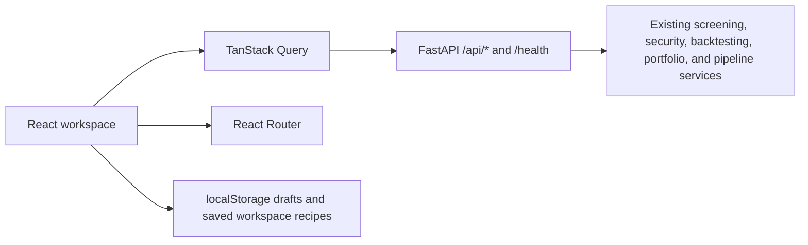

# Frontend Architecture

Updated: 2026-07-19

## Overview

The primary web workstation is a React 19, TypeScript, and Vite single-page application in `frontend-v2/`. FastAPI serves its production entry point and API routes. The previous vanilla-JavaScript pages remain temporarily available as compatibility routes while deeper specialist views are migrated.



## Routes

| Route | Workspace |
|---|---|
| `/` | Overview and recent work |
| `/screen` | Company screening |
| `/analyze` and `/analyze/:companyCode` | Company search and analysis |
| `/backtest` | Manual, CSV, and rolling-screen backtests |
| `/portfolio` | Portfolio overview, holdings, transactions, and performance |
| `/pipeline` | Data-pipeline recipes and advanced step builder |

All routes target the React SPA; there are no legacy compatibility routes.

## Directory layout

```text
frontend-v2/
├── src/
│   ├── api/                 # typed fetch and SSE clients
│   ├── components/          # shell, feedback, cards, fields, and data table
│   ├── features/
│   │   ├── overview/
│   │   ├── screening/
│   │   ├── analysis/
│   │   ├── backtesting/
│   │   ├── portfolio/
│   │   └── pipeline/
│   ├── hooks/
│   ├── test/
│   ├── App.tsx              # lazy route definitions
│   ├── main.tsx             # providers and browser entry point
│   ├── styles.css           # design tokens and shared layout
│   └── features.css         # feature-specific responsive rules
├── index.html
├── vite.config.ts
└── package.json

src/web_app/
├── server.py                # API app, SPA entry routes, static mounts
├── api/                     # API routers (screening, security_analysis, tags, portfolio)
│   ├── __init__.py
│   ├── screening.py
│   ├── security_analysis.py
│   └── tags.py
└── static/
```

## Application shell

`AppShell` owns the persistent desktop sidebar, mobile navigation, global company search, and backend-health indicator. Feature pages supply only their content. Routes are lazy-loaded so charting and feature code do not inflate the initial workspace bundle.

The layout is desktop-first but has a 390 px mobile treatment:

- persistent sidebar becomes a drawer;
- a five-item bottom navigation keeps the main journeys reachable;
- grids and rule builders collapse to one column;
- tables scroll within their own region.

## Data and state

- TanStack Query owns server state, loading/error states, caching, and invalidation.
- Local component state owns transient form input.
- Screening drafts use `shade.screening.draft` in `localStorage` so they can flow into rolling backtests.
- Pipeline recipes use `shade.pipeline.setups` in `localStorage`.
- The API clients in `src/api/` are the only shared network layer. `apiStream` parses the existing SSE format for rolling-backtest progress and cancellation.
- Existing Python services and API contracts remain authoritative; the frontend does not access databases directly.

## Feature behavior

- Screening preserves legacy saved definitions and supports full expressions on both sides of a comparison. Rule expressions and derived output fields share metric, literal-value, arithmetic-operator, and parenthesis tokens; validated parentheses provide explicit PEMDAS grouping while legacy numerator/denominator ratios remain editable.
- Analysis supports company search, overview metrics, price history, multi-metric financial-history charts and dense tables, price refresh, peer-screen handoff, and backtest handoff.
- Backtesting supports manual portfolios, CSV sets, and point-in-time rolling screens with cadence, durations, weighting, progress, cancellation, saved results, and downloads.
- Portfolio supports XML imports, rebuilds, currency selection, activity, holdings, transactions, performance, and company-analysis handoff.
- Pipeline supports recipes, dynamic step discovery, ordering, overwrite flags, generated configuration fields, cancellation, saved setups, and job history.

## Build and serving

Run `npm ci` and `npm run build` from `frontend-v2/`. Vite writes the entry point to `frontend-v2/dist/index.html` and hashed chunks to `dist/app-assets/`. FastAPI mounts those chunks at `/app-assets`.

During development, run FastAPI on port 8000 and `npm run dev` from `frontend-v2/`. Vite proxies `/api`, `/health`, and `/favicon.ico` to FastAPI.

## Extending the frontend

1. Add a feature component under `src/features/<feature>/`.
2. Add a lazy route in `App.tsx` and a navigation item in `AppShell.tsx` when it is a top-level journey.
3. Put reusable view primitives in `src/components/`; keep feature-specific state and presentation with the feature.
4. Add API types to `src/api/types.ts` and shared network behavior to `src/api/client.ts` or `stream.ts`.
5. Add a Vitest test and, for a new top-level route, a FastAPI entrypoint smoke test.
6. Run `npm run lint`, `npm test`, `npm run build`, and the focused Python web tests.
