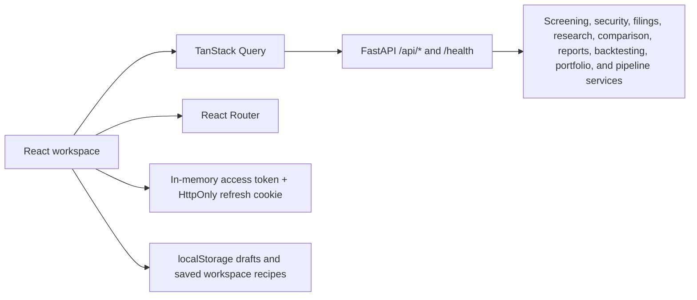

# Frontend Architecture

Updated: 2026-07-31

## Overview

The primary and only maintained workstation UI is the React 19, TypeScript, and Vite single-page application in `frontend-v2/`. FastAPI serves its production entry point and API routes. Compatibility URLs such as `/security` and `/backtesting` resolve to the same React bundle; no legacy page implementation is mounted.


```mermaid
flowchart LR
    Browser["React workspace"] --> Query["TanStack Query"]
    Browser --> Router["React Router"]
    Query --> API["FastAPI /api/* and /health"]
    API --> Services["Screening, security, filings, research, comparison, reports, backtesting, portfolio, and pipeline services"]
    Browser --> Auth["In-memory access token + HttpOnly refresh cookie"]
    Browser --> Storage["localStorage drafts and saved workspace recipes"]
```

## Routes

| Route | Workspace |
|---|---|
| `/` | Public product homepage |
| `/pricing` | Public single-tier pricing page |
| `/login` and `/register` | Account authentication and registration |
| `/overview` | Signed-in overview and recent work |
| `/screen` | Company screening |
| `/analyze` and `/analyze/:companyCode` | Company search and analysis |
| `/backtest` (`/backtesting` alias) | Manual, CSV, and rolling-screen backtests |
| `/portfolio` | Portfolio overview, holdings, performance, income, and activity with drill-down panels |
| `/pipeline` | Data-pipeline recipes and advanced step builder |
| `/filings` | Retained EDINET type-1 filing and XBRL explorer |
| `/compare` | Bounded multi-company comparison |
| `/research` | Account-owned watchlists, notes, and in-app alerts |
| `/account` | Password changes, sessions, and personal API tokens |
| `/admin` | Users, invitations, credential resets, registration, and password policy |
| `/security` | Compatibility alias for the React analysis workspace |

All routes target one React SPA. Compatibility means URL aliasing only.

## Directory layout

```text
frontend-v2/
├── src/
│   ├── api/                 # typed fetch and SSE clients
│   ├── components/          # shell, feedback, cards, fields, and data table
│   ├── features/
│   │   ├── marketing/
│   │   ├── auth/
│   │   ├── overview/
│   │   ├── screening/
│   │   ├── analysis/
│   │   ├── comparison/
│   │   ├── filings/
│   │   ├── research/
│   │   ├── backtesting/
│   │   ├── portfolio/
│   │   └── pipeline/
│   ├── hooks/
│   ├── test/
│   ├── App.tsx              # lazy route definitions
│   ├── main.tsx             # providers and browser entry point
│   ├── styles.css           # design tokens and shared layout
│   ├── features.css         # feature-specific responsive rules
│   └── portfolio.css        # bounded portfolio charts, ledgers, analytics, and drawers
├── index.html
├── vite.config.ts
└── package.json

src/web_app/
├── server.py                # API app, SPA entry routes, static mounts
├── api/                     # screening, security analysis, tags, and router composition
│   ├── __init__.py
│   ├── screening.py
│   ├── security_analysis.py
│   └── tags.py
└── static/
```

## Brand system

Production brand files live only in `assets/brand/`. FastAPI exposes that directory at `/brand-assets`, while `BrandLockup` in `frontend-v2/src/components/Brand.tsx` supplies the responsive wordmark used by marketing, authentication, loading, and workspace layouts. Shared CSS tokens define the approved indigo, midnight, paper, coral, and signal-red palette; chart colors come from `frontend-v2/src/brand.ts`. Draft boards under `docs/Feature Development/rebrand/` are design history and are not runtime inputs.

## Application shell

`AppShell` owns the persistent desktop sidebar, mobile navigation, global company search, and backend-health indicator for signed-in workspace routes. The homepage, pricing, login, and registration routes use standalone public layouts. Routes are lazy-loaded so charting and feature code do not inflate the initial bundle.

The layout is desktop-first but has a 390 px mobile treatment:

- persistent sidebar becomes a drawer;
- a five-item bottom navigation keeps the main journeys reachable;
- grids and rule builders collapse to one column;
- tables scroll within their own region.

## Data and state

- TanStack Query owns server state, loading/error states, caching, and invalidation.
- Local component state owns transient form input.
- Screening drafts use `shade.screening.draft` in `localStorage` so they can flow into rolling backtests.
- Pipeline recipes use `shade.pipeline.setups` in `localStorage`.
- Pipeline execution state is server-owned. Submission returns `202` plus a job ID; TanStack Query polls `/api/jobs/{job_id}`, stops at a terminal state, and retrieves bounded output separately. Reloading restores persisted jobs from the API rather than assuming a held request is still alive.
- The API clients in `src/api/` are the only shared network layer. `apiStream` parses the existing SSE format for rolling-backtest progress and cancellation. `AuthProvider` gates account mode; access tokens are kept in memory and refresh cookies are never exposed to JavaScript or persisted in browser storage.
- Existing Python services and API contracts remain authoritative; the frontend does not access databases directly.
- Portfolio keeps only the overview queries eager. Income and advanced-performance datasets load when their tab or detail drawer needs them; range and display-currency choices are query-key inputs, and changing a range presents an explicit loading state instead of stale statistics.

## Feature behavior

- Screening preserves legacy saved definitions and supports full expressions on both sides of a comparison. Rule expressions and derived output fields share metric, literal-value, arithmetic-operator, and parenthesis tokens; validated parentheses provide explicit PEMDAS grouping while legacy numerator/denominator ratios remain editable. Corporate-action rules expose `Stock_Splits` split/action dates as date inputs (including date-valued expression tokens) and a configurable `No recent split` rule for action, status, and date direction.
- Analysis supports company search, overview metrics, price history, multi-metric financial-history charts and dense tables, price refresh, peer-screen handoff, and backtest handoff.
- Analysis also lists archived company XBRL reports and links to the Filing Explorer. Filings presents sanitized narrative sections, structured facts, and archive metadata without rendering submitted active content. Filing translation preserves the Japanese source, requests one complete English document at a time, and displays explicit retryable errors instead of partial output or a per-section request fan-out.
- Comparison reuses the shared company picker, supports 2–12 companies, and starts with standard snapshot metrics. Its metric picker exposes searchable statement tables and columns, removes metrics with individual X controls, and sends validated `Table.Column` references for arbitrary numeric comparisons.
- Favorites and named watchlists are represented as ordinary private tags. Research reuses the shared company picker for tag membership, notes, thesis targets, and alerts; tag mutations invalidate both summary and member queries.
- Marketing owns the public homepage and informational pricing page. Auth owns login, registration, account settings, personal tokens, users/invitations/resets, and the administrator-controlled 15–128 character password minimum.
- Research, comparison, and authenticated portfolio/report slices use owner-scoped API contracts; the frontend never sends complete result payloads for report generation.
- Backtesting supports manual portfolios, CSV sets, and point-in-time rolling screens with cadence, durations, weighting, progress, cancellation, saved results, and downloads.
- Portfolio is organized into Overview, Holdings, Performance, Income, and Activity. Six headline metrics and every section action open an accessible side drawer; holdings and individual transactions have row-level drill-downs, and holdings can hand off to company analysis. The workspace includes allocation and currency concentration, risk and tail-loss statistics, return heatmaps and distributions, contribution leaders, dividend tax/net/yield and payer trends, formatted multi-currency ledgers, filters, and 50-row activity pagination. Chart canvases live in explicit height/width frames so dashboard cards do not overflow at wide desktop resolutions.
- Pipeline supports recipes, dynamic step discovery, ordering, overwrite flags, generated configuration fields, persisted job history, cooperative cancellation, per-step progress, and safe terminal output.

## API contract checks

Frontend-facing method/path pairs and unique OpenAPI operation IDs are checked by `tests/unit/test_openapi_contract.py`. Shared TypeScript shapes live in `frontend-v2/src/api/types.ts`; a backend contract change must update those types and the OpenAPI compatibility test in the same change.

## Build and serving

Run `npm ci` and `npm run build` from `frontend-v2/`. The checked-in build and test scripts use Vite/Vitest's runner config loader so verification does not depend on writing temporary bundled config files under `node_modules`. Vite writes the entry point to `frontend-v2/dist/index.html` and hashed chunks to `dist/app-assets/`. FastAPI mounts those chunks at `/app-assets`.

During development, run FastAPI on port 8000 and `npm run dev` from `frontend-v2/`. Vite proxies `/api`, `/health`, `/favicon.ico`, and `/brand-assets` to FastAPI.

## Extending the frontend

1. Add a feature component under `src/features/<feature>/`.
2. Add a lazy route in `App.tsx` and a navigation item in `AppShell.tsx` when it is a top-level journey.
3. Put reusable view primitives in `src/components/`; keep feature-specific state and presentation with the feature.
4. Add API types to `src/api/types.ts` and shared network behavior to `src/api/client.ts` or `stream.ts`.
5. Add a Vitest test and, for a new top-level route, a FastAPI entrypoint smoke test.
6. Run `npm run lint`, `npm test`, `npm run build`, and the focused Python web tests.
