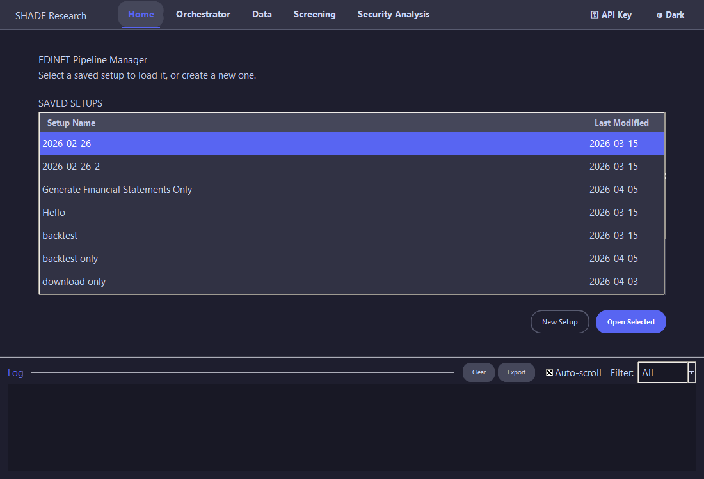
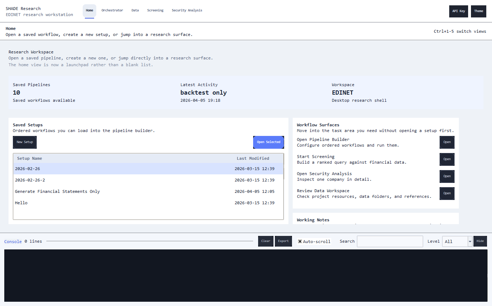
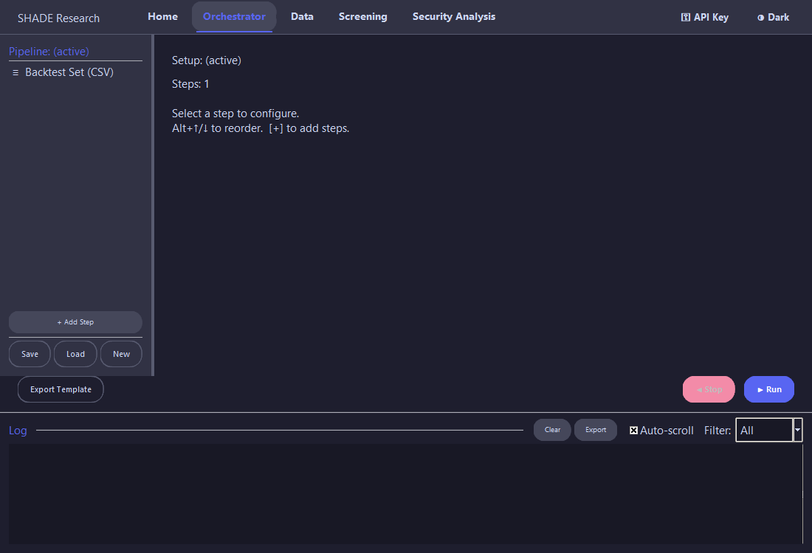
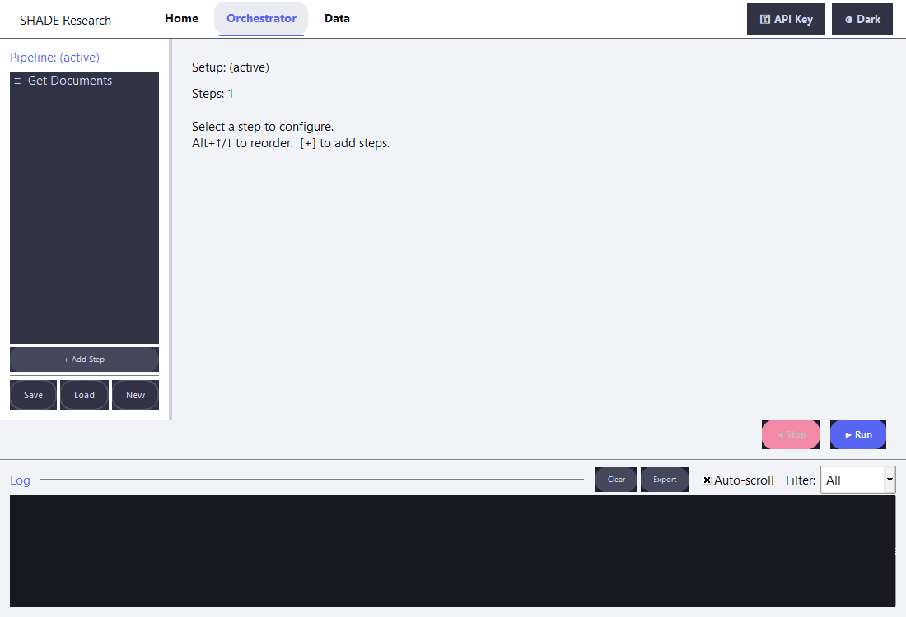
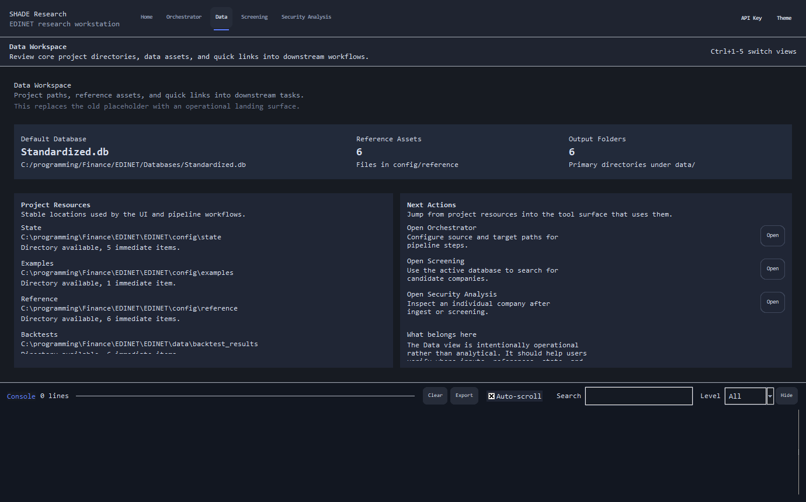
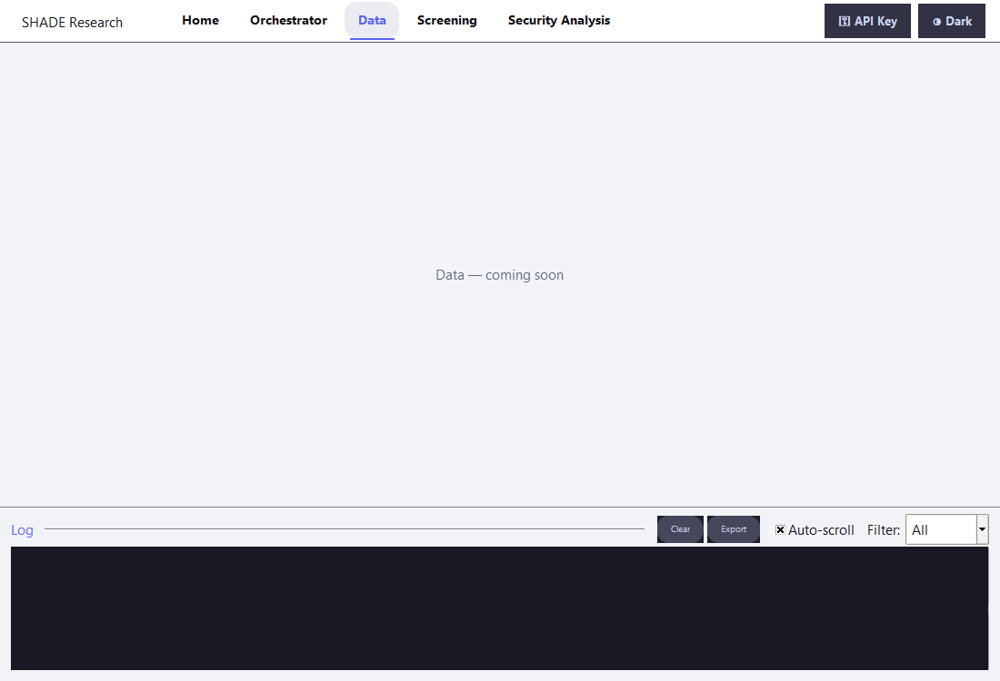
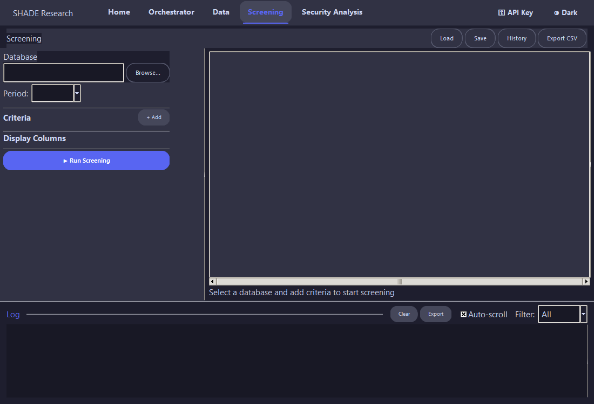
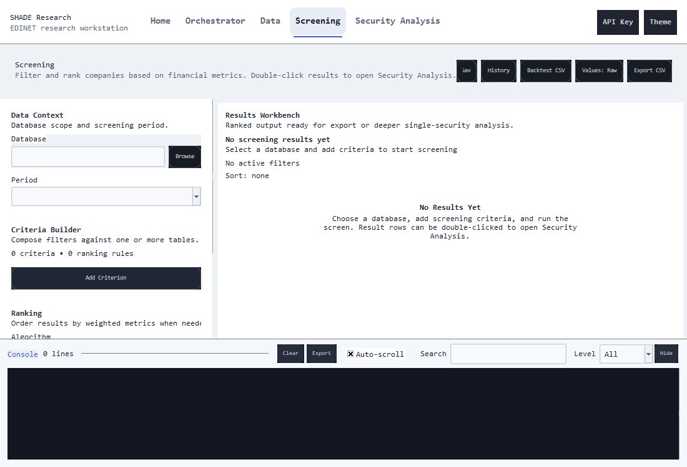
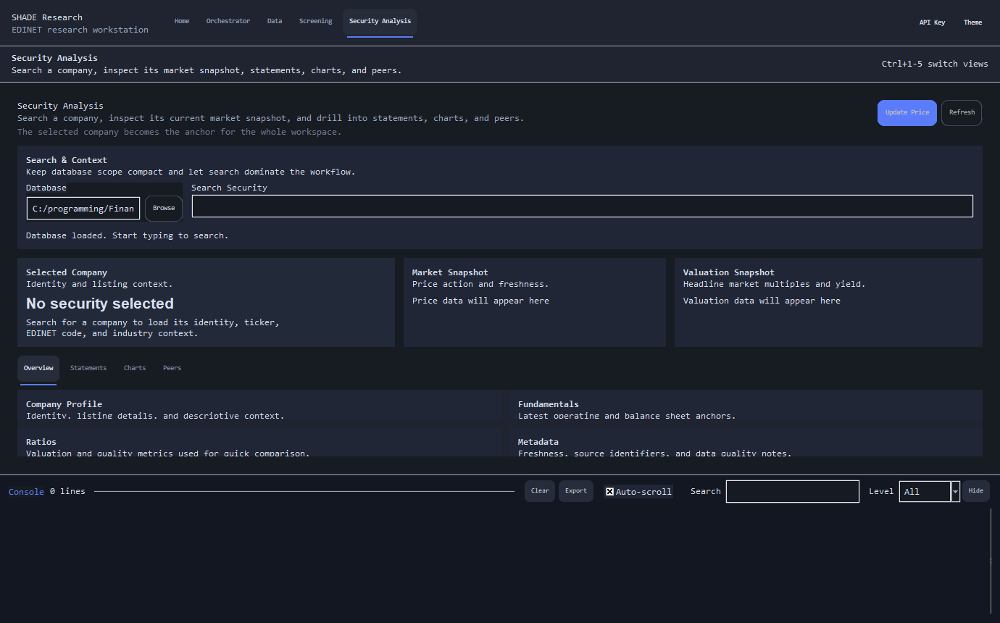
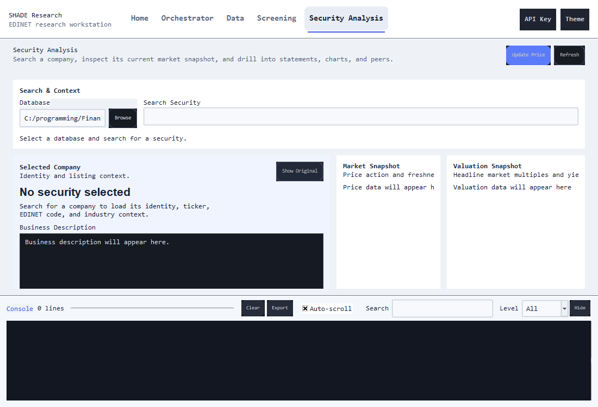

# EDINET Financial Data Tool

Downloads financial filings from the Japanese securities regulator (EDINET), processes them into a structured SQLite database, and runs statistical analysis to identify relationships between financial ratios and stock valuations.

The primary maintained interface is the Tk desktop application shown in the screenshots below. In-app it is branded as `SHADE Research — EDINET` and currently exposes five top-level workspaces: Home, Orchestrator, Data Workspace, Screening, and Security Analysis.

Each pipeline step is configured independently, including its source or target database path where applicable.

## Current Status

- **Primary UI** – the Tk desktop application is the default experience and the actively maintained GUI surface.
- **Research surfaces** – Screening and Security Analysis are now first-class views for candidate discovery and single-company research.
- **Operational workspace** – the Data view is no longer a placeholder; it summarizes project resources, reference assets, and output locations.
- **Headless runs** – the CLI path remains supported through `python main.py --cli`.
- **Documentation screenshots** – the README gallery is mirrored from the live screenshot capture flow used by `tests/test_ui_screenshots.py`.

## Quick Start

1. Download the latest release from [Releases](https://github.com/TiagoDeMatosDias/EDINET/releases)
2. Extract the latest release archive for your platform
3. Copy `config/examples/run_config.example.json` to `config/state/run_config.json` and configure your settings
4. Create a `.env` file with your API keys (see Setup section below)
5. Run `EDINET.exe` (Windows) or the binary for your OS

## What it does

1. **Fetch document list** – queries the EDINET API for available filings in a given date range.
2. **Download documents** – downloads the XBRL/CSV filings that match the filter criteria.
3. **Populate company info** – loads the EDINET company code list from CSV into the database.
4. **Import stock prices (CSV)** – imports historical prices from a user-supplied CSV file with configurable column mapping.
5. **Update stock prices** – fetches historical share prices via the Stooq API by default, with a Yahoo Finance chart fallback if Stooq is unavailable.
6. **Parse taxonomy** – parses an EDINET XBRL taxonomy XSD file and stores element metadata in the database.
7. **Generate financial statements** – extracts tagged values from raw XBRL data into structured per-company financial tables.
8. **Populate business descriptions (EN)** – fills `DescriptionOfBusiness_EN` via an ordered fallback list of free translation APIs defined in JSON.
9. **Generate ratios** – calculates per-share values, valuation ratios, and derived metrics for every company.
10. **Generate historical ratios** – computes rolling averages, growth rates, and z-scores over time.
11. **Multivariate regression** – user-defined multivariate OLS regression specified as a SQL query.
12. **Backtest** – portfolio backtesting with weighted returns, dividend adjustment, and optional benchmark comparison.
13. **Backtest set** – batch-runs 1/2/3/5/10-year backtests from a CSV of yearly portfolio selections.
14. **Screening** – filter companies by financial criteria (valuation, quality, per-share metrics), apply weighted ranking rules, review sortable results, toggle raw or formatted value display, save/load criteria, inspect screening history, export CSVs, or generate backtest-set CSV inputs.
15. **Security analysis** – inspect a single company with typeahead search, overview cards, translated/original business description display, statement history, charts, price refresh, and peer comparison. When available, the view prefers the translated `DescriptionOfBusiness_EN` text from `FinancialStatements`.

## Screenshots

Current captures from the live Tk desktop application. The gallery below shows the current shell and five maintained workspaces in both dark and light themes using the latest images mirrored into `docs/images/`.

| View | Dark | Light |
|---|---|---|
| Home |  |  |
| Orchestrator |  |  |
| Data Workspace |  |  |
| Screening |  |  |
| Security Analysis |  |  |

- **Home** – saved pipeline dashboard, quick workflow entry points, and working notes.
- **Orchestrator** – ordered pipeline builder with per-step configuration and live execution controls.
- **Data Workspace** – project paths, reference assets, state files, and output-folder summaries.
- **Screening** – criteria and ranking builder, saved/history/export actions, and drill-in to single-company analysis.
- **Security Analysis** – overview, statements, charts, peer comparison, and price-refresh workflows.

## GUI & CLI Modes

The application can run in two modes:

- **GUI mode** (default) — Launch the Tk desktop application with `python main.py`. The GUI provides five workspace views, keyboard navigation (`Ctrl+1..5`), per-step configuration panels, setup save/load, a theme toggle, and a live log output panel.
- **CLI mode** — Run headless from the terminal with `python main.py --cli`. This reads `config/state/run_config.json` directly and executes the enabled steps in order.

## Setup

### From Source

#### 1. Install dependencies

```
pip install -r requirements.txt
```

#### 2. Create a `.env` file

Copy the template below into a `.env` file in the project root and fill in your values:

```
API_KEY=<your_edinet_api_key>
baseURL=https://api.edinet-fsa.go.jp/api/v2/documents
doctype=5

RAW_DOCUMENTS_PATH=<your_documents_path>
DB_PATH=<your_sqlite_db_path>

DB_DOC_LIST_TABLE=DocumentList
DB_FINANCIAL_DATA_TABLE=financialData_full
DB_COMPANY_INFO_TABLE=CompanyInfo
DB_STOCK_PRICES_TABLE=Stock_Prices
DB_TAXONOMY_TABLE=TAXONOMY_JPFS_COR
```

#### 3. Configure and run

Edit `config/state/run_config.json` to enable the steps you want, then:

```
python main.py          # launches the GUI
python main.py --cli    # headless / terminal mode
```

### From Release

1. Extract the release ZIP file
2. Edit the `.env` file with your configuration
3. Run the executable

All output is logged to timestamped files in the `logs/` directory. See [LOGGING.md](LOGGING.md) for details.

## Documentation

- [RUNNING.md](RUNNING.md) – Full description of every step and configuration options
- [LOGGING.md](LOGGING.md) – Logging system documentation
- [Contributing.md](Contributing.md) – Contribution guidelines
- [CHANGELOG.md](CHANGELOG.md) – Version history and changes

## Building an executable

The project can be packaged into a single `.exe` with [PyInstaller](https://pyinstaller.org).
The exe resolves all config paths relative to the folder it lives in, so `config/`, `.env`,
and the output `data/` folder just need to sit alongside it.

### 1. Install PyInstaller

```
pip install pyinstaller
```

### 2. Build

Run from the project root:

```
pyinstaller --onefile --name EDINET main.py
```

The exe is written to `dist/EDINET.exe`.

### 3. Prepare the distribution folder

Create a deployment folder and copy the required items into it:

```
EDINET.exe                                   <- built by PyInstaller (from dist/)
.env                                         <- your API keys and DB paths
config/
    reference/
        companyinfo.csv
        jppfs_cor_2013-08-31.xsd
    state/
        run_config.json
    examples/
        run_config.example.json
data/
    ols_results/                             <- must exist for regression output steps
    backtest_results/                        <- must exist for backtest output
```

### 4. Run

Double-click `EDINET.exe` or launch it from a terminal.
It will look for `config/` and `.env` in the same folder as the exe.

> **Note:** Large dependencies (pandas, scipy) make the final exe around 200-300 MB.
> Build time is a few minutes on the first run.

## Configuration files

| File | Purpose |
|---|---|
| `config/state/run_config.json` | Controls which steps run, their order, and step-specific parameters |
| `config/reference/companyinfo.csv` | Optional local company info CSV override for `populate_company_info` |
| `config/reference/canonical_metrics_config.json` | Metric registry used for doc-level `FinancialStatements` fields and downstream ratio derivation during the current transition away from legacy canonical statement wiring |
| `config/reference/financial_statements_mappings_config.json` | Legacy mapping file retained for compatibility and migration reference |
| `src/orchestrator/generate_ratios/ratios_definitions.json` | Ratio-table definitions used by `generate_ratios` |
| `assets/taxonomy/` | Cached official EDINET taxonomy ZIP archives downloaded by `parse_taxonomy` |
| `config/examples/run_config.example.json` | Example run configuration for new users |
| `config/state/saved_setups/` | Named setup files saved from the GUI |
| `.env` | API keys, file paths, and database table names |

## GUI Features

The Tk-based GUI provides:

- **Home dashboard** – list saved pipelines with modification dates, open existing setups, create new ones, and jump directly into the main workflow surfaces.
- **Top-level workspace navigation** – switch between Home, Orchestrator, Data Workspace, Screening, and Security Analysis with `Ctrl+1..5`.
- **Theme toggle** – switch between dark and light mode without restarting the app.
- **API Key dialog** – securely set the EDINET API key without editing `.env` manually.
- **Type-to-filter dropdowns** – comboboxes across the app support partial-match filtering to make large table and column lists faster to navigate.
- **Step ordering controls** – reorder pipeline steps with keyboard shortcuts (`Alt+Up` / `Alt+Down`) and contextual actions.
- **Per-step enable/disable** – check or uncheck each step.
- **Per-step configuration panel** – configure each step (including database paths and advanced options) in the side panel.
- **Overwrite toggle** – steps that support it (Generate Financial Statements, Populate Business Descriptions (EN), Generate Ratios, Generate Historical Ratios) show an "Overwrite" checkbox.
- **Data workspace** – review the current default database, reference assets, stable config/state paths, and common output folders before moving into another workflow.
- **Screening workspace** – build filter and ranking rules, sort results, toggle raw/formatted values, save/load criteria, inspect run history, export CSVs, export backtest-set company lists, and open Security Analysis directly from a result row.
- **Save / Load setups** – persist and recall named configurations from `config/state/saved_setups/`.
- **Live log output** – see real-time log messages during execution in the output panel.
- **Security analysis** – search companies by company name, ticker, EDINET code, or industry; inspect statements and ratios; review translated or original business descriptions; view charts; refresh prices; compare peers; and jump directly from screening results.

## Key EDINET document type codes

| Code | Document type |
|---|---|
| 120 | Securities Report (Annual Report - 有価証券報告書) |
| 140 | Quarterly Securities Report (四半期報告書) |
| 150 | Semi-Annual Securities Report (半期報告書) |
