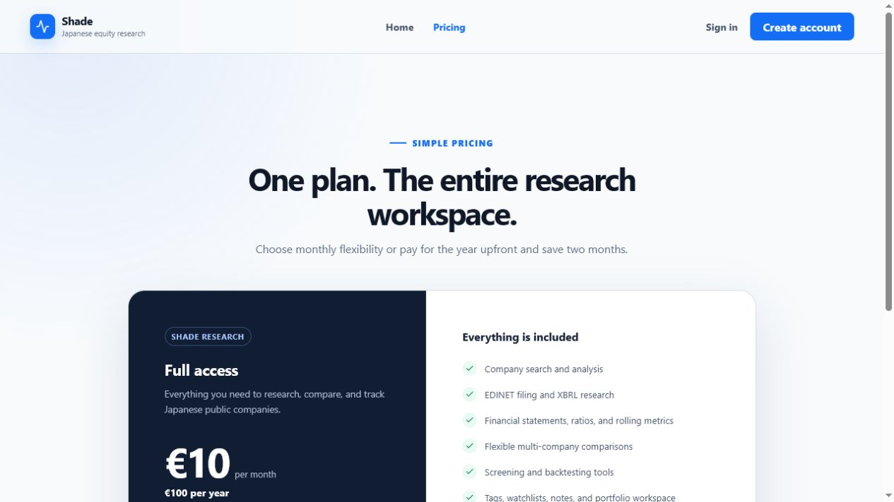
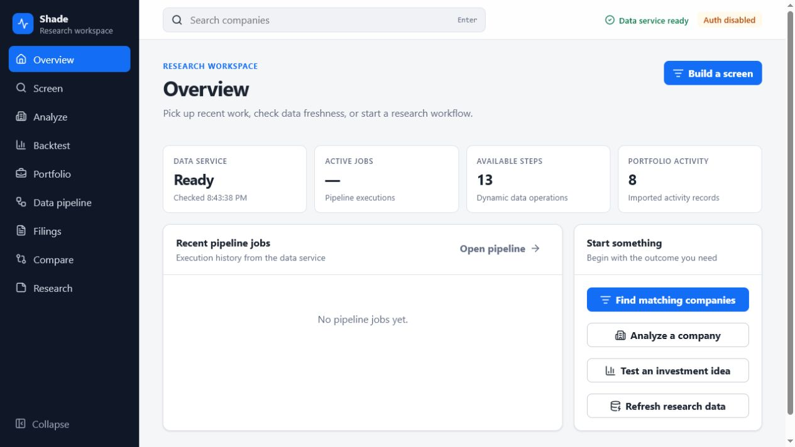
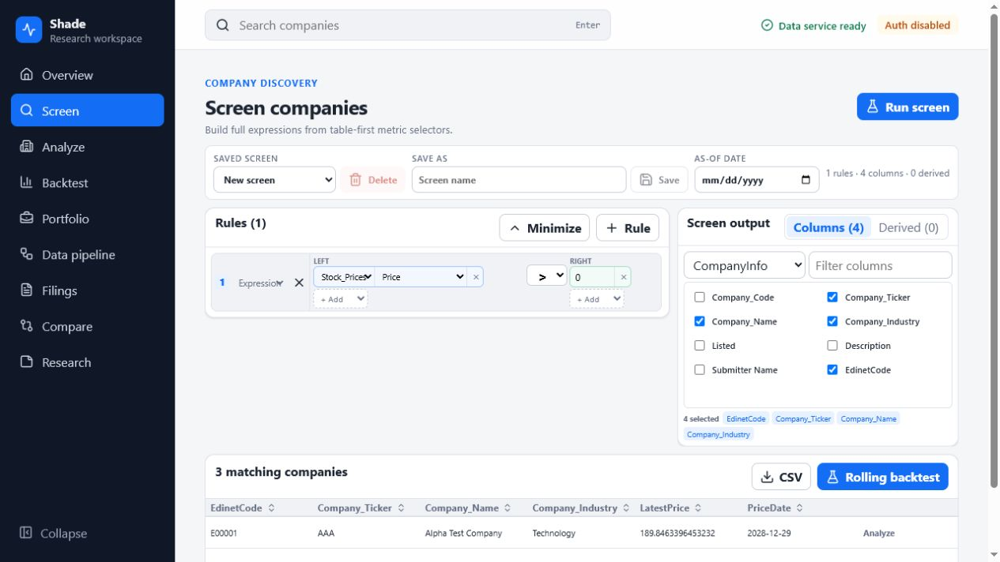
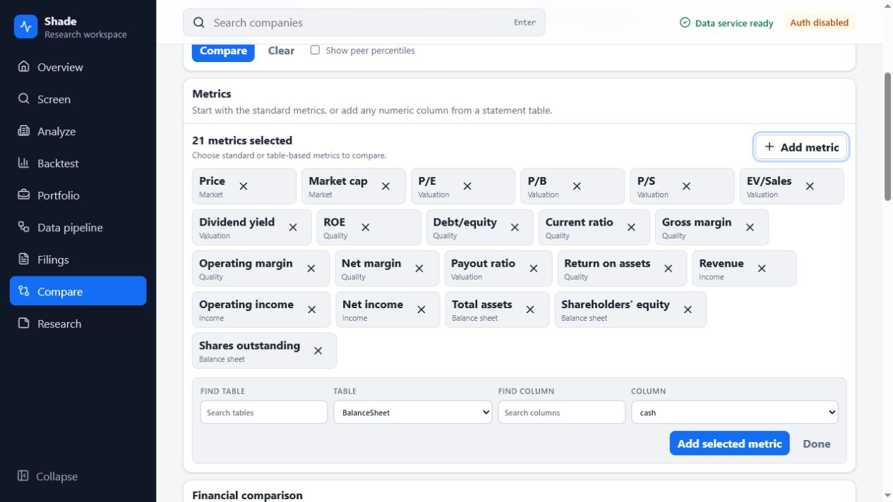
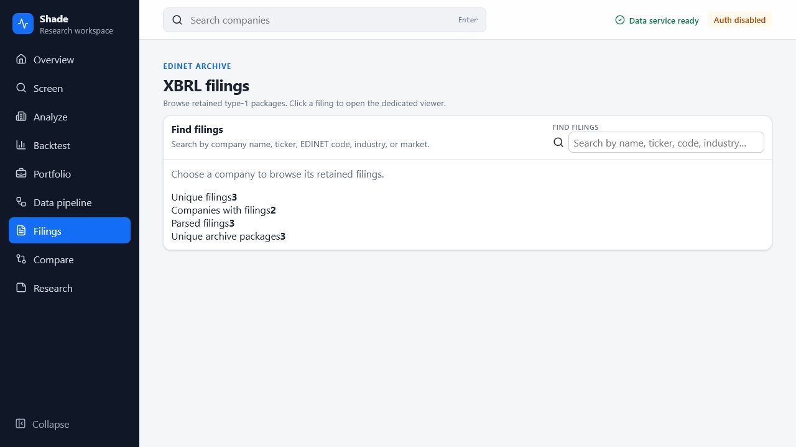
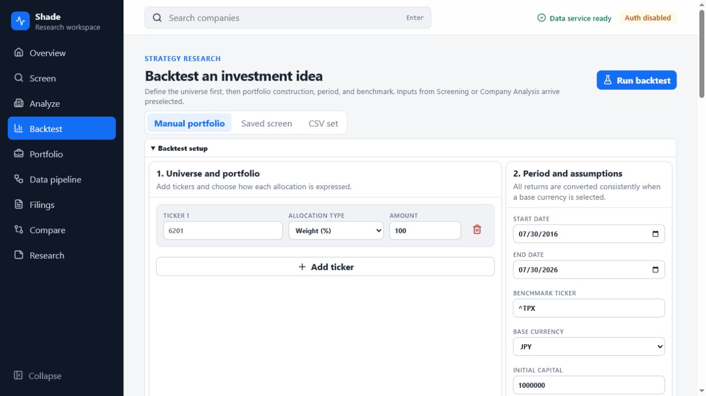
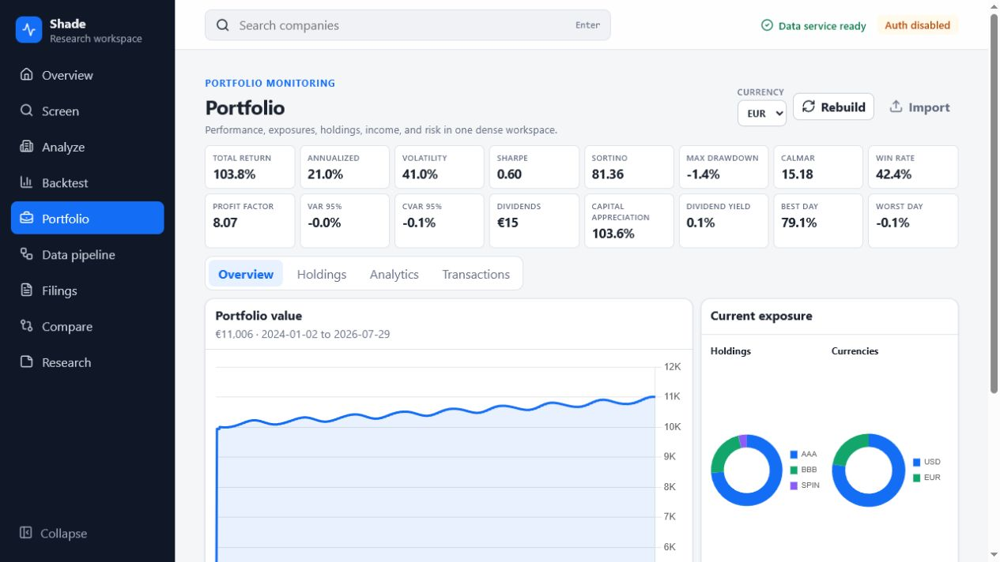

# Shade Research User Guide

Updated: 2026-07-30

Shade is a browser-based workspace for researching Japanese public companies from source EDINET filings through standardized financial analysis, comparison, screening, backtesting, and portfolio review.

All screenshots in this guide were captured at 1280×720 from generated demonstration databases. Company names, filings, prices, and portfolio activity shown here are synthetic.

## Public pages and accounts

The public homepage at `/` explains the product and links directly to registration, login, and pricing. `/pricing` currently presents one informational plan: €10 per month or €100 per year when paid upfront. Billing and subscription enforcement are not implemented yet.

| Homepage | Pricing |
|---|---|
|  |  |

Account authentication is optional for loopback use. In account mode:

- the first successful registration becomes the administrator;
- subsequent registration follows the configured registration mode;
- browser access tokens stay in memory and refresh tokens use an HttpOnly cookie;
- personal API tokens can be created and revoked from Account;
- an administrator can set the minimum password length from Admin → Security settings. The accepted range is 15–128 characters, and the policy applies to registration, invitations, resets, changes, and administrator-created credentials.

## Workspace overview

Open `/overview` after entering the workspace. It shows backend health, active and recent pipeline work, discovered pipeline-step count, portfolio activity, and shortcuts into the main research journeys.



The sidebar contains Overview, Screen, Analyze, Backtest, Portfolio, Data pipeline, Filings, Compare, and Research. Account and Admin appear when the authenticated role allows them.

The header company finder searches across the best data currently available. It accepts company name, ticker, EDINET code, industry, and market text. The same finder is reused in Analysis, Comparison, Filings, and Research, so a ticker or company selected in one workflow resolves to the same canonical company code elsewhere. If one configured database is missing or only partly populated, search returns results from the remaining usable sources instead of failing the whole request.

## Find and analyze companies

### Screening

Screening builds table-first expressions over company, price, statement, ratio, rolling, and tag fields. A rule can compare complete expressions on both sides, including metrics, literals, arithmetic operators, tags, and validated parentheses. Select result columns independently, add derived fields, save definitions, export CSV, or send the current draft into a point-in-time rolling backtest.



Use the optional as-of date when the result must be limited to data that was available by a historical date. The backtest handoff reruns the saved screening logic at each rebalance period instead of applying today's result list retroactively.

### Company Analysis

Choose a company from the global search or open `/analyze/:companyCode`. The analysis workspace includes:

- current price, valuation, quality, income, balance-sheet, cash-flow, and per-share snapshot metrics;
- price history and reporting-period context;
- a full financial-history table with selectable chart metrics;
- tags and a Favorite action;
- archived filing links;
- Yahoo Finance and backtest handoffs.


Favorite is an ordinary private tag named `Favorite`; it is not stored in a separate favorites subsystem.

## Compare companies and arbitrary metrics

Comparison accepts 2–12 companies through the shared company finder. Start with the standard market, valuation, quality, income, and balance-sheet metrics, then remove anything irrelevant with the X on its metric chip.

The Add metric panel exposes searchable table and column controls. It accepts numeric statement or analytical columns as `Table.Column` references, so comparisons are not limited to a fixed metric list.



Run Compare to produce a side-by-side matrix. The result uses each company's latest available price and financial period, highlights the best value in each row, and can show peer percentiles. Common-size income and balance-sheet tables appear below the main matrix.


## Read EDINET filings

### Filing Explorer

The default `/filings` page intentionally shows only the shared company finder and a compact coverage summary. It does not load a filing list until a company is selected. Coverage includes unique filings, companies with filings, parsed filings, and retained archive packages.



Search by company name, ticker, EDINET code, industry, or market, then choose a filing. The dedicated viewer includes:

- Report — sanitized source HTML reconstructed from the retained ZIP;
- Sections — narrative sections with Japanese and English panes;
- Statements — numeric XBRL facts organized into statement layouts;
- Audit — archive and parse provenance;
- Taxonomy — filing taxonomy information;
- Quality — parser and data-quality issues.

### Japanese and English side by side

Translation never replaces the Japanese source. Sections and report HTML keep the original on the left and place a complete English result alongside it.


Translation runs locally through Argos Translate. It translates complete section bodies and every visible report-HTML text node and user-facing label. If the model is unavailable or Japanese remains after retries, the English pane reports a retryable error rather than displaying source text or a partial translation as a successful result.

Validated translations are cached in the `filing_translations` table inside `Filings.db`. Cache rows are translator-versioned; incomplete rows from an older implementation are ignored.

## Organize research with tags

Research at `/research` stores private account-owned state:

- tags, including favorites and named watchlists;
- company-linked or general notes with revision checks;
- thesis status, target value/currency, and review date;
- in-app metric alerts.


Create a tag once, select it, then add a company through the same shared company finder. Tags are available from Analysis and Screening as well; there is no separate favorites/watchlist database model in the current UI.

## Test an investment idea

Backtesting supports three entry paths:

- Manual portfolio — tickers with weight, share, or value allocations;
- Saved screen — point-in-time screening with monthly, quarterly, or yearly rebalancing;
- CSV set — batch portfolios supplied from a CSV file.

Configure the period, benchmark, base currency, capital, execution costs, and other assumptions before running. Completed runs expose cumulative return, drawdown, annual results, benchmark comparison, contribution data, saved artifacts, and downloads.



## Review an imported portfolio

Portfolio imports IBKR FlexQuery XML. Imported transactions are account-owned and can be rebuilt into daily value, holdings, exposure, dividend, and performance views. Currency selection changes display conversion without rewriting source activity.



Use the tabs for overview, holdings, analytics, and transactions. Authenticated preview APIs also support tax-lot matching, option Greeks, and deterministic equity/FX scenarios; these previews return explicit assumptions and do not mutate imported activity.

## Run the data pipeline

The Pipeline workspace discovers available steps from the backend. Load a prepared recipe or assemble individual steps, order them, configure their generated fields, upload required files, and run the recipe as a durable job.


Important current behavior:

- Import Stock Prices (CSV) uses a local file picker and accepts up to 500 MiB.
- Multipart uploads are attached only to the step that declares the file field, so mixed recipes can include ordinary steps and one or more upload steps.
- Download XBRL supports `explicit`, `backfill`, and `all`. `all` reads eligible `DocumentList` rows, honors the document-type filter, skips completed records, uses no more than five concurrent downloads, batches status updates, and reuses HTTP connections.
- Generate Financial Statements accepts `Source_Mode=csv` for the legacy `financialData_full` input or `Source_Mode=filings` for compact numeric facts in `Filings.db`.
- Jobs persist across browser reloads. The UI shows current step, progress, cancellation, terminal status, and bounded output.

See [Running the Application](RUNNING.md) for every field and command-line recovery tool.

## Databases and clean startup

The server creates missing configured database parents, files, managed schemas, and migrations when it starts:

- Base — EDINET document list and legacy CSV ingestion;
- Standardized — company information, statements, ratios, rolling metrics, prices, and FX data;
- Portfolio — imported activity and materialized portfolio state;
- Auth — users, credentials, sessions, tokens, policy, and audit state;
- Research — tags, notes, thesis state, alerts, screens, report recipes, and runs;
- Pipeline jobs — durable job and step state;
- Filings — retained compressed ZIPs, compact numeric XBRL index, quality/provenance metadata, and translation cache.

New filing ingests keep the compressed provider ZIP in SQLite, omit duplicate extracted member BLOBs, retain numeric/non-nil analytical facts, and reconstruct narrative sections on demand. Existing filing databases can be compacted or rebuilt with the scripts documented in [Running the Application](RUNNING.md).

## Screenshot refresh

The repository includes a deterministic screenshot environment with generated market data, filing ZIPs, translations, research state, and IBKR activity. It never reads `data/` or the operator's configured databases.

```powershell
.\.venv3\Scripts\python.exe tests\capture_screenshots.py
```

Images are written to `docs/images/`. The script starts a temporary loopback server, captures the current React views, and removes its temporary databases when complete.
