# Shade Research User Guide

Updated: 2026-09-25

Shade Research is a browser-based workspace for researching companies from source filings through standardized financial analysis, comparison, screening, backtesting, and portfolio review. EDINET and its XBRL disclosures are one supported source, not the limit of the product identity.

All screenshots in this guide were captured at 1280×720 from generated demonstration databases. Company names, filings, prices, and portfolio activity shown here are synthetic.

## Public pages and accounts

The public homepage at `/` explains the product and links directly to registration, login, and pricing. `/pricing` currently presents one informational plan: €10 per month or €100 per year when paid upfront. Billing and subscription enforcement are not implemented yet.

| Homepage | Pricing |
|---|---|
| 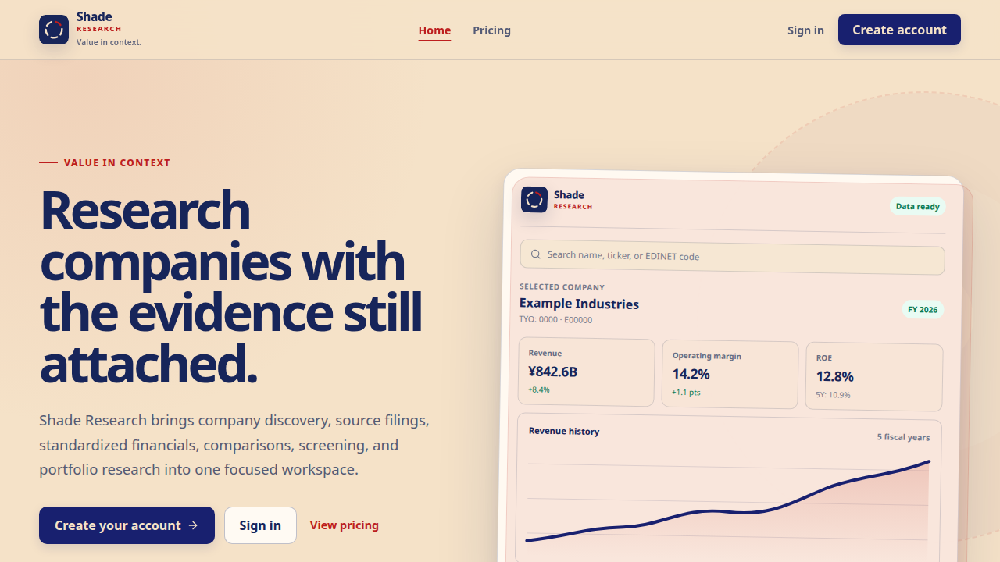 | 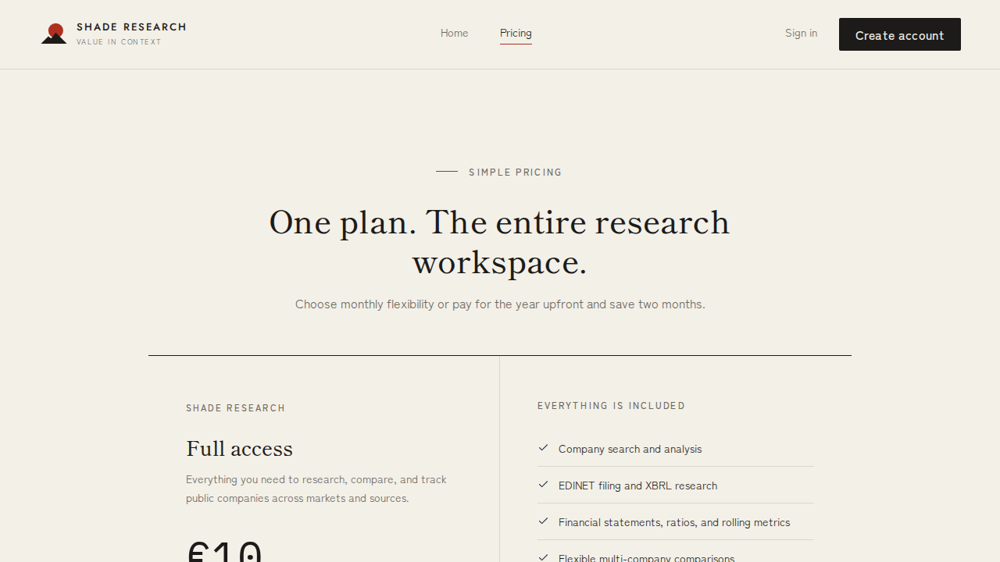 |

Account authentication is optional for loopback use. In account mode:

- the first successful registration becomes the administrator;
- subsequent registration follows the registration mode saved in Admin → Access (open, closed, or invite-only; open until one is saved);
- browser access tokens stay in memory and refresh tokens use an HttpOnly cookie;
- personal API tokens can be created and revoked from Account; a token with the `read` scope cannot change anything;
- changing or resetting a password signs the account out everywhere and revokes its API tokens;
- saved backtests are private to the account that ran them;
- refreshing a price from the provider is available to operators and administrators;
- an administrator can set the minimum password length from Admin → Access. The accepted range is 5–128 characters, and the policy applies to registration, invitations, resets, changes, and administrator-created credentials;
- an administrator enters the EDINET API key and every other server setting under Admin → Server settings (key `6`). The key is write-only: the page only shows whether it is set. Settings marked * apply after the server restarts.

## Workspace overview

Open `/overview` after entering the workspace. It shows backend health, active and recent pipeline work, discovered pipeline-step count, portfolio activity, and shortcuts into the main research journeys.

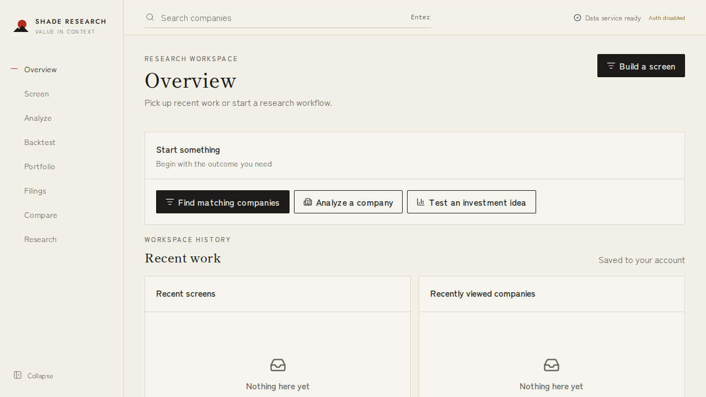

The sidebar contains Overview, Screen, Analyze, Backtest, Portfolio, Data pipeline, Filings, Compare, and Research. Account and Admin appear when the authenticated role allows them. From the keyboard, press `G` then a letter to switch pages: `O` Overview, `S` Screen, `A` Analyze, `B` Backtest, `P` Portfolio, `D` Data pipeline (admins), `F` Filings, `C` Compare, `R` Research. Each sidebar link shows its letter, and the letters light up while `G` waits for one. `/` searches companies, `Shift+Tab` leaves the field you are typing in, and `?` lists the shortcuts for the current page.

### Keyboard shortcuts

Every shortcut follows the same conventions on every screen: `1`–`9` jump to tabs or sections, `J`/`K` (or `↓`/`↑`) move through a list, `[`/`]` step to the previous or next page, tab, or item, `F` focuses the filter, `N` creates, `A` adds, `O` opens, `X` deletes, `D` downloads, `R` runs or refreshes, and `Esc` closes. `?` lists the keys of the screen in view, including any panel or tab that is open, followed by the keys that work anywhere.

To change a key, open **Account → Keyboard shortcuts** (or the link at the foot of the `?` list). It lists every shortcut on every screen, including screens you have not opened yet; choose a screen or search by action or key, press **Change**, then press the new key (`Esc` cancels). A key another shortcut on the same screen already uses is refused, as are `Tab`, `Esc`, and browser keys such as `Ctrl+W`. Changes apply at once, are saved to your account so they follow you to every browser, and each row has a **Reset**; **Reset all to defaults** restores everything. In a local workspace without accounts the keys are saved for the local user. Hints shown next to buttons and in tooltips always show your current key.

The header company finder searches across the best data currently available. It accepts company name, ticker, EDINET code, industry, and market text. The same finder is reused in Analysis, Comparison, Filings, and Research, so a ticker or company selected in one workflow resolves to the same canonical company code elsewhere. If one configured database is missing or only partly populated, search returns results from the remaining usable sources instead of failing the whole request.

## Find and analyze companies

### Screening

A screen is a list of rules, and the results fill the rest of the window below them. Each rule reads as a sentence: a metric, a comparison (`>`, `≥`, `<`, `≤`, `=`, `≠`, between, is one of, contains, is empty, has a value), and a value or a second metric. The metric picker searches every table at once and also offers formulas such as P/E, P/B, P/S, dividend yield, earnings yield, and market cap. Percentage metrics are typed as percentages (`15` means 15%).

Rules combine in two levels. The screen matches companies that pass **all** or **any** of its rules, and a **group** of rules inside it matches **any** or **all** of its own rules. Together these express both "A and (B or C)" and "(A and B) or (C and D)". Untick a rule to set it aside without deleting it. The `⋯` menu on a rule duplicates it, moves it into or out of a group, or adds arithmetic to the metric. A rule whose left side already has arithmetic or parentheses is edited as a full expression, with metrics, literals, `+ − × ÷`, tags, and validated parentheses on both sides. A rule that cannot run yet is flagged with the reason.

The `Split event` rule includes or excludes companies by split recency. By default it matches confirmed splits within the last 365 days, counted back from the as-of date (or today). Its Advanced panel exposes confirmation status and an exact cutoff date. `Stock_Splits` is linked through each filing's `Company_Code` to `CompanyInfo.Company_Ticker`, so split rules apply to the right company. Legacy raw `Stock_Splits` filters in older saved screens keep the same semantics: confirmed splits only, capped at the as-of date.

Results lead with the company name, which links to Analysis, with ticker and EDINET code beneath. Headers explain each column on hover and sort on click. `Columns` chooses output columns, adds whole column sets (overview, valuation, quality, growth, dividends, size), and defines derived columns. The default overview set covers industry, price, ROE, net margin, equity ratio, 3-year sales growth, net sales, market cap, P/E, P/B, and dividend yield.

`Screens` opens saved screens, which show their rule and column counts and when they changed, along with starter screens and a blank screen. Saving under the name of the open screen updates it. Saving under another existing name asks before replacing it. Screens can be exported to CSV, sent to Compare, or handed to a point-in-time rolling backtest.

Keyboard: `N` adds a rule and opens its metric search, `Shift+N` adds a group, `O` opens screens, `D` changes the as-of date, `C` opens columns, and `B` collapses the rules. `Ctrl+Enter` runs and `Ctrl+S` saves, even while typing. `↓` or `J` moves into the results from anywhere on the page. `J`/`K` or the arrow keys move from company to company across pages, `Enter` opens the company in Analysis, `Shift+Enter` opens it in a new tab, and `[`/`]` change pages. A company opened from the results shows its position ("3 of 984"). `Shift+J`/`Shift+K` step to the next or previous screened company, and `G S` returns to the results with the cursor on the last company viewed. `?` lists every shortcut.

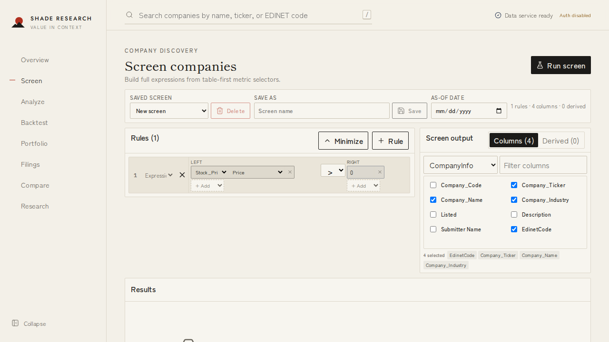

The as-of date (`D`) limits a screen to data that was available by a historical date. Type a date (`2023-06-30`), a month or year (`2023-06`, `2023`, read as its last day), or a distance back (`18m`, `5y`). You can also pick latest, a preset, or a recently used date. Choosing a date reruns the screen. The backtest handoff reruns the saved screening logic at each rebalance period instead of applying today's result list retroactively.

### Company Analysis

Choose a company from the global search (press `/` from anywhere, then `↑`/`↓` and `Enter`) or open `/analyze/:companyCode`. The page has five sections, reachable from the sticky section bar or with `1` to `5`:

- **Overview** — the latest close with its one-day move, market cap, and 52-week range in the header; a split-adjusted price chart (1M to All, remembered per browser, `-`/`=` to widen or narrow) whose hover readout shows the date, close, and move since the start of the range; key statistics grouped as valuation, quality, income, and balance sheet, each with a tooltip saying how it is calculated (ROE and ROA are three-year averages); and the company profile with its business description, identifiers, and research links (Filing Explorer, Comparison, option pricing, credit and bonds, Yahoo Finance, Yahoo! Finance Japan, Kabutan). Below them, **Your research** is the same panel as on the Research page (also for a holding without EDINET filings, opened by ticker): thesis status, target price with the gap to today's price, review date, thesis, tags (`T`), notes (`N`), and alerts. Once you set a status or target, it also appears beside the company name in the header. Unlisted companies show statement-based statistics without an empty price panel.
- **Financial statements** — one tab per statement table with values, and rolling multi-year averages and growth rates alongside (`[`/`]` switch tabs). Lines appear in filing order with components nested under their subtotal, concepts EDINET renamed between years (for example *Capital stock* and *Share capital*) are combined into one line, and lines the company never reported stay hidden until you ask for them (`E`). Each line shows a trend sparkline, the latest year-on-year change, and its compound annual growth. Switch between reported values, year-on-year change, and common size (`V`); click lines or press `Space` on the focused line to chart up to six of them as bars or lines (`C`); `F` filters lines and **CSV** exports the lines shown with unrounded values. Per-share figures and share counts are split-adjusted: every year is on today's shares, so EPS, dividends, book value per share, and their multi-year averages and growth rates compare across a split. For a company that split, **As filed** (`S`) shows each year as its report gave it; adjusted lines are marked, hovering a year shows the other figure, and the footnote names the splits.
- **Filings** — the retained EDINET annual reports with fiscal period, form, submission time, document ID, archive size, and parse status; `O` opens the latest. Export all downloads every retained archive with a manifest.
- **Bonds** — the company's bonds, from its bond supplements and the bond schedule in its latest annual report (filled by the **Update bonds** pipeline step). Tiles show the amount outstanding, the average coupon and remaining life, what falls due within a year, the ratings at its latest issue, and its spread against bonds rated the same. A maturity ladder stacks the company's own bonds and its subsidiaries', and a chart places each bond against today's government (JGB) curve. The table lists every bond with its ranking (senior, secured, subordinated, hybrid, convertible), coupon, issue and maturity dates (and first call), years left, balance, rating, spread over JGBs, and price: the JSDA reference price where dealers quote it, otherwise an estimate at today's JGB yield plus the spread at issue (marked `*`). **Terms** opens the bond supplement on EDINET, **Report** the annual report in the Filing Explorer, and **Price** the calculator; clicking a bond compares it in the bond market (`M` opens the company's bonds there). `H` shows matured and redeemed bonds; **Sources** lists every filing used, with a ZIP of each stored supplement.
- **Discussion** — the company's public channel and mentions elsewhere.

Press `?` on the page for the full list of keyboard shortcuts. Shortcuts pause while a field has focus. **Report** downloads a Markdown report with the snapshot and the full financial history; **Compare** (`P`) and **Backtest** (`B`) hand the company to those workspaces.

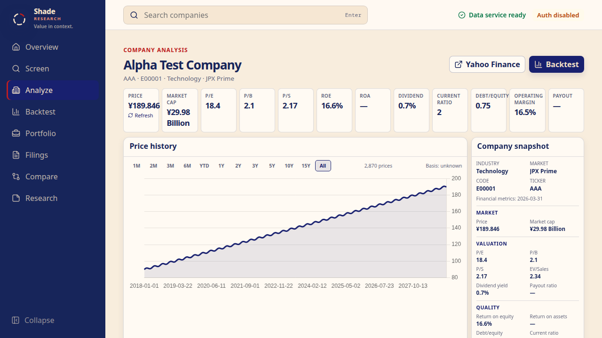


## Compare companies and arbitrary metrics

Comparison lines up 2–12 companies metric by metric. Add companies with the finder (`A`), or send them from Screening or Analysis (`P` on a company opens Comparison with it). The comparison runs as soon as two companies are chosen, and the address bar always holds the current set, so **Link** copies it, a refresh keeps it, and a link only lists the metrics you hid (`hide=`) or added (`add=`).

- **Companies** lists the set in order, one row each with its ticker, industry, and latest fiscal year; each company keeps its colour in every chart. `[` and `]` move the company under the cursor, `Shift+X` removes it.
- **Suggested peers** lists the listed companies that share an industry with the set, closest in market cap first, with market cap, size relative to the nearest chosen company (the dot is that company's colour), P/E, P/B, ROE, and yield. `P` goes to the list, `↑`/`↓` move, and `Enter` adds a peer; `Shift+P` or **Add 3 closest** adds without leaving the table.
- **Metrics** shows every standard metric as a toggle in its group (click a group name to toggle all of it). Search (`M`) adds any numeric statement or analytical column as a `Table.Column` reference, so comparisons are not limited to the standard list. Showing or hiding a standard metric does not recalculate anything.
- **Comparison table** puts metrics down and companies across, with a median column from three companies. Where a direction is meaningful, cells are tinted from vermilion (worst) to indigo (best) and the best value is bold; a negative P/E or leverage ratio ranks last. Size metrics carry a bar relative to the largest company. `J`/`K` (or `↑`/`↓`) move between metrics, `H`/`L` (or `←`/`→`) between companies, `Enter` opens the company in Analysis, `S` sorts companies by the metric (best first), `X` hides it, `R` shows ranks, and `E` shows metrics no company reports. Notes warn when fiscal years end in different months or amounts are in different currencies. **CSV** (`D`) downloads the table with unformatted values.
- **Charts** rank the companies on the metric under the cursor (with the median as a dashed line), plot any two metrics against each other (P/B against ROE to start, with median lines splitting the quadrants), and trace a statement metric by fiscal year: revenue, profits, margins, ROE, leverage, liquidity, assets, equity, or an added column. **Index** (`I`) rebases each company to 100 in its first year, to compare growth between companies of different sizes.
- **Saved** (`O`) keeps named comparisons; `Ctrl+S` saves the current one. With no companies chosen, the page lists saved and recent comparisons to pick up.

Press `?` for every shortcut; `1`–`4` jump to Companies, Metrics, Table, and Charts.

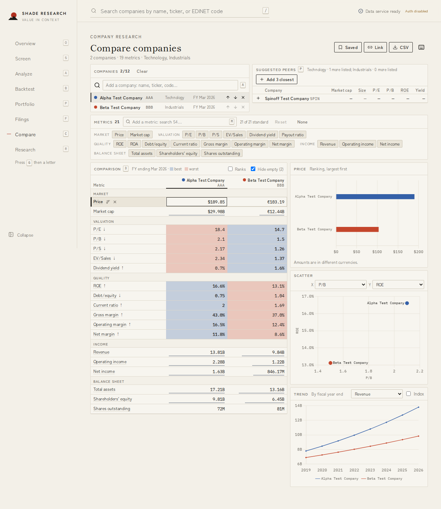

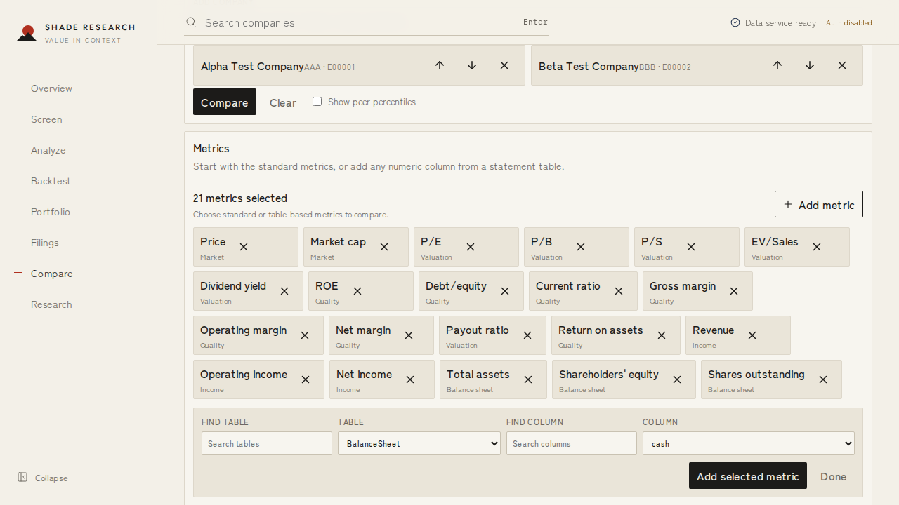

## Read EDINET filings

### Filing Explorer

`/filings` opens on the archive at a glance: how many reports and filers it holds, the submission date range, and how many reports carry data-quality notes. Report-type tabs (annual reports, semi-annual and quarterly reports, amendments, funds and trusts, foreign companies) show how many of each are retained and filter everything below them; `[` and `]` step through them. The latest filings from every filer are listed newest first with the English company name, ticker, and EDINET code where the research database knows the filer, and recently opened filings sit above the list.

Find a company (`F`) to list its reports instead, with links to its analysis (`A`) and an **Export all** download of every retained archive. The company and report type live in the URL, so the browser's back button and shared links return to the same view. `J` jumps into a list, `↑`/`↓` move between filings, and `Enter` opens one.

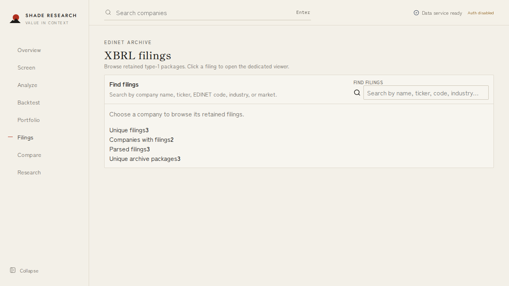

The filing viewer names the company and the report (form, fiscal period, filing time, size, and parse status), steps to the company's older or newer report with `[` and `]` while keeping the open tab, and links back to the company's filings (`L`) and analysis (`A`). Its four tabs (`1`–`4`) are:

- **Report** — the original EDINET documents, listed in statutory order and named by their own headings (Company overview, Consolidated cash flow statement, Auditor's report, …) with the Japanese heading beside each. Choose Japanese, side by side, or English (`T`; the choice is remembered), and `J`/`K` move between documents.
- **Sections** — the narrative text with an outline grouped by document, search across the Japanese and English text (`F`), and English alongside (`T`).
- **Statements** — every statement and note table built from the filing's own XBRL linkbases, grouped into business results, financial statements, notes, and other disclosures. Currency amounts share one unit per table, per-share amounts, share counts, and ratios keep their own, a change column compares the latest period with the prior one, and **CSV** exports the table with unrounded values.
- **Details** — data-quality notes, the parse record, the package contents by folder, and the taxonomy concepts the filing reports, summarised by taxonomy and filterable.

### Japanese and English side by side

Translation never replaces the Japanese source. Sections and report documents keep the original on the left and place a complete English result alongside it. Report documents are translated only when you ask for English; a whole-document translation that cannot be completed leaves each section translatable on its own.

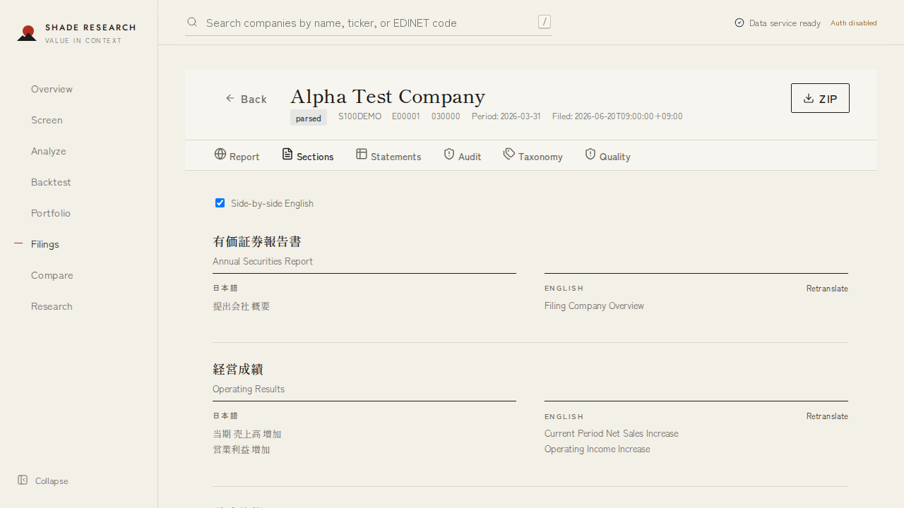

Translation runs locally through Argos Translate. It translates complete section bodies and every visible report-HTML text node and user-facing label. If the model is unavailable or Japanese remains after retries, the English pane reports a retryable error rather than displaying source text or a partial translation as a successful result.

Validated translations are cached in the `filing_translations` table inside `filings.db`. Cache rows are translator-versioned; incomplete rows from an older implementation are ignored.

## Research: your companies, notes, alerts, and pricing

Research at `/research` holds your private, account-owned research, two calculators, and the bond market. Its six tabs are reachable with `1` to `6` (or `←`/`→` in the tab list); the address bar keeps the tab and the chosen company, so `/research?company=E02144` or `/research?tab=bonds&company=E02144` can be bookmarked or linked. Press `?` for the shortcuts of the tab in use.

**Companies** lists every company you follow: one you have tagged, written a note on, given a status or target, or set an alert on. Each row shows the status (Watch, Buy, Hold, Sell), the latest price, the gap to your target, when it is due for review (overdue in red), P/E, dividend yield, and its notes and alerts, with alerts that hold today marked. Sort by any column, filter by text (`F`), by tag (chips, or `[`/`]` to step through them), or by status, reviews due, or triggered alerts. `J`/`K` move through the list and `O` (or `Enter` in the list) opens the company's Analysis page. **Compare** (`C`) opens the companies listed in Comparison, and **CSV** (`D`) downloads them.

Your portfolio tags its holdings automatically. Every stock or fund you hold now carries **Open position**, and every one you held before but have since sold carries **Closed position**; a company moves from one to the other when the portfolio is rebuilt after a trade (importing a Flex Query, Rebuild, refreshing prices, or deleting records), and again whenever Research loads. The two tags lead the tag chips, show as Open or Closed beside the name, and appear on the company's Analysis page; they cannot be added, removed, renamed, or deleted by hand, and your own tags on the same companies are untouched. Tokyo-listed holdings are filed under their EDINET company. Other holdings — US shares, European funds — are kept under their portfolio symbol: they get notes, tags, a thesis, alerts, and option pricing like any company, and open in Analysis by ticker, but have no statements, so no peers or credit profile.

Beside the list, the chosen company's research panel edits everything in place: click a status (`S` focuses it), type a target and currency, pick a review date, write the thesis (`E`; `Ctrl+Enter` saves), add tags (`T`; existing tags are suggested), write a note (`N`; its first line becomes the title), and add an alert. Add a company that is not yet followed with `A`; it joins the list as soon as you record anything about it. With a tag filter on, the tag can be renamed or deleted for every company.

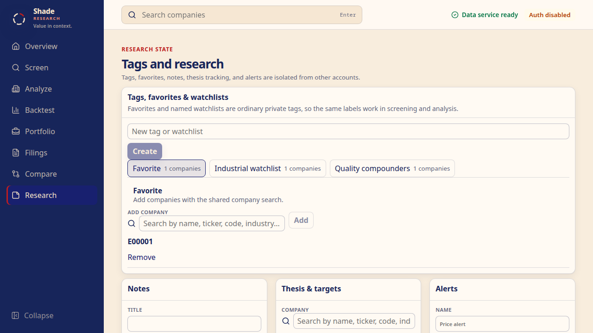

**Notes** lists every note, newest first, with its company. Search them (`F`), write one with or without a company (`N`), edit in place (`E`; a note changed in another window is refused rather than overwritten), delete with `X` pressed twice, and download the notes listed as Markdown (`D`). Choosing a company elsewhere on the page narrows the list to its notes.

**Alerts** shows each alert's condition, the current value, how far it is from the threshold, and whether it holds today; triggered alerts come first (`T` shows only those). Alerts watch the Analyze metrics: price, market cap, P/E, P/B, P/S, dividend yield, payout ratio, ROE, ROA, and current ratio. They are checked against the latest stored prices and filings when the page loads.

**Options** prices European options with Black–Scholes (with a continuous dividend yield) and shows, for a call and a put at the chosen strike: price, intrinsic and time value, delta, gamma, vega, theta, rho, the risk-neutral chance of finishing in the money, the breakeven, and an American-exercise value from a 200-step binomial tree. Choose a company (`A`) to start from its latest split-adjusted price, its trailing dividend yield, and its realised volatility over 1 month to 3 years or an exponentially weighted estimate (`V` cycles them); or clear it (`M`) and enter every input yourself. The risk-free rate is an assumption you set per currency and is remembered. Set the expiry as days (`T`, or 30 days to 2 years in one click) or pick the date; the other follows. Enter a market price to solve for implied volatility. `[`/`]` step the strike; the strike ladder (`L`) prices calls and puts across strikes, and a row sets the strike. Strategies (`S`) — covered call, protective put, collar, straddle, strangle, spreads, iron condor, or your own legs — show the net cost, maximum profit and loss, breakevens, the risk-neutral chance of profit, combined Greeks, and a profit-and-loss chart at expiry, today, and halfway, with a one-standard-deviation band. Further charts show value against volatility or time, and the company's realised volatility over three years.

Trading fees are a fee per contract and the contract size (100 shares by default; a share leg counts as one contract), charged once or also when closing or exercising. Every result that depends on cost includes them: the breakevens, the cost per contract, the strategy's fees, maximum profit and loss, chance of profit, and the profit-and-loss chart. The fees and rates you enter are remembered in this browser.

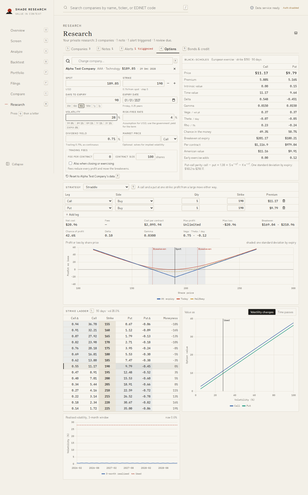

**Bonds & credit** prices a fixed-coupon bond from its coupon and frequency, maturity, face value, risk-free yield, and recovery rate: the price with and without default risk, yield to maturity, credit spread, expected loss, the chance of default by maturity, current yield, modified duration, convexity, DV01, and accrued interest. Default risk comes from the company's Merton model, a credit spread, an annual default rate, or none. A trading fee, as a percentage of face value paid when buying, gives the price with the fee and the yield after it, and the outcomes count it in what you paid. A market price gives its yield (and its yield after the fee) and the default rate it implies. A scenario grid reprices the bond as rates and the spread move, and charts show price against yield (with duration and convexity estimates), the chance of default in each year, and every outcome — default in each coupon period or repayment — with its probability and total return.

With a company chosen (`A`), its credit profile comes from the latest fiscal year's statements and its share price:

- interest-bearing debt (borrowings, bonds, commercial paper), cash, and net debt;
- interest coverage, and the cost of debt (interest expense over average debt), which also sets the starting coupon;
- the Merton model's distance to default and its chances of default within one year and by maturity. This model treats equity as a call on the firm's assets and uses short-term liabilities plus half the long-term ones as the default point;
- Altman's Z and Z″ scores with their safe, grey, and distress zones.

The probabilities are risk-neutral, so they run above historical default rates. Banks, insurers, and securities firms are flagged, because deposits and policy reserves make these models overstate their risk.

Opened from a bond (its **Price** link), the calculator starts from that bond: its coupon and frequency, the years to maturity (or to its first call), today's JGB yield for that term as the risk-free yield, and its spread as the credit spread.

**Bond market** lists every outstanding bond of every issuer from the **Update bonds** step: by default public, yen bonds issued by the filing company itself, largest first. Filter by rating group (chips, or `[`/`]`), ranking, term, industry, or text (`F`); include private placements (bank-guaranteed bonds and small placements, whose coupons leave out the guarantee fee) or subsidiaries' bonds with the checkboxes; `I` shows only the selected bond's issuer and again everyone. The credit curve plots each bond's spread over JGBs against its years left (to the first call for callable bonds), coloured by rating; click a dot to select it. Spreads come from JSDA reference prices where the bond is quoted, and otherwise are the spread at issue (marked `i`, with the yield an estimate marked `*`). `J`/`K` move through the table, `O` opens the issuer in Analysis, `C` prices the bond in the calculator, and `D` downloads the bonds listed as CSV.

The selected bond's panel shows its terms (coupon and how it resets, issue price, maturity and first call, amount issued and outstanding, every agency's rating, security, negative pledge, offering), its valuation (the reference price with the yield and spread it implies and their change since issue, the spread at issue, today's JGB yield, modified duration), and a peer fair value: the median spread of comparable bonds of other issuers (same ranking, rated within a notch, within two years of its tenor — wider if few are found; quoted spreads, or spreads at issue of bonds issued in the last three years) applied to today's curve, with whether the bond is cheap or rich against them. A chart shows those peers' spreads, the issuer's other bonds, the bond, and the median used; below are the reference price history, the fifteen closest bonds of other issuers (one per company), and the issuer's other bonds.

How the numbers are made: spreads are yields less the Ministry of Finance JGB par yield for the same tenor on the same day, interpolated between the published 1- to 40-year points; yields compound semi-annually (or at the bond's own frequency) like the JSDA's compound yield, and callable bonds are measured to their first call. A bond's comparison rating is its R&I rating, then JCR, S&P, Moody's (Moody's grades map one to one: A2 is A); a bond without a rating of its own shows the issuer's latest rating for the same ranking, marked `*`. Bonds JSDA lists without a coupon — most perpetual and many subordinated bank bonds — keep their spread at issue.

Favorites are ordinary private tags (for example one named `Favorite`); tags work in Screening and Analysis as well.

## Test an investment idea

Backtesting supports three entry paths:

- Manual portfolio — tickers with weight, share, or value allocations;
- Saved screen — point-in-time screening with monthly, quarterly, or yearly rebalancing;
- CSV set — batch portfolios supplied from a CSV file.

Configure the period, benchmark, base currency, capital, execution costs, and other assumptions before running. Completed runs expose cumulative return, drawdown, annual results, benchmark comparison, contribution data, saved artifacts, and downloads.

Results open at the portfolio level and drill down from there. For a portfolio backtest, **Holdings** breaks the result down by holding: **Contribution** charts what each holding added to the total return (its weight × its return) above a table of every holding; choosing a holding opens its own growth against the portfolio, its year-by-year figures (from the previous year's close, with its start-of-year weight and contribution), and every dividend it was paid. **By year** is the contribution of each holding in each year (a row adds up to the year's return), **Allocation** shows how the buy-and-hold weights drifted and what each holding has added over time, and **Dividends** lists every payment with its record date, the amount as paid, the split factor, and the cash credited. For a rolling screen or CSV set, the views run from the strategy (every holding period and weighting, over time, the distribution, a start-month heatmap, growth paths) to each run, whose panel lists its holdings by contribution; **Companies** shows which companies were held most often, how they did, and what they contributed, and opening a company lists the runs it was in.

**Report** opens a self-contained HTML page of the result in a new tab and **Share HTML** saves it: one file with no external requests (charts are drawn inline, with hover readouts, and every value is also in a table), light and dark, with each holding, year, and run in a section that opens in place. The same `report.html` is in the ZIP download, next to the CSV files and a `dividend_payments.csv` ledger.

How the numbers are calculated: holdings are bought on the first trading day at the close and held without rebalancing; prices are split-adjusted; each annual dividend is split into its interim and final payments, credited on their record dates while the holding is owned and kept as cash, and put on the same split-adjusted share basis as the prices; the benchmark is held the same way. Screens on the adjusted basis (Screening and rolling backtests) put reported per-share figures — EPS, book value and dividends per share, per-share ratios, and share counts — on that basis too, so a company that split later is not two to ten times cheaper on P/E or P/B in earlier screens. Splits come from confirmed `Stock_Splits` rows and from the issued share counts in annual reports (at consecutive year ends, and at the year end and filing date of one report). Multi-year averages and growth rates of per-share figures (the `_Rolling` tables) are on the same basis.

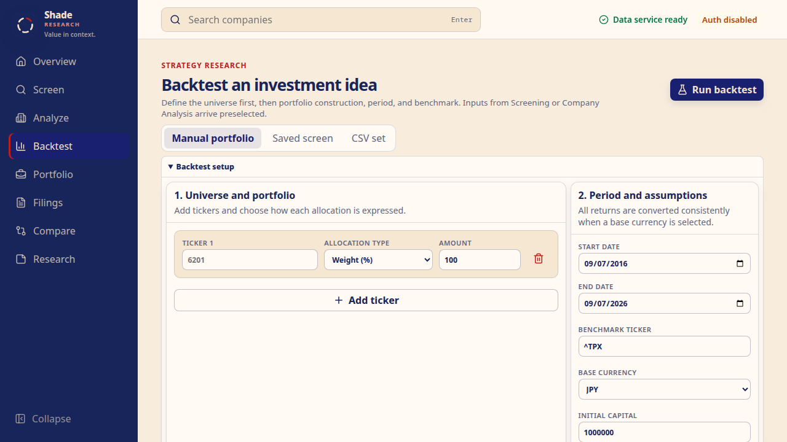

## Review an imported portfolio

Portfolio imports IBKR FlexQuery XML with the Trades, Cash Transactions, Corporate Actions, and Transfers sections. Importing a file again never duplicates records: it adds only new ones and fills in details that earlier versions did not keep (booking dates and commission currencies), and Data & method says when that is worth doing. Imported transactions are account-owned and are rebuilt into a daily ledger: every calendar day each holding is valued at its latest close (in its own currency, even when the stored quote comes from another listing, such as CSPX quoted in USD in London) and every holding and cash balance is converted at that day's ECB euro reference rate. The display currency converts the ledger without rewriting source activity.

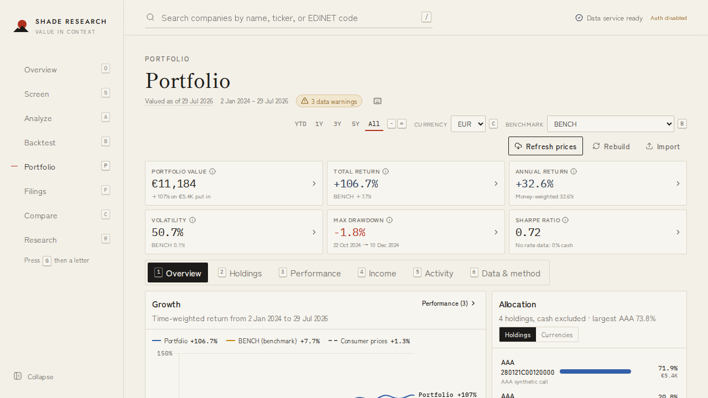

The header shows when the ledger was last valued and whether its data checks pass, with the period (YTD, 1Y, 3Y, 5Y, All), the display currency, and a benchmark (an index fund such as VWCE or CSPX). The six headline figures are the portfolio value against the money put in, the time-weighted total and annual return (with the money-weighted return beside it), volatility, maximum drawdown, and the Sharpe ratio; the info mark on each explains how it is calculated.

- **Overview** charts growth against the benchmark and consumer prices, the fall below each previous high, value against money put in, calendar-year returns, allocation by holding or currency, and the latest activity.
- **Holdings** lists every position with its shares, how long it has been held (the latest unbroken holding period: after a full sale and a later purchase, the clock restarts), its weight, value, latest close, unrealized and total P&L, and dividends; a warning mark flags a holding valued at cost or with an old quote. Enter opens a holding's details (price history against average cost, P&L, the position record); A opens it in Analysis, where Shift+J and Shift+K step through your holdings and G P returns to the same row.
- **Performance** compares returns and risk with the benchmark side by side (beta, alpha, tracking error, and capture use weekly returns, because Tokyo, Europe, and New York close hours apart), then shows monthly returns, the daily return distribution, and each holding's contribution by year.
- **Income** shows every dividend payment with its withholding tax, for the whole portfolio or the companies you choose (press `F`, type a name, `Enter`; `X` shows every payer again; or use Held now and Top 5). Switch between net, gross, and withholding, group by month, quarter, or year, and stack by company or payment currency. The payers table compares each company's dividends, withholding rate, share of income, last twelve months, latest amount per share and its growth on a year ago, yield on cost, and current yield; `Enter` shows one company and `A` adds or removes it. With one company chosen you see its dividend per share for every payment and every year, and its payment ledger (amount per share, shares paid on, gross, withheld, net); with several, their dividend per share indexed to the same start. Dividend growth is weighted by the income each company paid, and counts only complete years. A holding's details link straight to its dividends.
- **Activity** is the full imported ledger, newest first, searchable and filterable by type, import file, and dates; within a day each company's payment sits above its taxes. A currency conversion shows both balances it moves (its commission is charged separately, in the currency shown in its details). Rows marked Reversal and Corrected are the broker's own corrections, not duplicates: when it recalculates withholding tax or a fee it cancels the original and books the right amount under the original date, and "booked" shows when; Hide reversed records leaves only what counts. To delete records, tick them (or press `Space` on a row; Select all takes every record the filters show) and choose Delete selected (`Del`). Imported data lists each file with its records, to delete a whole import, and Clear all portfolio data removes everything (type `delete` to confirm). Every delete first shows exactly which records it removes and offers them as a CSV download; afterwards holdings, values, and returns are rebuilt from what remains. Deleted records come back only by importing the original Flex Query files again.
- **Data & method** lists what the figures rest on: each holding's quote and its age, quotes converted from another currency, weekly-only price history, unusual whole-portfolio days, the exchange-rate, cash-rate, and inflation series, and how every statistic is calculated. Sharpe and Sortino use the display currency's short-term rate (the euro area three-month AAA yield, the three-month US Treasury bill, SONIA, or the Japanese call rate), stored by the Update FX Data pipeline step; enter your own rate there when no series is stored.

**Rebuild** (R) revalues the ledger from your activity and the stored prices. **Refresh prices** (Shift+R, operators and admins) fetches the latest prices for every holding and the benchmark, replaces weekly-only histories with daily ones, corrects stored prices labelled with the wrong currency, updates exchange and interest rates, and rebuilds.

Keyboard: `1`–`6` switch sections, `-` and `=` lengthen or shorten the period, `C` and `B` choose the currency and benchmark, `F` finds a holding, record, or paying company, `I` imports a file, and `?` lists everything. In the Holdings and Activity lists, `↓` or `J` enters the list, `J`/`K` move, `Enter` opens details, and `[` `]` change pages.

Authenticated preview APIs also support tax-lot matching, option Greeks, and deterministic equity/FX scenarios; these previews return explicit assumptions and do not mutate imported activity.

## Chat

`/chat` is a private, account-scoped message space for the companies you follow. Channels are per-company and carry the company's analysis context; direct and group conversations are end-to-end encrypted in your browser, so the server stores only ciphertext. Channel messages are encrypted at rest. Set a chat passphrase under **Account** to protect your identity key; unread counts badge the sidebar.

## Run the data pipeline

The Pipeline workspace discovers available steps from the backend. Load a prepared recipe or assemble individual steps, order them, configure their generated fields, upload required files, and run the recipe as a durable job.


Important current behavior:

- Import Stock Prices (CSV) uses a local file picker and accepts up to 500 MiB.
- Multipart uploads are attached only to the step that declares the file field, so mixed recipes can include ordinary steps and one or more upload steps.
- Download XBRL supports `explicit`, `backfill`, and `all`. `all` reads eligible `DocumentList` rows, honors the document-type filter, skips completed records, uses no more than five concurrent downloads, batches status updates, and reuses HTTP connections.
- Update bonds reads new bond supplements (it downloads them, so it needs the EDINET API key), the bond schedules in the latest annual reports already in `filings.db`, the JGB curve, and JSDA reference prices; run it after Get Documents and Download XBRL, daily or weekly.
- Generate Financial Statements accepts `Source_Mode=csv` for the legacy `financialData_full` input or `Source_Mode=filings` for compact numeric facts in `filings.db`.
- Jobs persist across browser reloads. The UI shows current step, progress, cancellation, terminal status, and bounded output.

See [Running the Application](RUNNING.md) for every field and command-line recovery tool.

## Databases and clean startup

The server creates missing configured database parents, files, managed schemas, and migrations when it starts:

- Base — EDINET document list and legacy CSV ingestion;
- Standardized — company information, statements, ratios, rolling metrics, prices, and FX data;
- Portfolio — imported activity and materialized portfolio state;
- Auth — users, credentials, sessions, tokens, policy, and audit state;
- Research — tags, notes, thesis state, alerts, screens, report recipes, and runs;
- Pipeline jobs — durable job and step state;
- Filings — retained compressed ZIPs, compact numeric XBRL index, quality/provenance metadata, and translation cache;
- Bonds — bond terms read from EDINET bond supplements and annual-report bond schedules, the stored supplements, the JGB curve, and JSDA reference prices (rebuildable: the **Update bonds** step recreates it).

New filing ingests keep the compressed provider ZIP in SQLite, omit duplicate extracted member BLOBs, retain numeric/non-nil analytical facts, and reconstruct narrative sections on demand. Existing filing databases can be compacted or rebuilt with the scripts documented in [Running the Application](RUNNING.md).

## Screenshot refresh

The repository includes a deterministic screenshot environment with generated market data, filing ZIPs, translations, research state, and IBKR activity. It never reads `data/` or the operator's configured databases.

```powershell
.\.venv3\Scripts\python.exe tests\capture_screenshots.py
```

Images are written to `docs/images/`. The script starts a temporary loopback server, captures the current React views, and removes its temporary databases when complete.
